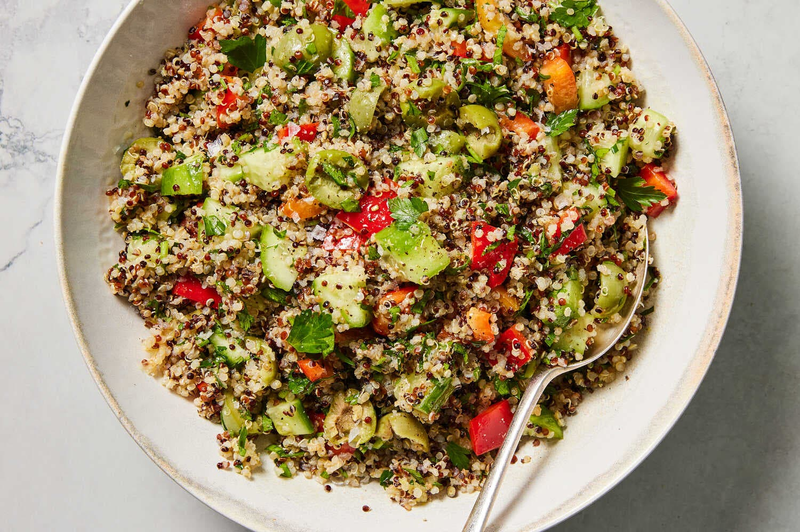

---
tags:
  - dish:salad
  - protein:quinoa
  - ingredient:cucumber
  - ingredient:olives
  - difficulty:easy
---
<!-- Tags can have colon, but no space around it -->

# Quinoa Greek Salad

<!-- Serves has to be a single number, no dashes, but text is allowed after the
number (e.g., 24 cookies) -->
- Serves: 4
{ #serves }
<!-- Time is not parsed, so anything can be input here, and additional
values can be added (e.g., "active time", "cooking time", etc) -->
- Time: 15 min
- Date added: 2026-01-11

## Description

This bright, crunchy and hearty quinoa salad is inspired by the flavors and textures of tabbouleh and Greek salad. Quinoa, cucumbers, bell pepper, olives, lots of parsley and an assertive lemon-garlic dressing make it a filling and protein-rich vegan lunch, or a great side for grilled chicken, seared fish or spiced chickpeas. Feel free to add other briny, creamy, snappy or herbaceous ingredients, such as feta, avocado, torn romaine leaves or fresh mint. The salad will keep for up to 2 days refrigerated; refresh with salt and lemon juice before eating as flavors may become muted in the fridge.

## Ingredients { #ingredients }

<!-- Decimals are allowed, fractions are not. For ranges, use only a single dash
and no spaces between the numbers. -->

- 1 small garlic clove
- 2 lemons
- .25 cup extra-virgin olive oil, plus more as needed
- Salt and black pepper
- 3 cups cooked quinoa, cold or at room temperature
- 2 mini seedless or Persian cucumbers, cut into bite-sized pieces
- 1 bell pepper, any color, seeded and cut into bite-sized pieces
- 1 cup finely chopped parsley leaves and stems (see Tip)
- .5 cup green olives, such as Castelvetrano or Cerignola, pitted and halved

## Directions

<!-- If you have a direction that refers to a number of some ingredient, wrap
the number in asterisks and add `{.ingredient-num}` afterwards. For example,
write `Add 2 Tbsp oil to pan` as `Add *2*{.ingredient-num} to pan`. This allows
us to properly change the number when changing the serves value. -->
1. In a large bowl, finely grate the garlic clove. Finely grate the zest of 1 lemon, then halve the lemons and squeeze in ¼ cup juice. Add the olive oil, season with salt and pepper and stir to combine.
2. Stir in the quinoa, cucumbers, bell pepper, parsley and olives. Taste and adjust seasonings with salt (if bland), black pepper (if mild), olive oil (if too puckery) and lemon juice (if it needs a punch).

## Notes
The quickest way to chop a lot of parsley is to fold a small bunch in half so the leaves are under the stems. Hold onto the bunch with your non-dominant hand and finely slice the leaves and stems. Parsley stems are crunchy and concentrated with flavor; be sure to use them in your salad.

## Source
[NYTimes](https://cooking.nytimes.com/recipes/1024829-quinoa-salad)

## Comments

- 2026-01-11: good, would've been better with feta in it.
