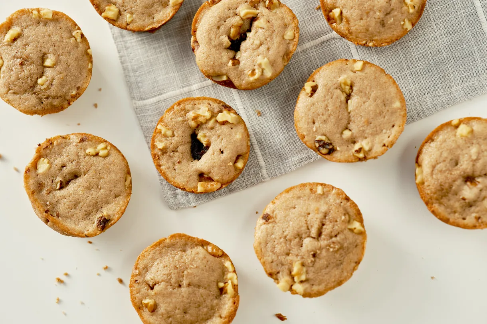

---
tags:
  - dish:baking
  - ingredient:red bean
  - ingredient:walnut
  - cuisine:korean
---
<!-- Tags can have colon, but no space around it -->

# Red bean and walnut snack cake

<!-- Serves has to be a single number, no dashes, but text is allowed after the
number (e.g., 24 cookies) -->
- Serves: 18 muffins
{ #serves }
<!-- Time is not parsed, so anything can be input here, and additional
values can be added (e.g., "active time", "cooking time", etc) -->
- Time: 1 hour
- Date added: 2024-12-04

## Description
Using a mixture of all-purpose and sweet rice flours yields cakes with a moist, slightly springy texture, and sweetened red bean paste (opt for the smooth, fine variety like this one, rather than the chunkier kind) is both creamed into the batter and dolloped on top of it by the tablespoon. As the cakes bake, the red bean paste sinks to the center while most of the chopped toasted walnuts remain on top, resulting in a balance of creamy, crunchy, and soft textures. Baked in muffin pans (thoroughly grease the wells first), the cakes make for individually portioned, handheld treats that work as well for breakfast as they do for an afternoon pick-me-up.

Though my interpretation of hodu-gwaja takes quite a few liberties with the original, it retains the same familiar flavors in a simple, approachable format. And it also boasts longevity: the sour cream and red bean paste keep the cakes soft for a few days when stored in an airtight container, which means you can share some of them and make your way through the rest. They’re a great way to welcome the cooler temperatures — and proof that red bean and walnuts belong on the season’s flavor roster.

## Ingredients { #ingredients }

<!-- Decimals are allowed, fractions are not. For ranges, use only a single dash
and no spaces between the numbers. -->
- .75 (105g) all-purpose flour
- .5 cup, lightly packed (70g) sweet rice flour, like Mochiko
- 1 teaspoon baking powder
- .25 baking soda
- .5 teaspoon kosher salt
- .5 cup (113g) unsalted butter, softened
- .5 cup (100g) granulated sugar
- .25 cup (50g) light brown sugar
- 2 large eggs, at room temperature
- .75 vanilla extract
- .5 cup (145g) fine sweetened red bean paste, plus more for topping the cakes (such as this one)
- .5 cup (120g) full-fat sour cream, at room temperature
- .25 cup (55g) whole milk, at room temperature
- Chopped toasted walnuts, for topping 

## Directions

<!-- If you have a direction that refers to a number of some ingredient, wrap
the number in asterisks and add `{.ingredient-num}` afterwards. For example,
write `Add 2 Tbsp oil to pan` as `Add *2*{.ingredient-num} to pan`. This allows
us to properly change the number when changing the serves value. -->
1. Preheat the oven to 350 degrees and thoroughly grease two 12-cup muffin pans — you’ll need to grease 18 of the cups (I like to use Pam’s Baking Cooking Spray for consistent results).
2. In a medium bowl, whisk together the flours, baking powder, baking soda, and salt.
3. In a large bowl, beat the butter with an electric hand mixer or in a stand mixer fitted with the paddle attachment until smooth. Add both sugars and cream the mixture until light and fluffy, 2-3 minutes. Scrape down the bowl with a rubber spatula.
4. Add in the eggs one at a time, beating after each addition until combined. Scrape the bowl once more, then beat in the vanilla and red bean paste until incorporated.
5. Add half of the dry ingredients to the red bean mixture and beat just until combined. Carefully beat in the sour cream and milk, then add the rest of the dry ingredients and beat just until the batter is smooth.
6. Divide the batter between 18 muffin wells (unlined is fine, as long as you’ve greased well) and smooth the surface with your finger. Dollop a tablespoon of red bean paste on the center of each cake and sprinkle with chopped walnuts.
7. Bake the cakes for 15-20 minutes, rotating the pans halfway through, until a toothpick inserted in the center comes out clean.
8. Let the cakes cool in the pans for 10-15 minutes, then gently run a small offset spatula around the edges of the cakes to loosen and place onto a cooling rack.

## Source

[Eater](https://www.eater.com/22710680/red-bean-walnut-snack-cakes-recipe-joy-cho-hodu-gwaja)

## Comments
