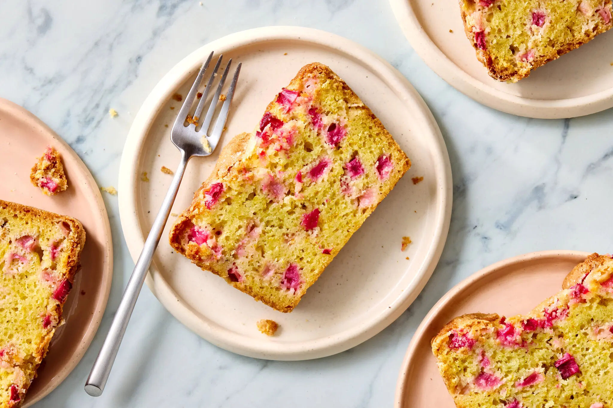

---
tags:
  - dish:dessert
  - ingredient:rhubarb
---
<!-- Tags can have colon, but no space around it -->

# Rhubarb Quick Bread

<!-- Serves has to be a single number, no dashes, but text is allowed after the
number (e.g., 24 cookies) -->
- Serves: 1 bread
{ #serves }
<!-- Time is not parsed, so anything can be input here, and additional
values can be added (e.g., "active time", "cooking time", etc) -->
- Time: 1.5 hours
- Date added: 2026-05-30

## Description

Beautiful pink rhubarb at the markets signals spring's arrival. A bit sour on their own, the stalks work beautifully with sweet strawberries and blueberries, and citrus. This buttery loaf is made with a bit of orange zest, which perfectly complements rhubarb’s pleasant tang. Dress the cooled loaf with a simple glaze of confectioners’ sugar and orange juice, if you like, or serve fat slices with vanilla ice cream. Leftovers are nice toasted in a skillet with plenty of salty butter.

## Ingredients { #ingredients }

<!-- Decimals are allowed, fractions are not. For ranges, use only a single dash
and no spaces between the numbers. -->
- 8 tablespoons/113 grams unsalted butter (1 stick), melted, plus more for the pan
- 1 cup/200 grams plus 2 tablespoons granulated sugar
- 1 tablespoon freshly grated orange zest
- .33 whole-milk yogurt
- 2 large eggs
- 1.75 cups/223 grams all-purpose flour, plus more for the pan
- 1 teaspoon baking powder
- .5 teaspoon baking soda
- .5 teaspoon kosher salt
- 1.75 cups/227 grams chopped rhubarb (8 ounces), cut into ¼-inch pieces

## Directions

<!-- If you have a direction that refers to a number of some ingredient, wrap
the number in asterisks and add `{.ingredient-num}` afterwards. For example,
write `Add 2 Tbsp oil to pan` as `Add *2*{.ingredient-num} to pan`. This allows
us to properly change the number when changing the serves value. -->
1. Heat the oven to 350 degrees. Butter and flour an 8 ½-inch-by-4 ½-inch loaf pan.
2. In a large bowl, whisk together the butter, 1 cup of the sugar, orange zest and yogurt until well combined. Whisk in eggs. In a separate medium bowl, whisk together the flour, baking powder, baking soda and salt. Add the flour mixture and 1 ½ cups rhubarb to butter mixture and fold until combined. Transfer the batter to the prepared pan and smooth out the top. Sprinkle the top with the remaining ¼ cup rhubarb and 2 tablespoons sugar. Bake until the loaf is golden brown and set and a skewer inserted in the center comes out with moist crumbs attached, 55 to 60 minutes.
3. Transfer the pan to a rack to cool for 10 minutes, then cut around the edges and carefully flip the loaf out of the pan. Turn it right side up and let it cool completely before slicing.

## Source

[NYTimes](https://cooking.nytimes.com/recipes/1019317-rhubarb-quick-bread)

## Comments

- 2026-06-30: following the comments, I used lemon zest and some grated fresh ginger, and replaced the yogurt with buttermilk.
