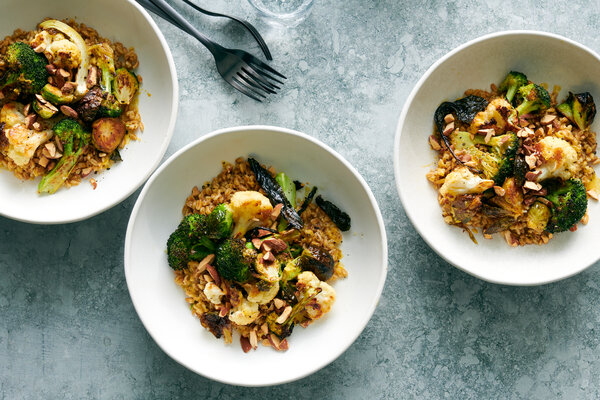

---
tags:
  - dish:main
  - ingredient:broccoli
  - difficulty:easy
---
# Roasted broccoli salad with nooch dressing

- Serves: 4 servings
{ #serves }
- Time: 25 minutes
- Date added: 2023-10-21

This nutty, savory and deeply satisfying — not to mention vegan — grain bowl stands out because of a stellar sauce made of nutritional yeast (also known as “nooch”), lemon, mustard and garlic powder that provides umami, brightness and spunk. The sauce works especially well on roasted brassicas like broccoli, cauliflower and brussels sprouts, likely because the combination is reminiscent of broccoli-Cheddar soup. Keep a jar of the stuff on hand for grain bowls on demand. (It keeps for three days in the fridge.) Cook any cold-weather vegetables, use any leftover grains, incorporate any crunch, and maybe even add dill, apples or celery for freshness. The sauce will tie it all together.

## Ingredients { #ingredients }

- 3 pounds broccoli, cauliflower or a combination, cut into 1 .5- to 2-inch-long florets, stem sliced .25-inch-thick, leaves reserved
- 1 pound brussels sprouts, trimmed and halved
- .75 cup olive oil
- Kosher salt and black pepper
- .5 cup nutritional yeast
- Zest and juice of 1 large lemon (about 1 teaspoon zest and 3 tablespoons juice)
- 1 tablespoon Dijon mustard
- .25 teaspoon garlic powder
- 4 cups cooked whole grains (such as farro, quinoa, or wheat berries), warm or room temperature
- .25 cup roasted, salted almonds, coarsely chopped

## Preparation

1. Place the racks in the top and bottom thirds of the oven, and heat the oven to 450 degrees. Place two baking sheets in the oven to heat.
2. In a large bowl (or two if you need), toss broccoli and cauliflower florets, stems and leaves, and the brussels sprouts with enough olive oil to coat (around *.5*{.ingredient-num} cup). Season generously with salt and pepper. (Don’t wash the bowl.) Roast on the heated sheets, rotating the pans and switching racks halfway through but leaving the vegetables themselves untouched, until browned and crisp-tender, 15 to 20 minutes.
3. In a medium bowl, stir together the nutritional yeast, *.25*{.ingredient-num} cup water, remaining *.25*{.ingredient-num} cup olive oil, the lemon juice, mustard and garlic powder. Season to taste with salt and pepper. Add the grains to the large bowl. Season and dress the grains with salt, lemon zest, and some of the nutritional yeast dressing to taste.
4. Top the grains with the roasted vegetables, then drizzle with some of the dressing. Top with the almonds.

# Source

[NYTimes](https://cooking.nytimes.com/recipes/1022865-roasted-broccoli-grain-bowl-with-nooch-dressing)

## Comments

- Bill Broderick, Feb 12, 2022 at 5:37 PM: this dressing is really good, I've used it with a variety of roasted / raw veggies

