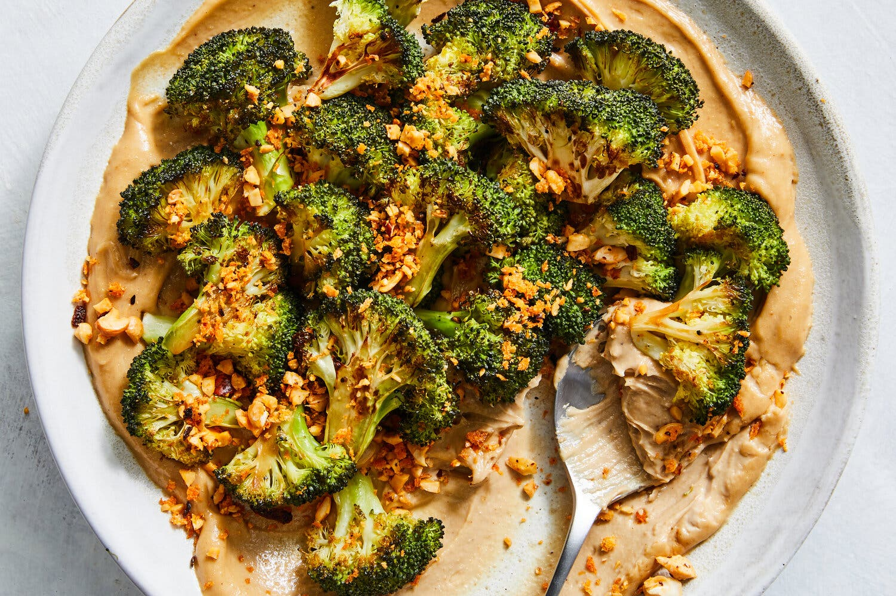

---
tags:
  - dish:main
  - protein:tofu
  - ingredient:broccoli
  - difficulty:easy
---
<!-- Tags can have colon, but no space around it -->

# Roasted Broccoli and Whipped Tofu With Chile Crisp Crunch

<!-- Serves has to be a single number, no dashes, but text is allowed after the
number (e.g., 24 cookies) -->
- Serves: 4
{ #serves }
<!-- Time is not parsed, so anything can be input here, and additional
values can be added (e.g., "active time", "cooking time", etc) -->
- Time: 30 min
- Date added: 2026-01-11

## Description

The concept here is simple, but the results are truly spectacular: Broccoli florets are tossed with olive oil and soy sauce, steamed in the oven until softened, then crowned with crunchy chile crisp bread crumbs. The broccoli is bundled up in aluminum foil, then cooked, so that it tenderizes swiftly and retains moisture. Meanwhile, chile crisp, panko, cashews and olive oil are toasted in a skillet until seasoned and crunchy. (This mix would also be stellar over peanut noodles, roasted vegetables or salad greens.) The optional base of two-ingredient cashew cream (tofu and cashew butter) adds lusciousness and protein. This dish has got heat, but it’s more about texture.

## Ingredients { #ingredients }

<!-- Decimals are allowed, fractions are not. For ranges, use only a single dash
and no spaces between the numbers. -->
### For the Broccoli
- 1.5 pounds broccoli (about 2 medium heads), cut into 1-inch florets
- 4 tablespoons extra-virgin olive oil
- 2 teaspoons soy sauce
- Salt and black pepper
- 1 garlic clove, thinly sliced
- .5 cup coarsely chopped cashews
- 1 tablespoon chile crisp, plus more for serving if you like
- .33 cup panko bread crumbs
### For the Cashew Cream (optional)
- 14 ounces drained silken tofu
- 1 cup cashew butter

## Directions

<!-- If you have a direction that refers to a number of some ingredient, wrap
the number in asterisks and add `{.ingredient-num}` afterwards. For example,
write `Add 2 Tbsp oil to pan` as `Add *2*{.ingredient-num} to pan`. This allows
us to properly change the number when changing the serves value. -->
1. Heat the oven to 400 degrees. Line a large baking sheet with aluminum foil. Add the broccoli, drizzle with 3 tablespoons olive oil and the soy sauce, season lightly with salt and pepper, and toss to coat. Arrange in an even layer, then dot with the garlic.
2. Tightly wrap the broccoli mixture with another piece of aluminum foil, sealing shut, and bake until crisp-tender, about 15 minutes.
3. While the broccoli bakes, prepare the chile crisp bread crumbs: Heat the remaining 1 tablespoon olive oil in a medium skillet over medium. Add the cashews, season to taste with salt and pepper and cook, stirring frequently, until fragrant, about 3 minutes.
4. Add the chile crisp to the cashews, then stir in the panko and continue to cook, stirring frequently, until the panko is toasted, 2 to 3 minutes. Season to taste and transfer to a paper towel-lined plate.
5. If using cashew cream, add the tofu, cashew butter and 6 tablespoons water to a small food processor; blend until fluffy. Season generously with salt and pepper, then spread it on a serving platter or shallow bowl.
6. Arrange the cooked broccoli on top, drizzle with additional chile crisp, if desired, and sprinkle generously with the chile crisp topping. Serve immediately, with any additional chile crisp crunch on the side.

## Source

[NYTimes](https://cooking.nytimes.com/recipes/1026270-roasted-broccoli-and-whipped-tofu-with-chile-crisp-crunch)

## Comments

- 2026-01-11: dropped the cashews from the broccoli and replaced the cashew butter with peanut butter. Nora loved the tofu/peanut butter.
