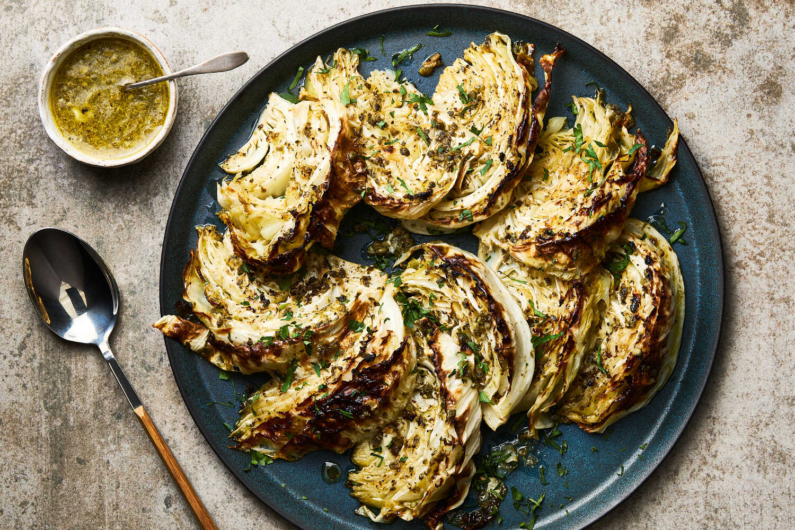

---
tags:
  - dish:sides
  - ingredient:cabbage
---
<!-- Tags can have colon, but no space around it -->

# Roasted Cabbage With Capers and Garlic

<!-- Serves has to be a single number, no dashes, but text is allowed after the
number (e.g., 24 cookies) -->
- Serves: 4
{ #serves }
<!-- Time is not parsed, so anything can be input here, and additional
values can be added (e.g., "active time", "cooking time", etc) -->
- Time: 45 min
- Date added: 2025-05-07

## Description
It sounds so simple — roasted cabbage with a garlicky caper oil — but the resulting dish is anything but plain. Sharp from briny capers and unapologetically pungent from the garlic, with a bold kick of zesty lemon, the flavored oil serves as both a marinade for the cabbage and a finishing glaze. As the cabbage roasts, it turns savory and caramelized while the capers develop a crunch. Make this dish heartier by roasting chickpeas alongside the cabbage, serve alongside a protein like quinoa or pan-fried tofu, toss through pasta, or simply serve with bread to mop up every last drop.
## Ingredients { #ingredients }

<!-- Decimals are allowed, fractions are not. For ranges, use only a single dash
and no spaces between the numbers. -->
- .5 cup extra-virgin olive oil, plus more for drizzling 
- .25 cup capers, finely chopped 
- 3 garlic cloves, finely chopped
- Zest of 1 lemon 
- .25 cup lemon juice (from 1 to 2 lemons), or more as needed
- Salt and pepper 
- 1 medium green cabbage (2½ to 3 pounds)
- Handful of chopped parsley or torn basil leaves

## Directions

<!-- If you have a direction that refers to a number of some ingredient, wrap
the number in asterisks and add `{.ingredient-num}` afterwards. For example,
write `Add 2 Tbsp oil to pan` as `Add *2*{.ingredient-num} to pan`. This allows
us to properly change the number when changing the serves value. -->
1. Heat the oven to 450 degrees.
2. Place the olive oil, capers, garlic, lemon zest and lemon juice into a small bowl and stir to combine. Season generously with salt and black pepper. Taste to make sure the oil is both very lemony and salty, adjusting seasonings as needed.
3. Prepare the cabbage: Remove any wilted outer leaves, then halve the cabbage through its core. Place both halves flat side down on a cutting board and slice through the core into 1½-inch-thick wedges.
4. Drizzle a rimmed sheet pan with olive oil and gently transfer the cabbage, keeping each wedge intact and placing them flat-side down in a single layer. Spoon about half of the garlicky caper oil evenly over the cabbage and, using your hands, gently massage it in, pressing the garlic and capers over and between the leaves. Season lightly with salt and pepper.
5. Roast the cabbage until tender, golden at the edges and caramelized, 25 to 30 minutes.
6. Transfer the cabbage to serving plates. Drizzle the remaining garlicky caper oil over each wedge, scatter with parsley or basil, and serve.

## Source

[NYTimes](https://cooking.nytimes.com/recipes/1026705-roasted-cabbage-with-capers-and-garlic)

## Comments

- 2025-05-07: roasted the cabbage ahead of time and then served at room temperature with the oil.
