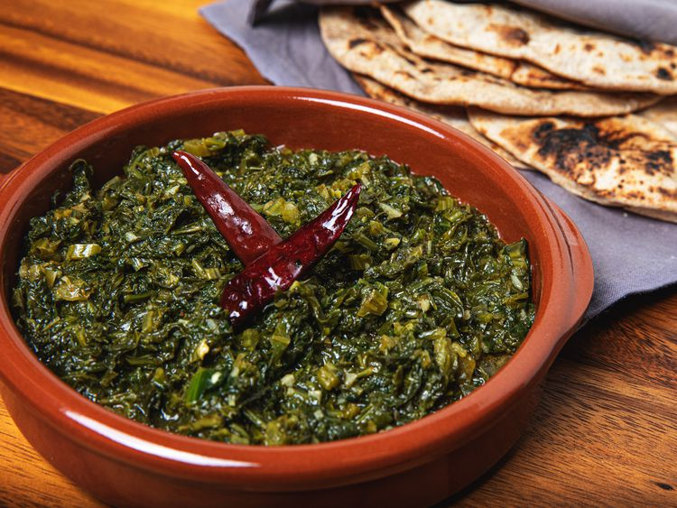

---
tags:
  - dish:main
  - ingredient:greens
  - cuisine:indian
---
<!-- Tags can have colon, but no space around it -->

# Sarson Ka Saag

<!-- Serves has to be a single number, no dashes, but text is allowed after the
number (e.g., 24 cookies) -->
- Serves: 4
{ #serves }
<!-- Time is not parsed, so anything can be input here, and additional
values can be added (e.g., "active time", "cooking time", etc) -->
- Time: 30 min
- Date added: 2025-06-10

## Description
Sarson ka saag is the ultimate comfort food, and it recalls for me the bitterly cold winter months of northern India. Growing up in a Punjabi family, this was a dish that was often made for special occasions, like weddings that took place during the winter, but it was also made on weekends, too. 

### Why It Works
- Braising the tough mustard greens makes them tender.
- Adding spinach ameliorates the sharpness of the mustard greens.
- A simple tadka adds layers of flavor and aroma to the final dish.
- A final pat of salted butter on top adds richness and salt.
## Ingredients { #ingredients }

<!-- Decimals are allowed, fractions are not. For ranges, use only a single dash
and no spaces between the numbers. -->

### For the Greens:
- 1 tablespoon ghee
- 4 bunches (400 g) of sarson (mustard leaves), washed, spun, and finely chopped
- 1 bunch (100 g) spinach leaves, washed, spun, and finely chopped

### For the Tadka:
- 2 tablespoons ghee
- 1 tablespoon neutral-flavored oil, such as sunflower
- 2 dried red chiles
- 2 garlic cloves, peeled and minced
- 1 (1/2-inch) piece of ginger, peeled and minced
- 1 hot green chile, minced
- 1 teaspoon (3 g) Diamond Crystal kosher salt; if using table salt, use half as much by volume or same weight
- .5 teaspoon chile powder
- 2 tablespoons salted butter, for serving

## Directions

<!-- If you have a direction that refers to a number of some ingredient, wrap
the number in asterisks and add `{.ingredient-num}` afterwards. For example,
write `Add 2 Tbsp oil to pan` as `Add *2*{.ingredient-num} to pan`. This allows
us to properly change the number when changing the serves value. -->

1. **For the greens:** In a large straight-sided skillet or Dutch oven, heat the ghee over medium-high heat. Add the mustard greens along with *.5*{.ingredient-num} cup (*120*{.ingredient-num} ml) water, stir to combine, and bring water to a boil, about 5 minutes. Cover, reduce heat to medium-low, and cook until leaves have softened, about 8 minutes. Add the spinach, stir to combine, cover, and cook until spinach is completely softened, about 5 minutes. Transfer cooked greens to medium mixing bowl and wipe out the pan or pot with a clean kitchen towel or a paper towel.
2. **For the tadka (and to finish):** Add ghee and oil to the pan or pot and heat over medium heat. Add the dried red chiles and cook until they begin to sizzle, about 1 minute. Add the ginger, garlic, and fresh chiles, stir, and cook until fragrant, about 1 minute. Add the cooked greens back to the pan or pot along with salt, chile powder, and a *.5*{.ingredient-num} cup of water, and stir to combine. Increase heat to high and bring liquid to a boil, about 2 minutes. Turn off heat and, using a potato masher, firmly mash greens. Stir well, then transfer to a serving dish. Top with salted butter and serve immediately.

## Source

[Serious Eats](https://www.seriouseats.com/sarson-ka-saag-recipe-5705197)

## Comments
