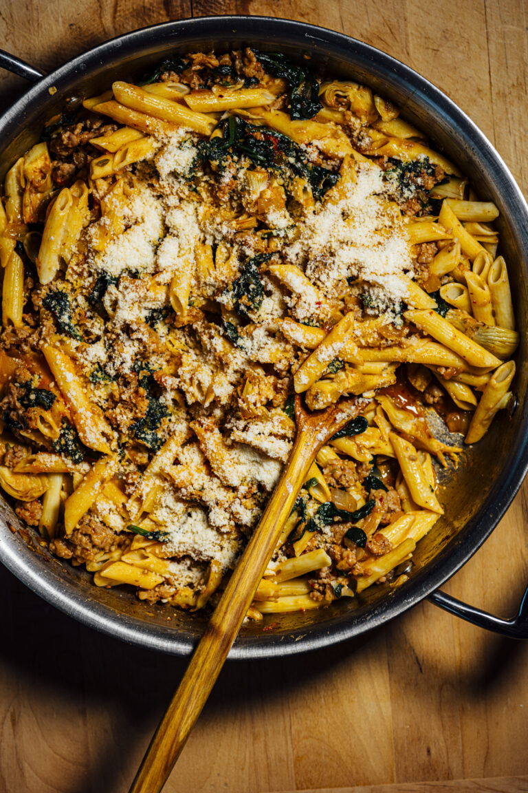

---
tags:
  - dish:main
  - protein:sausage
  - ingredient:pasta
---
<!-- Tags can have colon, but no space around it -->

# Italian Sausage Gochujang Pasta

<!-- Serves has to be a single number, no dashes, but text is allowed after the
number (e.g., 24 cookies) -->
- Serves: 4
{ #serves }
<!-- Time is not parsed, so anything can be input here, and additional
values can be added (e.g., "active time", "cooking time", etc) -->
- Time: 45 min
- Date added: 2024-02-08

## Description

A big bowl of comforting pasta full of sizzling flavors comes together through the union of Italian sausage, Korean gochujang, and Japanese miso. I’ve also folded in baby spinach and artichokes. Makes this on a weekday or weeknight.

## Ingredients { #ingredients }

<!-- Decimals are allowed, fractions are not. For ranges, use only a single dash
and no spaces between the numbers. -->
- 8 oz/230 g penne pasta
- fine sea salt
- 2 Tbsp extra-virgin olive oil
- 1 large yellow onion/about 400 g, diced
- 2 garlic cloves, grated
- 1 Tbsp gochujang
- 1 tsp miso
- 1 tsp crushed fennel seeds
- .5 tsp red pepper flakes (See Notes)
- 15 oz/425 g Italian sausage
- 10 oz/280 g fresh baby spinach (See Notes)
- 14 oz canned quartered artichokes packed in water, drained
- 4 Tbsp grated Parmesan

## Directions

<!-- If you have a direction that refers to a number of some ingredient, wrap
the number in asterisks and add `{.ingredient-num}` afterwards. For example,
write `Add 2 Tbsp oil to pan` as `Add *2*{.ingredient-num} to pan`. This allows
us to properly change the number when changing the serves value. -->

1. Cook the pasta to al dente as per the manufacturer’s instructions. Reserve 2 cups/480 ml of pasta cooking water.
2. Heat the oil over medium heat in a large skillet or saucepan.
3. Add the onion and sauté until translucent, 4 to 5 minutes. Add the garlic and sauté for 1 minute, until fragrant.
4. Add the fennel and red pepper flakes and cook for 1 minute until fragrant.
5. Crumble the sausage and add it to the skillet. Cook until the sausage is browned, 6 to 8 minutes. Add 1 cup/240 ml of pasta cooking water. Stir in the gochujang and miso and bring to a boil over high heat. Reduce the heat to a medium-low.
6. Fold in the spinach and artichokes, and sauté until the spinach wilts, 3 to 4 minutes.
7. Fold in the cooked pasta to coat well. Add the remaining 1 cup/240 ml of pasta cooking water to help loosen up the sauce if it is too dry. It should be saucy enough to coat the pasta, not too wet.
8. Serve hot, topped with the grated Parmesan. Leftovers can be stored in an airtight container for up to 4 days in the refrigerator.

## Notes

<!-- Delete section if no additional notes -->

- I’ve successfully made this dish with chickpea pasta.
- I prefer white or yellow miso, but red miso will also work.
- If you use a milder red pepper flake like Aleppo, use 1 tsp. I normally use Aleppo in all my cooking.
- If using frozen spinach, use 5 oz/140 g. Of course, you can always double the quantity!

## Source

[Nik Sharma](https://niksharmacooks.com/italian-sausage-gochujang-pasta/)

## Comments

- 2024-02-06: this was tasty. made it with cevapi and cumin instead of Italian
  sausage and fennel
