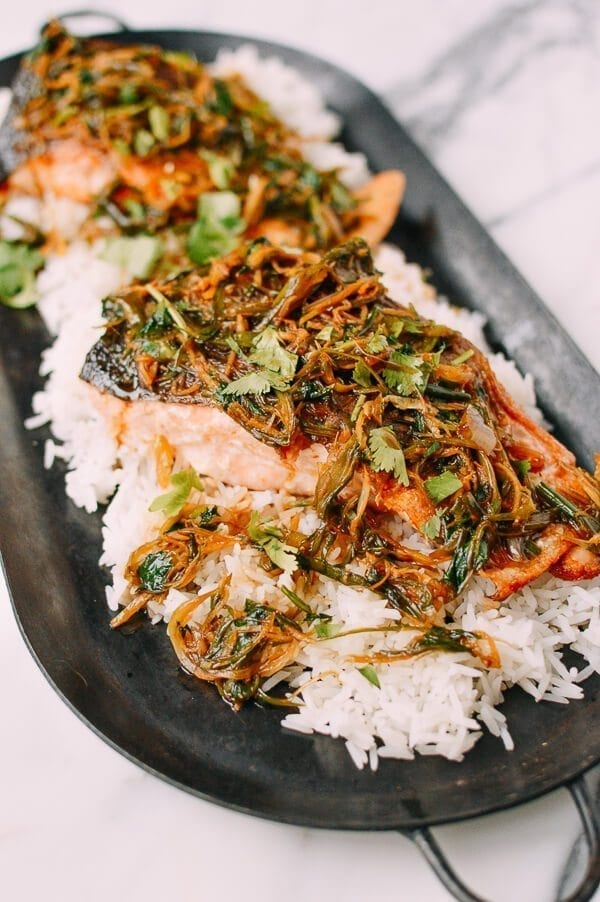

---
tags:
  - dish:main
  - protein:fish
  - ingredient:salmon
  - cuisine:chinese
  - difficulty:easy
---
<!-- Tags can have colon, but no space around it -->

# Crispy Scallion Ginger Salmon

<!-- Serves has to be a single number, no dashes, but text is allowed after the
number (e.g., 24 cookies) -->
- Serves: 4
{ #serves }
<!-- Time is not parsed, so anything can be input here, and additional
values can be added (e.g., "active time", "cooking time", etc) -->
- Time: 15 minutes
- Date added: 2024-01-10

## Description

This Crispy Ginger Scallion Salmon recipe uses a delicious combination of ginger, scallion, cilantro, and soy sauce gives that traditional flavor of a steamed fish, but easy-to-prepare and rich, crispy salmon takes the traditional recipe to a new level.

## Ingredients { #ingredients }

<!-- Decimals are allowed, fractions are not. For ranges, use only a single dash
and no spaces between the numbers. -->

- 4 tablespoons oil
- 2 eight oz. salmon fillets (450g total, sprinkled lightly and evenly with salt)
- .5 cup water
- 3 tablespoons soy sauce
- 1 teaspoon sugar
- .25 teaspoon sesame oil
- .25 teaspoon salt
- 4 tablespoons ginger (finely julienned)
- 3 scallions (very thinly julienned into 2-inch pieces)
- .5 cup cilantro (chopped)

## Directions

<!-- If you have a direction that refers to a number of some ingredient, wrap
the number in asterisks and add `{.ingredient-num}` afterwards. For example,
write `Add 2 Tbsp oil to pan` as `Add *2*{.ingredient-num} to pan`. This allows
us to properly change the number when changing the serves value. -->
1. Place a frying pan (we used a cast-iron skillet), over medium-high heat. Spread two tablespoons of oil evenly in the pan. Place the salmon in the pan skin-side down. Cook the salmon on each side for 4-7 minutes, depending on the thickness of the piece. These somewhat thicker fillets took closer to 7 minutes on each side. Don’t fuss with the salmon while it cooks.
2. As a little cheat, look at the side of your filet. There should be no appearance of rawness in the middle. As the cooked salmon converges in the center of the cross-section of your filet as you sear each side, you’ll be able to get a decent sense of when your salmon is cooked.
3. While the salmon is cooking, in a small bowl, mix together the water, soy sauce, sugar, sesame oil, and salt. Set aside.
4. Transfer the cooked filets to a plate. In the same pan you seared the salmon in, add 2 tablespoons of oil, and lightly fry the ginger until crisp. Add the scallions and cook until wilted, followed by the prepared soy sauce mixture. Bring the sauce to a boil, and turn off the heat.
5. To serve the salmon, place on a bed of rice, and spoon the scallion and ginger evenly over the salmon. Pour the sauce over the top, and sprinkle with the chopped cilantro.

## Source

[Woks of Life](https://thewoksoflife.com/scallion-ginger-salmon/)

## Comments
