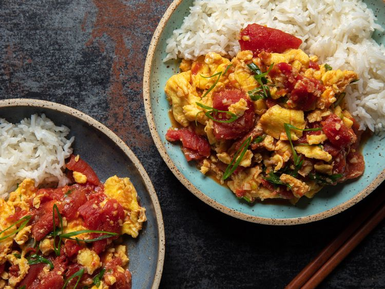

---
tags:
  - dish:main
  - protein:eggs
  - ingredient:tomato
  - cuisine:chinese
  - difficulty:easy
---
<!-- Tags can have colon, but no space around it -->

# Chinese Scrambled Eggs With Tomato Recipe

<!-- Serves has to be a single number, no dashes, but text is allowed after the
number (e.g., 24 cookies) -->
- Serves: 3
{ #serves }
<!-- Time is not parsed, so anything can be input here, and additional
values can be added (e.g., "active time", "cooking time", etc) -->
- Time: 20 min
- Date added: 2025-07-17

## Description
Like so many other dishes that are passed down within families, the variations of tomato and egg are endless and ever-growing. In one video alone, Sichuan Chef Wang Gang shows six of his own interpretations, from one that's extra soft for elders and young children, to a self-proclaimed “lazy man” approach that comes together in minutes. My personal take, shared below, starts by gently scrambling the eggs, and then cooking down the tomatoes in a wok. At home, I do this by cooking the eggs in a nonstick skillet while the tomatoes simmer on the side, but that requires the confidence to juggle two tasks at the same time (or a partner that can be delegated egg duty). If you would prefer to dirty one fewer pan, you can use the wok from start-to-finish. This truly shows off the versatility of the wok: when well-seasoned, it can scramble eggs as easily as the finest nonstick. Once the eggs are scrambled it can quickly be wiped, then reused to cook the aromatics and tomatoes before folding the eggs back in to finish. 

### Why It Works
- Allowing the egg to solidify on the bottom of the wok before gently scrambling produces larger, fluffier curds.
- Pouring the soy sauce and Shaoxing wine around the sides of the wok rapidly caramelizes them, enhancing their flavor.

## Ingredients { #ingredients }

<!-- Decimals are allowed, fractions are not. For ranges, use only a single dash
and no spaces between the numbers. -->

### For the Scrambled Eggs:
- 6 large eggs (305 g)
- .5 teaspoon kosher salt, plus more to taste
- 1 tablespoon (15 ml) water
- 5 tablespoons plus 2 teaspoons (85 ml) neutral oil, such as peanut oil, divided 

### To Finish:
- 4 scallions, white and light green parts minced, dark green parts sliced thinly on the bias, divided
- 4 small garlic cloves (15 g), finely minced
- 1 (1/2-inch) piece (10 g) fresh ginger, peeled and finely grated
- 6 ripe Roma (plum) tomatoes (about 1.25 pounds; 545 g), cored and cut into 1-inch pieces, or 1 (28-ounce; 794 g) can whole peeled tomatoes, tomatoes drained then cut into 1-inch chunks
- .5 teaspoon Diamond crystal kosher salt, plus more to taste; for table salt, use half as much by volume or the same weight 
- 1 dash MSG (optional)
- 2 tablespoons (30 ml) Shaoxing wine
- 1 teaspoon (5 ml) Chinese light soy sauce 
- .25 teaspoon finely ground white pepper
- .5 teaspoon Chinkiang black vinegar
- .25 teaspoon toasted sesame oil (optional)
- Cooked rice, for serving

## Directions

<!-- If you have a direction that refers to a number of some ingredient, wrap
the number in asterisks and add `{.ingredient-num}` afterwards. For example,
write `Add 2 Tbsp oil to pan` as `Add *2*{.ingredient-num} to pan`. This allows
us to properly change the number when changing the serves value. -->

1. For the Scrambled Eggs: In a medium bowl, thoroughly whisk together eggs with salt, water, and 2 teaspoons (10ml) oil.
2. Heat a well-seasoned carbon steel wok (see note) over high heat until lightly smoking. Add 2 tablespoons (30ml) oil, swirling to coat wok. Add eggs, reduce heat to medium-low, and cook, allowing eggs to form a solid layer at the bottom of the wok before slowly scrambling with a spatula, until eggs are gently scrambled in large curds, 2 to 3 minutes. Transfer eggs to a plate and set aside. Wipe out wok of any remaining egg.
3. To Finish: Return wok to medium-high heat and heat until very lightly smoking. Add remaining 3 tablespoons (45ml) oil and swirl to coat the wok. Add scallion whites and garlic and cook, stirring and tossing constantly, until fragrant, about 20 seconds; do not let them scorch. Add ginger and continue to cook, stirring constantly, until fragrant, about 10 seconds.
4. Add tomatoes, salt, and MSG (if using), and cook, stirring and tossing frequently, until tomatoes soften and their juices come to a boil.
5. Add Shaoxing wine followed by the soy sauce, pouring each around the sides of the wok so that they sizzle. Season with salt.
6. Reduce heat to medium, then add eggs and white pepper, stirring to combine and breaking up any very large egg curds. Continue to cook until tomato-egg mixture is thoroughly combined and heated through, 2 to 3 minutes.
7. Stir in black vinegar, remove wok from heat, then stir in sesame oil, if using, and scallion greens. Transfer to a serving plate and serve immediately with rice. 

## Source

[Serious Eats](https://www.seriouseats.com/chinese-tomato-scrambled-egg-recipe-5218069)

## Comments
