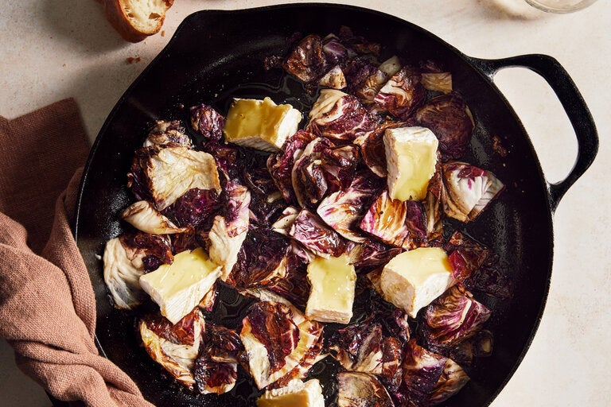

---
tags:
  - dish:sides
  - ingredient:radicchio
  - context:entertaining
  - difficulty:easy
---
<!-- Tags can have colon, but no space around it -->

# Pan-seared radicchio with soft cheese

<!-- Serves has to be a single number, no dashes, but text is allowed after the
number (e.g., 24 cookies) -->
- Serves: 2
{ #serves }
<!-- Time is not parsed, so anything can be input here, and additional
values can be added (e.g., "active time", "cooking time", etc) -->
- Time: 10 minutes
- Date added: 2024-04-18

## Description

Is there a vegetable more perfectly sized for two people than a single head of radicchio? Not much bigger than a softball and wonderfully bitter, radicchio tastes otherworldly when seared briefly in a skillet, gaining a roasted kale-like savoriness while maintaining most of its crunch. A funky, strong-flavored soft cheese like Camembert or taleggio melts gloriously in the hot pan and, with a bit of sherry vinegar and honey, creates a makeshift dressing. This easy but luxurious recipe proves that you don’t need much for a stellar appetizer: just a pan, a few ingredients and a hunk of crusty bread to sop up the salty, bittersweet juices.

## Ingredients { #ingredients }

<!-- Decimals are allowed, fractions are not. For ranges, use only a single dash
and no spaces between the numbers. -->
- 1 head radicchio (8 to 10 ounces)
- 2 tablespoons olive oil
- Salt and black pepper
- 4 ounces Camembert, Brie or taleggio cheese, cut into wedges or large chunks
- 1 tablespoon sherry vinegar
- 1 tablespoon honey
- Crusty bread, for serving
## Directions

<!-- If you have a direction that refers to a number of some ingredient, wrap
the number in asterisks and add `{.ingredient-num}` afterwards. For example,
write `Add 2 Tbsp oil to pan` as `Add *2*{.ingredient-num} to pan`. This allows
us to properly change the number when changing the serves value. -->
1. Quarter the radicchio head lengthwise and slice the hard white core off of each piece, then cut each quarter in half crosswise. Don’t separate the leaves.
2. Heat a large skillet over medium-high. Add the oil and carefully nestle the chopped radicchio into the pan, leaving it alone to sear on one side until golden brown, 2 to 3 minutes. Stir for a few seconds. The radicchio leaves may separate and start to smell like roasted broccoli or kale. Immediately remove the pan from the heat so the leaves don’t wilt too much. Season with salt and pepper.
3. Add the cheese, placing some pieces directly over the radicchio and others in the empty spots of the pan. The cheese will start to melt and bulge slightly. Drizzle the vinegar and honey evenly over the radicchio and cheese, and finish with a final sprinkling of salt, if you’d like.
4. Serve right in the pan with crusty bread for dipping into the melty cheese and pan juices.

## Source

[NYTimes](https://cooking.nytimes.com/recipes/1022946-pan-seared-radicchio-with-soft-cheese)

## Comments
