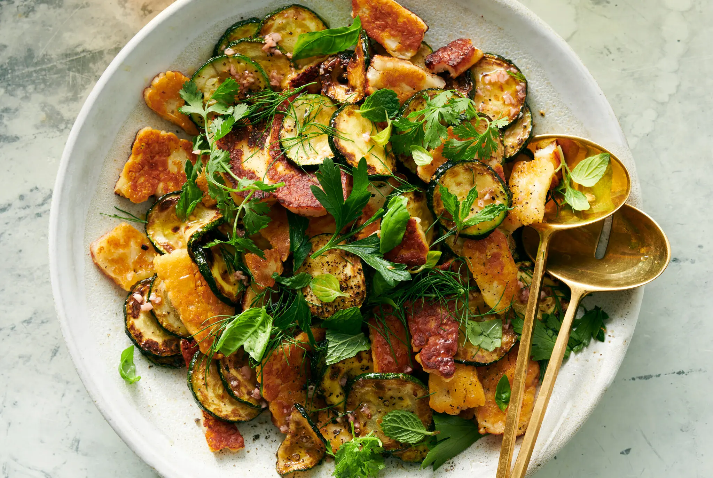

---
tags:
  - dish:sides
  - ingredient:zucchini
  - ingredient:halloumi
  - difficulty:easy
---
<!-- Tags can have colon, but no space around it -->

# Seared Zucchini and Halloumi in Red-Wine Vinaigrette

<!-- Serves has to be a single number, no dashes, but text is allowed after the
number (e.g., 24 cookies) -->
- Serves: 4
{ #serves }
<!-- Time is not parsed, so anything can be input here, and additional
values can be added (e.g., "active time", "cooking time", etc) -->
- Time: 30 min
- Date added: 2026-05-30

## Description
This spectacular but simple side dish pairs golden, crisp-tender rounds of zucchini with salty, molten cheese, a garlicky red-wine vinaigrette and fresh herbs. Start by searing the zucchini in a skillet, then transfer it to a platter where it can soak up the punchy vinaigrette. Meanwhile, sear craggy pieces of halloumi in the same skillet. It’s added to the zucchini just before serving so the edges stay crunchy. Eat with whole grains, pita, hummus, grilled fish, chicken kebabs or other Mediterranean dishes. 

## Ingredients { #ingredients }

<!-- Decimals are allowed, fractions are not. For ranges, use only a single dash
and no spaces between the numbers. -->
- .25 extra-virgin olive oil, divided, plus more as needed
- 2 medium zucchini, sliced into ¼-inch-thick rounds
- Salt and black pepper
- 2 tablespoons red wine vinegar
- 1 large garlic clove, finely chopped
- 1 (8- to 9- ounce) block halloumi, sliced ¼-inch thick
- A handful of torn mint, basil, parsley and/or dill leaves

## Directions

<!-- If you have a direction that refers to a number of some ingredient, wrap
the number in asterisks and add `{.ingredient-num}` afterwards. For example,
write `Add 2 Tbsp oil to pan` as `Add *2*{.ingredient-num} to pan`. This allows
us to properly change the number when changing the serves value. -->
1. In a large skillet over medium-high, heat 1 tablespoon oil. Add a single layer of zucchini. Cook until the zucchini is golden-brown and gives slightly when pressed, 2 to 4 minutes per side. Transfer to a platter or shallow bowl, season with salt and pepper, and repeat with the remaining zucchini, adding more oil and reducing heat as needed to prevent burning. 
2. To the platter of zucchini, add the garlic, vinegar and 2 tablespoons oil. Toss to coat. 
3. Return the skillet to medium-high and add another tablespoon of oil. Rip the halloumi slices into two or three pieces each and add to the skillet. Cook until golden brown, 2 to 4 minutes per side. Transfer to the zucchini, stir to combine, then top with the herbs. Eat right away.

## Source

[NYTimes](https://cooking.nytimes.com/recipes/779127092-seared-zucchini-and-halloumi-in-red-wine-vinaigrette)

## Comments
