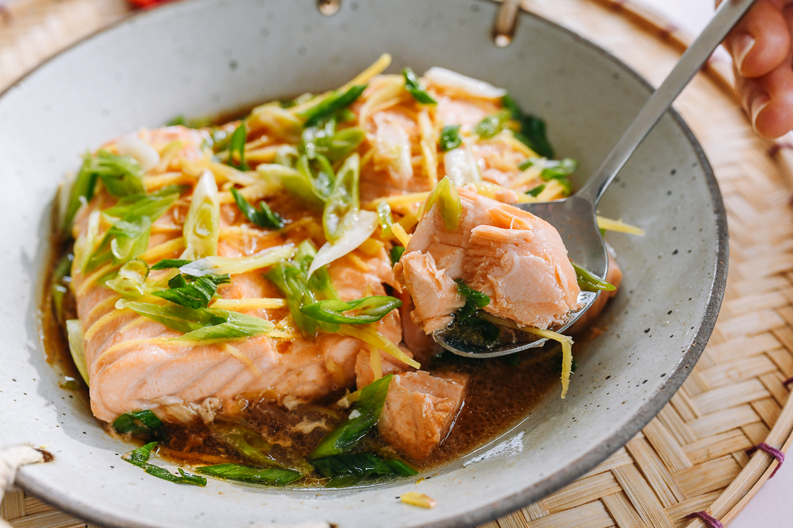

---
tags:
  - dish:main
  - protein:fish
  - cuisine:chinese
  - difficulty:easy
---
<!-- Tags can have colon, but no space around it -->

# Shanghai-style steamed salmon

<!-- Serves has to be a single number, no dashes, but text is allowed after the
number (e.g., 24 cookies) -->
- Serves: 2
{ #serves }
<!-- Time is not parsed, so anything can be input here, and additional
values can be added (e.g., "active time", "cooking time", etc) -->
- Time: 10 minutes
- Date added: 2024-06-02

## Description

This Shanghai-style steamed salmon recipe is healthy, delicious, and takes minutes to prepare. It'll be your new favorite way to cook salmon!

## Ingredients { #ingredients }

<!-- Decimals are allowed, fractions are not. For ranges, use only a single dash
and no spaces between the numbers. -->

- 12 ounce salmon fillet at room temperature (out of the refrigerator for 30 mins)
- 2 teaspoons Shaoxing wine
- .5 teaspoon salt
- 2 tablespoons julienned ginger
- 2 scallions (cut on a diagonal into 1-inch/2.5cm pieces)
- 2 teaspoons soy sauce

## Directions

<!-- If you have a direction that refers to a number of some ingredient, wrap
the number in asterisks and add `{.ingredient-num}` afterwards. For example,
write `Add 2 Tbsp oil to pan` as `Add *2*{.ingredient-num} to pan`. This allows
us to properly change the number when changing the serves value. -->
1. Before beginning the recipe, leave the fish out at room temperature for 30 minutes. Avoid steaming the fish directly from the refrigerator, which may cause undercooking or uneven cooking. Note that the fish should be fully thawed before coming to room temperature if previously frozen.
2. Preheat the water in your steaming set-up until boiling. For more info on how to set up a steamer without any special equipment, see our post on how to steam food.
3. Place the salmon fillet into a heatproof dish that will fit into your steamer. Pour the Shaoxing wine over the fish, and rub it into the fish—the top, bottom, and sides—so the whole piece is coated. Tuck the thinner belly portion underneath the fillet so it is an even thickness across. This will help it cook more evenly.
4. Sprinkle the salt evenly over the top of the fish, along with the ginger and scallions. Drizzle soy sauce around the fish.
5. Once the water in the steamer is boiling, place the fish in the steamer, cover tightly, and steam over high heat for 4 minutes. Then turn off the heat, but leave the steamer tightly covered for 1 minute to allow the salmon to continue cooking in the residual heat. Uncover and serve!

## Source

[Woks of Life](https://thewoksoflife.com/steamed-salmon-shanghai-style/)

## Comments
