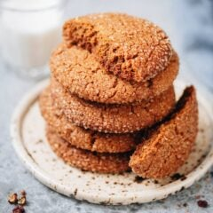

---
tags:
  - dish:dessert
  - context:holiday
---
<!-- Tags can have colon, but no space around it -->

# Sichuan Peppercorn Gingersnap Cookies

<!-- Serves has to be a single number, no dashes, but text is allowed after the
number (e.g., 24 cookies) -->
- Serves: 16 cookies
{ #serves }
<!-- Time is not parsed, so anything can be input here, and additional
values can be added (e.g., "active time", "cooking time", etc) -->
- Time: 30 min
- Date added: 2025-12-22

## Description
These spice and molasses-forward gingersnap cookies have a warm flavor, citrusy aroma, and numbing tingling heat of Sichuan peppercorn. They are quite bold and make a perfect holiday edible gift.

## Ingredients { #ingredients }

<!-- Decimals are allowed, fractions are not. For ranges, use only a single dash
and no spaces between the numbers. -->
### Cookie dough
- 2 cups all-purpose flour
- 1.5 teaspoons baking soda
- 2 teaspoons freshly ground Sichuan peppercorns (*Footnote 1)
- 2 teaspoons ground ginger
- .25 teaspoon ground cloves
- 2 teaspoons ground cinnamon
- .5 teaspoon allspice
- .75 teaspoon salt
- .75 cup vegetable oil (or other neutral oil)
- 1 large egg
- .25 cup molasses
- 1 cup packed light brown sugar
### Topping
- .5 cup Demerara sugar
- 1 teaspoons coarsely ground Sichuan peppercorns

## Directions

<!-- If you have a direction that refers to a number of some ingredient, wrap
the number in asterisks and add `{.ingredient-num}` afterwards. For example,
write `Add 2 Tbsp oil to pan` as `Add *2*{.ingredient-num} to pan`. This allows
us to properly change the number when changing the serves value. -->
1. Preheat the oven to 375ºF (190ºC).
2. Mix dry ingredients: Whisk together flour, baking soda, Sichuan peppercorns, ground ginger, ground cloves, ground cinnamon, allspice, and salt in a medium sized bowl.
3. Mix wet ingredients: In a separate large bowl, combine vegetable oil, egg, molasses, and light brown sugar. Whisk together until smooth and the oil is fully incorporated. You should not see oil floating on the top of the bowl.
4. Form the cookie dough: Mix the dry ingredients into the wet, until no patches of dry remain and it forms a soft dough.
5. Mix the topping: Mix the Demerara sugar and 1 teaspoon Sichuan peppercorns together in a shallow bowl.
6. Shape cookies: Line two baking sheets with parchment paper. Scoop 2 tablespoons of dough, and roll it between your palms to make a ball. Roll the dough ball in the spiced sugar to coat on all sides, and place on the lined baking sheet, about 3” (7cm) apart. Press the cookie dough ball to flatten slightly.
7. Bake cookies: Bake for 8 to 10 minutes. Cookies will appear spread and crackly on top, and be barely set in center. It will firm up significantly once cooled off.
8. Rest and serve: Once baked, let the cookies cool off completely before serving.

## Notes

The quantity of Sichuan peppercorn you use will highly depend on the freshness of your Sichuan peppercorns. If using a high quality product that’s recently opened, follow the recipe and your cookies will have a very strong Sichuan peppercorn flavor. If the Sichuan peppercorns are less fresh, increase the amount to 1 tablespoon in the cookie dough, and use 2 teaspoons in the sugar topping. To judge the freshness of your Sichuan pepper, it should smell very strong and almost overwhelming if you place them close to your nose.

## Source

[Omnivore's Cookbook](https://omnivorescookbook.com/sichuan-peppercorn-gingersnap-cookies/#recipe)

## Comments
