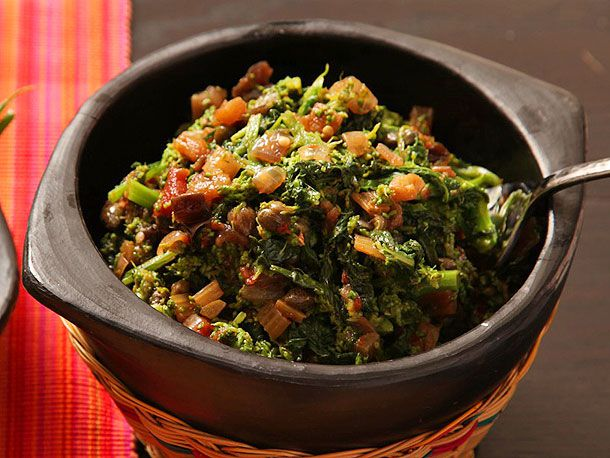

---
tags:
  - dish:sides
  - ingredient:broccoli rabe
  - cuisine:italian
---
<!-- Tags can have colon, but no space around it -->

# Sicilian-Style Broccoli Rabe With Eggplant and Capers Recipe

<!-- Serves has to be a single number, no dashes, but text is allowed after the
number (e.g., 24 cookies) -->
- Serves: 8
{ #serves }
<!-- Time is not parsed, so anything can be input here, and additional
values can be added (e.g., "active time", "cooking time", etc) -->
- Time: 50 min
- Date added: 2025-01-15

## Description
I don't think they really eat broccoli rabe like this in Sicily, but having recently returned from a week of gorging myself on everything I could find on that pretty and olive-oil soaked island, I can tell you that the flavors represented in this dish—the sweet and sour of vinegar and sugar, the butteriness of pinenuts and olive oil—is about as Sicilian as it gets. Plus, "Sicilian Style Sweet and Sour Broccoli Rabe" just sounds sexier than "Not-Sicilian Broccoli Rabe with Sicilian-ish Flavors," doesn't it?

The root of the dish is a basic caponata, the Sicilian relish of eggplants cooked down in olive oil, flavored with capers, celery, onions, vinegar, and sugar. You'll see it most often in the U.S. as a dip, whereas in Sicily, it's a small plate unto itself served at the beginning and throughout the meal.

Here, I'm instead changing up the ratios a bit, thinning it out a little, and using it as a sauce for broccoli rabe. The bitterness of broccoli rabe adds yet another dimension to the already flavor-packed sauce.
### Why It Works
- Vinegar, sugar, pinenuts, and olive oil create a dish that is balanced but very flavorful.
- Instead of the typical caponata that's used as a dip, here it's thinned out as a sauce for broccoli rabe.
## Ingredients { #ingredients }

<!-- Decimals are allowed, fractions are not. For ranges, use only a single dash
and no spaces between the numbers. -->

- 1 small eggplant, cut into 1/2-inch dice (about 1 quart)
- Kosher salt
- 6 tablespoons extra-virgin olive oil
- 1 medium onion, finely diced (about 1 cup)
- 2 stalks celery, finely diced (about 1/2 cup)
- 2 tablespoons tomato paste
- 3 tablespoons capers, rinsed, drained, and roughly chopped
- .25 cup golden raisins
- 2 tablespoons sugar
- 3 tablespoons red wine or balsamic vinegar
- 1 cup canned whole peeled tomatoes with their juice, chopped into 1/4-inch pieces
- Freshly ground black pepper
- 3 bunches (about 2 1/2 pounds) broccoli rabe, thick stems trimmed, cut into 3-inch lengths

## Directions

<!-- If you have a direction that refers to a number of some ingredient, wrap
the number in asterisks and add `{.ingredient-num}` afterwards. For example,
write `Add 2 Tbsp oil to pan` as `Add *2*{.ingredient-num} to pan`. This allows
us to properly change the number when changing the serves value. -->

1. Place eggplant on a large plate lined with a triple layer of paper towels or a clean kitchen towel. Season with salt. Top with another triple layer of paper towels or a clean kitchen towel. Top with another large plate. Microwave on high power until eggplant has lost most of its moisture and appears slightly shriveled, about 8 minutes.
2. Meanwhile, heat olive oil in a medium saucepan over medium-high heat until shimmering. Add onion and celery and cook, stirring frequently, until softened and translucent, about 8 minutes. Add eggplant and cook, stirring occasionally, until eggplant is starting to break down, about 5 minutes longer. Add tomato paste, capers, raisins, sugar, vinegar, and chopped tomatoes and stir to combine. Bring to a gentle simmer and cook, stirring occasionally, until reduced into a thick, stew-like consistency, about 20 minutes. Season to taste with salt and pepper. Set aside.
3. Bring a large pot of salted water to a boil. Add broccoli rabe and cook until tender, about 6 minutes. Drain in a colander and transfer to a large bowl. Add eggplant mixture and toss to combine. Season to taste with salt, pepper, and more vinegar or sugar as desired. Serve. 

## Notes

<!-- Delete section if no additional notes -->
Sweet and sour eggplant relish can be made ahead and stored in a sealed container in the refrigerator for up to 1 week. 
## Source

[Serious Eats](https://www.seriouseats.com/sicilian-style-broccoli-rabe-recipe)

## Comments

- 2025-01-15: delicious! I used pumpkin seeds instead of pine nuts.
