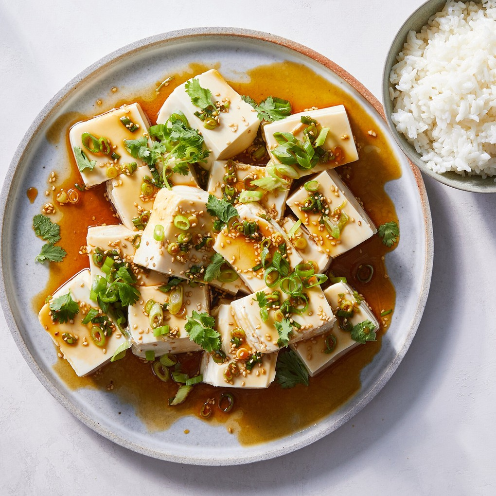

---
tags:
 - difficulty:easy
 - protein:tofu
 - context:summer vacation
 - dish:main
---

# Silken Tofu With Spicy Soy Dressing

- Serves: 4 servings
{ #serves }
- Working time: 5
- Waiting time: 0
- Date added: 2023-08-27

## Description

This recipe is inspired by the many cold silken tofu dishes from East Asia, like Japanese hiyayakko and Chinese liangban tofu. This no-cook dish is a handy one to have up your sleeve, especially for warm evenings when the desire to cook is nonexistent. Silky soft tofu is draped in a punchy soy dressing, creating a lively dish with little effort.

## Ingredients { #ingredients }

### For the dressing
- 0.25 cup soy sauce 
- 1.0 tablespoon rice vinegar 
- 1.0 tablespoon sesame oil 
- 1.0 tablespoon chile oil 
- 2.0 teaspoons granulated sugar 
- 1.0 tablespoon toasted white sesame seeds 
- 1.0 scallion (green and white parts, finely sliced)

### For the tofu
- 2.0 blocks silken tofu, cold (14-ounce)
- 1.0 scallion (green and white parts, thinly sliced)
- Handful of cilantro leaves 

## Directions

1. Make the dressing: Combine the soy sauce, rice vinegar, sesame oil, chile oil, sugar, sesame seeds and scallion in a small bowl. Whisk until the sugar has dissolved.  
2. Carefully drain the liquid from the package of tofu, and gently tip the block onto a kitchen towel. (Try to keep the block in one piece, if possible, but don’t worry if it falls apart; it will still taste great.) Pat with another clean kitchen towel, removing as much liquid as possible. Transfer the blocks to one large plate or two smaller plates, and spoon the soy dressing over the top until the tofu is completely covered. Top with scallions and cilantro leaves, and eat on its own or with rice or noodles on the side.

## Notes

The tofu is ideally served cold, but 10 minutes at room temperature can take the edge off. Make it your own with other fresh herbs such as Thai basil, mint or shiso leaves, or add crunch with fried shallots or roasted peanuts. A salty, fermented element like kimchi, pickled radish or ja choi, also known as zha cai, a Sichuan pickled mustard root, would work well, too. One block of silken tofu is usually enough to feed two people, but for a more substantial meal, serve it with hot rice or noodles to create a pleasing contrast of temperatures.

## Source

[NYTimes](https://cooking.nytimes.com/recipes/1022562-silken-tofu-with-spicy-soy-dressing)

## Comments
