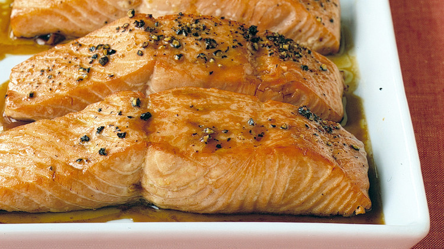

---
tags:
 - dish:main
 - protein:fish
 - ingredient:salmon
 - difficulty:easy
 - context:entertaining
---

# Soy-Glazed Salmon

- Serves: 4 
{ #serves }
- Working time: 30
- Date added: 2023-10-19

## Description

This tasty, simple salmon recipe is from Anne Ford, of Palo Alto, California.

## Ingredients { #ingredients }

- 0.25 cup packed light-brown sugar 
- 0.25 cup olive oil 
- 3.0 tablespoons soy sauce 
- 2.0 tablespoons fresh lemon juice 
- 2.0 tablespoons dry white wine (or water)
- 2.0 pounds salmon fillet 
- Lemon wedges (for serving)

## Directions

1. Preheat oven to 400 degrees. with a rack in the center. Make the glaze: In a small bowl, stir brown sugar, olive oil, soy sauce, lemon juice, and white wine until the sugar has dissolved.
2. Cut salmon fillet into 4 equal-size pieces; arrange, skin side down, in a single layer in a baking dish. Pour glaze over the fish, and turn to coat evenly.
3. Bake until fish is opaque but still bright pink inside, basting every few minutes with glaze from baking dish, 15 to 20 minutes. Serve with lemon wedges.

## Source

[Martha Stewart](https://www.marthastewart.com/314009/soy-glazed-salmon)

## Comments
