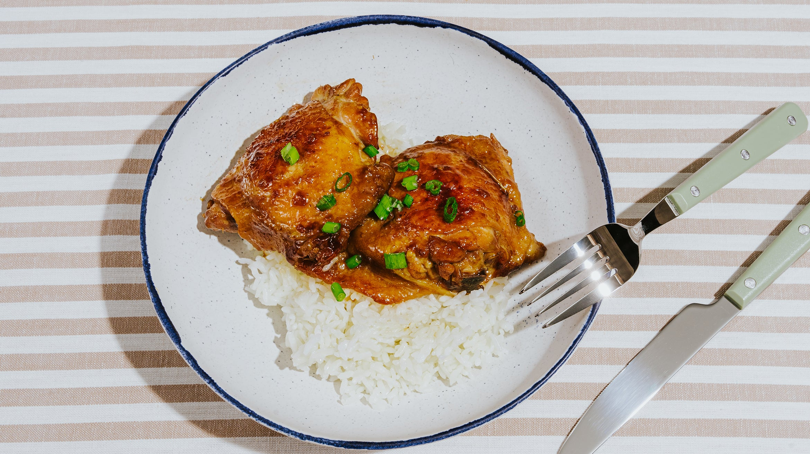

---
tags:
  - dish:main
  - protein:chicken
  - difficulty:easy
---
<!-- Tags can have colon, but no space around it -->

# Sticky Soy-Coconut Chicken

<!-- Serves has to be a single number, no dashes, but text is allowed after the
number (e.g., 24 cookies) -->
- Serves: 4
{ #serves }
<!-- Time is not parsed, so anything can be input here, and additional
values can be added (e.g., "active time", "cooking time", etc) -->
- Time: 45 min
- Date added: 2025-03-11

## Description

This soy-coconut chicken takes inspiration from two sticky-sweet meat dishes: Cambodian braised pork belly and Vietnamese caramelized chicken. The result? Tender, coconut-infused meat covered in a glossy coating of rich salty-sweet sauce. While it cooks, the chicken is left partially covered, which allows the liquid to reduce to a syrupy consistency that can better cling to the meat. There is a relatively small amount of liquid used in this recipe, so it’s important to turn the chicken every 5 to 10 minutes to help it soak up as much of the flavorful sauce as possible. Take note that the skin on this chicken won’t be crispy—instead, it should be lightly sticky and full of flavor. Use a well-seasoned cast iron or carbon steel skillet, which will prevent sticking and help keep the chicken skin intact—you’ll be grateful, since the skin is arguably the best part.

## Ingredients { #ingredients }

<!-- Decimals are allowed, fractions are not. For ranges, use only a single dash
and no spaces between the numbers. -->

- 2 lb bone-in, skin-on chicken thighs
- Kosher salt
- 1 tbsp neutral oil, such as peanut or canola
- 1 sm shallot, thinly sliced
- 3 to 4 cloves garlic, finely minced
- 2 to 3 Thai chiles, thinly sliced
- .5 coconut milk (or use one 5.4 or 5.6 ounce can)
- 2 tbsp dark brown sugar
- 1 tbsp soy sauce
- 1 tbsp fish sauce 

## Directions

<!-- If you have a direction that refers to a number of some ingredient, wrap
the number in asterisks and add `{.ingredient-num}` afterwards. For example,
write `Add 2 Tbsp oil to pan` as `Add *2*{.ingredient-num} to pan`. This allows
us to properly change the number when changing the serves value. -->

1. Pat the chicken dry and lightly salt both sides. Heat a 10-inch cast iron skillet over medium-high heat. When the pan is hot, add the oil, then add the chicken thighs skin side down. Let the chicken cook for about 5 minutes per side or until well browned, then remove to a plate.
2. Drain all but about 2 tablespoons of the rendered fat from the pan, then add in the shallots, chiles, and garlic. Cook, stirring frequently, until the shallots soften and begin to turn golden brown around the edges.
3. Add the coconut milk, brown sugar, soy sauce, and fish sauce to the pan and stir to combine, then nestle the chicken into the pan (it doesn’t matter if it’s skin side up or down). Once the liquid in the pan comes to a boil, reduce the heat to a lively simmer and partially cover the pan. Continue cooking, flipping the chicken every 5 or so minutes, for about 30 minutes, or until the sauce is thick and syrupy and a thermometer inserted into the thickest part of the chicken registers about 180°F. If the sauce reduces too much before the chicken is done, add a splash of water and keep cooking until the desired internal temperature is reached.

## Notes

<!-- Delete section if no additional notes -->

- As the sauce cooks down and water evaporates, the mixture will eventually break (or separate). This is expected! We’re not aiming for a creamy sauce here; instead the goal is a sticky sauce that coats the chicken. What’s left in the pan will be very oily, and while a small amount is delicious drizzled over the finished chicken and rice, some may prefer to simply enjoy the chicken and leave the excess sauce in the pan.
- For a less fatty dish, feel free to swap in an equal amount of coconut water for the coconut milk. The final product will be slightly less coconutty but no less delicious.

## Source

[TASTE](https://tastecooking.com/recipes/sticky-soy-coconut-chicken/)

## Comments

- 2025-03-11: delicious! took a little bit longer than called for
