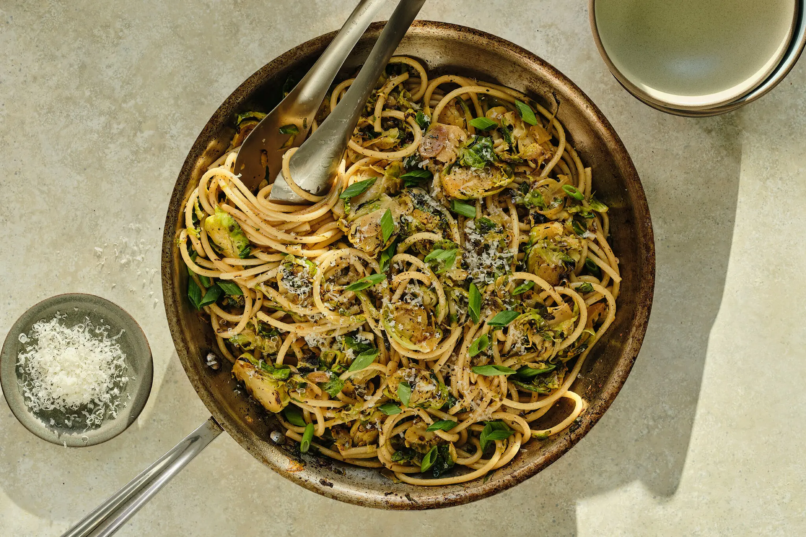

---
tags:
  - dish:main
  - ingredient:brussels sprouts
  - ingredient:cabbage
  - ingredient:pasta
  - difficulty:easy
---
<!-- Tags can have colon, but no space around it -->

# Soy Sauce and Brown Butter Brussels Sprouts Pasta

<!-- Serves has to be a single number, no dashes, but text is allowed after the
number (e.g., 24 cookies) -->
- Serves: 4
{ #serves }
<!-- Time is not parsed, so anything can be input here, and additional
values can be added (e.g., "active time", "cooking time", etc) -->
- Time: 30 min
- Date added: 2026-03-22

## Description
With cues from wafu pasta, the Japanese-style style of cooking that brings together global and Japanese flavors, this indulgent weeknight dish delivers a powerful umami kick thanks to the combination of butter and soy sauce. Maximize the potential of butter by browning it to produce a headier sauce with nutty notes; adding soy sauce produces a caramel-like richness. A stainless steel skillet, or one with a light colored cooking surface, is preferred so you have a visual cue of the milk solids darkening. Slicing the brussels sprouts helps them cook quickly, while also giving more surface area and edges for browning. This is an adaptable recipe, so it is possible to add other or more vegetables to balance the richness of the buttery soy sauce; mushrooms, spinach, kale and broccoli are all good options. 

## Ingredients { #ingredients }

<!-- Decimals are allowed, fractions are not. For ranges, use only a single dash
and no spaces between the numbers. -->
- Salt and pepper
- 1 tablespoon extra-virgin olive oil
- 1 pound brussels sprouts, trimmed and thinly sliced 
- 2 garlic cloves, thinly sliced 
- 1 pound long pasta, such as spaghetti or bucatini
- 8 tablespoons unsalted butter, cut into 1-inch chunks
- 3 tablespoons soy sauce
- 2 scallions, white and green parts separated, thinly sliced
- Grated Parmesan, for serving

## Directions

<!-- If you have a direction that refers to a number of some ingredient, wrap
the number in asterisks and add `{.ingredient-num}` afterwards. For example,
write `Add 2 Tbsp oil to pan` as `Add *2*{.ingredient-num} to pan`. This allows
us to properly change the number when changing the serves value. -->
1. Bring a large pot of salted water to a boil over high.
2. Heat a 12-inch skillet (preferably stainless steel, or one with a light colored cooking surface, so you can monitor the butter as it browns) on medium-high. When hot, drizzle with olive oil and then add the brussels sprouts and garlic. Season with salt and pepper and cook, stirring frequently, until the brussels sprouts are tender and caramelized around the edges, 6 to 7 minutes.
3. Scrape the brussels sprouts into a bowl, ensuring that the skillet is as clean as possible. (You may need to rinse or wipe it out, but take care, as the pan will be very hot.)
4. Add the pasta to the boiling water and cook according to the package instructions until al dente. Drain and reserve ½ cup of pasta cooking water.
5. Place the skillet back on medium-high heat. Add the butter, swirling the pan to encourage it to melt. Once it has melted, continue swirling gently, until the milk solids turn a deep golden brown and smell nutty; this should only take 4 to 6 minutes. Remove immediately from the heat and allow it to cool for 1 minute. Very carefully drizzle in the soy sauce (it may sizzle) and add the white parts of the scallions. Stir to lift any burnt bits stuck to the pan. 
6. Add the pasta and the Brussels sprouts to the soy sauce-brown butter, along with 2 to 3 tablespoons of pasta cooking water, and place on medium heat, tossing until the strands are well coated, about 2 minutes. 
7. To serve, place the pasta into serving bowls, and season generously with pepper. Top with grated Parmesan and the green parts of the scallions.

## Source

[NYTimes](https://cooking.nytimes.com/recipes/765830983-soy-sauce-and-brown-butter-brussels-sprouts-pasta)

## Comments

- 2026-03-22: really good, replaced brussels with cabbage
