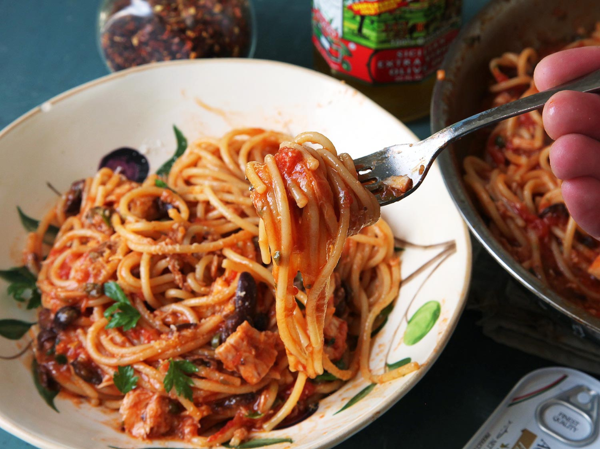

---
tags:
  - ingredient:pasta
  - difficulty:easy
  - cuisine:italian
---
# Spaghetti puttanesca

- Serves: 2
{ #serves }
- Time: 15 minutes
- Date added: 2023-11-01

## Ingredients { #ingredients }

- .5 pound (225g) dried spaghetti
- Kosher salt
- 6 tablespoons (90ml) extra-virgin olive oil, divided
- 4 medium cloves garlic, thinly sliced or finely chopped by hand (see note)
- 4 to 6 anchovy fillets, finely chopped (1 .5 to 2 tablespoons; 20–30ml chopped anchovy)
-  Large pinch red pepper flakes
- .25 cup capers, drained and chopped (about 2 ounces; 60g) (see note)
- .25 cup chopped pitted black olives (about 2 ounces; 60g) (see note)
- 1 cup (225g) whole peeled tomatoes, preferably San Marzano, roughly broken up by hand (about half a 14 ounce can)
- Small handful minced fresh parsley leaves
- 1 ounce (30g) finely grated Pecorino Romano or Parmesan cheese, plus more for serving
- Freshly ground black pepper
- 1 (5-ounce; 140g) can oil-packed tuna (optional)

## Directions

1.  Place spaghetti in a large skillet, sauté pan, or saucepan and cover with water. Add a small pinch of salt. Bring to a boil over high heat, stirring occasionally to prevent pasta from sticking.
2.  Meanwhile, in a medium skillet, combine *4*{.ingredient-num} tablespoons oil, garlic, anchovies, and red pepper flakes. Cook over medium heat until garlic is very lightly golden, about 5 minutes. (Adjust heat as necessary to keep it gently sizzling.) Add capers and olives and stir to combine.
3.  Add tomatoes, stir to combine, and bring to a bare simmer. Continue to simmer until pasta is cooked to just under al dente (about 1 minute less than the package recommends).
4. Using tongs, transfer pasta to sauce. Alternatively, drain pasta through a colander, reserving *1*{.ingredient-num} cup of the cooking water. Add drained pasta to sauce.
5.  Add a few tablespoons of pasta water to sauce and increase heat to bring pasta and sauce to a vigorous simmer. Cook, stirring and shaking the pan and adding more pasta water as necessary to keep sauce loose, until pasta is perfectly al dente, 1 to 2 minutes longer. (The pasta will cook more slowly in the sauce than it did in the water.) Stir in remaining olive oil, parsley, and cheese.
6.  Season with salt and pepper. (Be generous with the pepper and scant with the salt—the dish will be plenty salty from the other ingredients.) If using, stir in canned tuna and break it up with a fork. Serve immediately with more grated cheese at the table.

## Source

[Serious Eats](https://www.seriouseats.com/recipes/2016/02/spaghetti-puttanesca-pasta-week-capers-olives-anchovies-recipe.html)

## Comments

Total comments: 0

