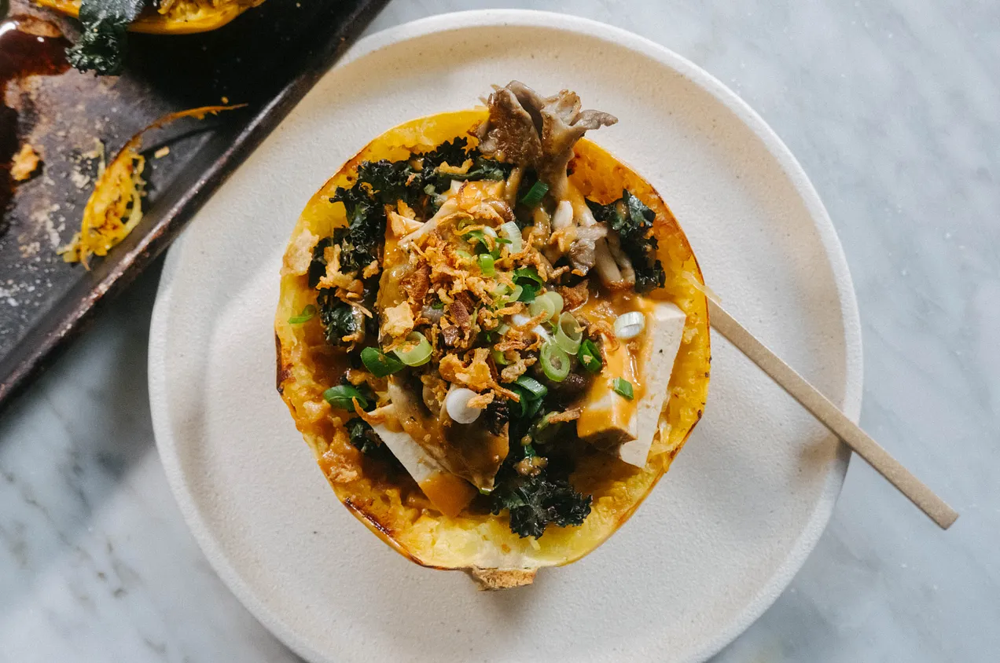

---
tags:
  - dish:main
  - protein:tofu
  - ingredient:winter squash
---
<!-- Tags can have colon, but no space around it -->

# Spaghetti squash with tofu, mushrooms and sweet peanut sauce 

<!-- Serves has to be a single number, no dashes, but text is allowed after the
number (e.g., 24 cookies) -->
- Serves: 2
{ #serves }
<!-- Time is not parsed, so anything can be input here, and additional
values can be added (e.g., "active time", "cooking time", etc) -->
- Date added: 2024-01-10

## Description

For this recipe, I wanted to serve the “spaghetti” strands in the squash shell, and load it up with many delicious things. I chose kale, mushrooms and tofu to hammer home heartiness. After scraping the strands away from the bottom and sides of the squash, treat them as you would any ingredient and season them – a little salt and black pepper goes a long way. I go the extra mile and add some of the peanut sauce to the strands, tossing it through before adding the toppings. This makes a huge difference to this dish.

## Ingredients { #ingredients }

<!-- Decimals are allowed, fractions are not. For ranges, use only a single dash
and no spaces between the numbers. -->

- 1 medium (about 800g / 1.75 pounds) spaghetti squash (see notes for substitution)
- extra virgin olive oil
- sea salt and black pepper
- 1 bunch kale, leaves removed
- 225g (8 ounces) mushrooms such as oyster, torn or sliced
- 200g baked tofu (store bought), sliced into strips
- 2 scallions, trimmed and finely sliced
- handful of crispy fried onions/shallots

### Sweet peanut sauce
- 90g (.33 cup) smooth peanut butter
- 80ml (.33 cup) just-boiled water, or more to loosen
- 1 garlic clove, finely chopped or grated
- .5 teaspoon red chilli flakes
- 1.5 tablespoons kecap manis (or 1 tablespoon soy sauce with 1 teaspoon sugar)
- .5 teaspoon sea salt

## Directions

<!-- If you have a direction that refers to a number of some ingredient, wrap
the number in asterisks and add `{.ingredient-num}` afterwards. For example,
write `Add 2 Tbsp oil to pan` as `Add *2*{.ingredient-num} to pan`. This allows
us to properly change the number when changing the serves value. -->

1. Preheat oven to 400˚F / 200˚C.
2. Using a sharp knife, cut the spaghetti squash in half lengthwise (through the stalk). Drizzle the cut side with a little olive oil and season with a little sea salt and black pepper. Turn the squash over and poke a few holes into the skin using a fork (this allows for even cooking). Bake until the skin is lightly browned on the outside and a fork inserts easily into the skin and flesh, about 30-40 minutes (it is okay if it is still a bit firm; the time will vary depending on the size of your squash).
3. Meanwhile, heat a skillet (frying pan) on medium high heat. Add a drizzle of olive oil and the kale, and season with a little sea salt and black pepper. Cook, turning every now and then, until the leaves are wilted and started to get crispy, about 3-4 minutes. Remove from the pan and set aside.
4. In the same pan, add a little more olive oil, along with the mushrooms. Season with a touch of salt and black pepper and leave to cook, undisturbed until golden, about 2-3 minutes. Flip them over and cook the other side.
5. To make peanut sauce, combine the peanut butter, garlic, red pepper (chili) flakes, kecap manis and salt in a small bowl and slowly whisk in the hot water. If the mixture separates, whisk in a touch more water which will bring it back together.
6. Remove the spaghetti squash from the oven and flip it over so it’s cut side up. Using a fork, scrape the flesh to loosen the strands from the bottom and sides. Season the strands with a touch of salt and black pepper and add 1-2 tablespoons of the peanut sauce. Toss the squash to coat with the sauce. Top the squash spaghetti with kale, tofu, mushrooms and then drizzle over more of the peanut sauce. Top with scallions and crispy fried onions/shallots.

## Notes

<!-- Delete section if no additional notes -->

Alternative ways to serve dish:
- Roast honeynut, acorn or butternut squash in the same way, increasing or decreasing cooking time depending upon the size (meaning, cut them in half, season, and roast them cut side down). If your squash is a similar weight to the spaghetti squash in my recipe (about 800g / 1 ¾ pounds), about 30-40 minutes should do it. Simply press the skin of your squash with your finger and if it gives in easily, it’s ready. Once tender, rough up the flesh of your squash with a fork and then layer in the ingredients in the same way. The flesh will not be strands, but more like a mash.
- Stuff a whole baked potato or sweet potato! Pretty much same theory as above but with a large starchy potato (such as russet).
- You could slice thick “steaks” from a cauliflower, drizzle with olive oil, season with sea salt and black pepper and then roast them at 400˚F / 200˚C for 25–30 minutes, until the cauliflower steaks are golden on the outside and tender on the inside. Pile the kale, mushrooms and tofu and peanut sauce on top.
- Simply take rice noodles, rice or even sticky rice, and top with the the kale, mushrooms and tofu and peanut sauce.

## Source

[To Vegetables with Love](https://tovegetableswithlove.substack.com/p/spaghetti-squash-with-crispy-tofu)

## Comments

- 2024-01-10: made this with acorn squash and it was delicious!
