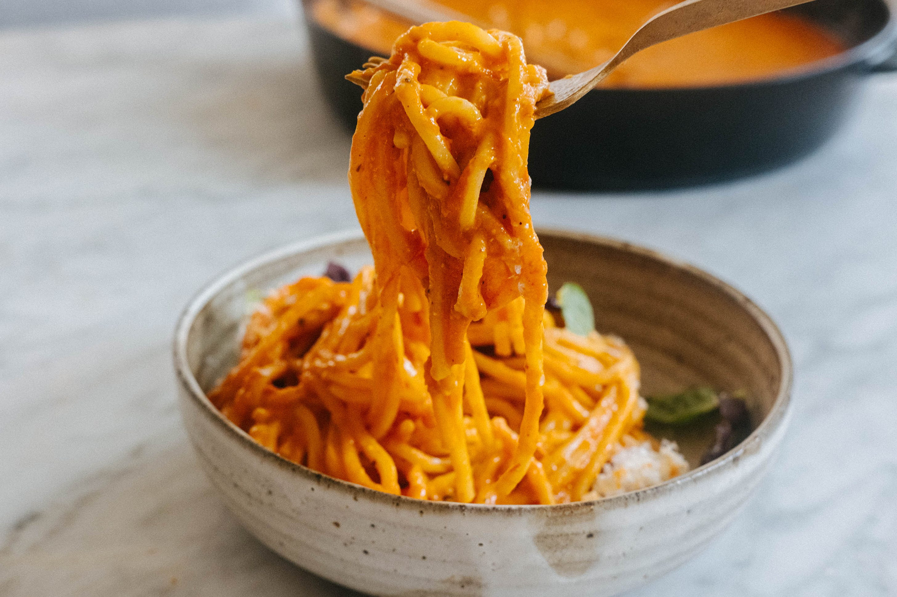

---
tags:
  - dish:main
  - ingredient:pasta
---

# Spaghetti with Roasted Tomato Miso Sauce

- Serves: 4
{ #serves }
- Date added: 2023-10-17

## Description
 
This recipe uses a good amount of tomatoes and that is the reason the flavors are so deep. Nik’s little twist of miso is a deft touch, bringing that vital suggestion of 'something different' that keeps us coming back for more. Miso provides an instantaneous source of umami and balances out the taste of the sauce rather wonderfully. It also helps thicken the sauce.

## Ingredients { #ingredients }

- 3 lb [1.4 kg] cherry or grape tomatoes
- .5 cup [120 ml] extra-virgin olive oil
- 1 lb [455 g] dried spaghetti
- 4 garlic cloves, grated
- 2 tsp red pepper flakes such as Aleppo, Maras, or Urfa
- .25 cup [40 g] white or yellow miso paste
- .25 cup [15 g] grated Parmesan 
- torn fresh basil leaves

## Directions

1. Preheat the oven to 400°F [200°C].
2. On a baking sheet, toss *3*{ .ingredient-num } lb  cherry or grape tomatoes with *.25*{ .ingredient-num } cup extra-virgin olive oil and roast until the tomatoes start to burst and turn a light golden brown, rotating the pan halfway through cooking, 25 to 30 minutes. Remove from the oven and transfer the tomatoes with the juices to a blender or food processor. Pulse on high speed into a smooth purée.
3. While the tomatoes roast, cook the pasta. Bring a large pot of salted water to a boil and cook *1*{ .ingredient-num } lb dried spaghetti until al dente, per the package instructions. Drain the cooked pasta and transfer to a large bowl.
4. In a medium saucepan, warm *.25*{ .ingredient-num } cup  extra-virgin olive oil over medium heat. Add grated garlic cloves and red pepper flakes such as Aleppo, Maras, or Urfa and swirl in the hot oil until fragrant and the oil starts to turn red, 30 to 45 seconds. Remove from the heat and whisk in ¼ cup [40 g] white or yellow miso paste. Stir in the puréed tomatoes until smooth and free of lumps. Return the saucepan to the stove, bring to a boil over high heat, then turn down the heat to low and simmer until the sauce thickens, 2 to 3 minutes. Taste and season with fine sea salt. Remove from the heat.
5. Fold the spaghetti with the tomato sauce. Garnish with ¼ cup [15 g] grated Parmesan and torn fresh basil leaves. Leftovers can be stored in an airtight container in the refrigerator for up to 4 days.

## Notes

<!-- Delete section if no additional notes -->

- Roasting the tomatoes helps concentrate their flavors and makes them taste sweeter. The color of the sauce will vary depending on the color of the tomatoes you use, but that won’t affect the final taste.
- You can opt for a hot­ter red pepper here, but I prefer a much gentler heat.

## Source

Nik Sharma's Veg-Table, via [To Vegetables, With Love](https://tovegetableswithlove.substack.com/p/spaghetti-with-roasted-tomato-miso)

## Comments
