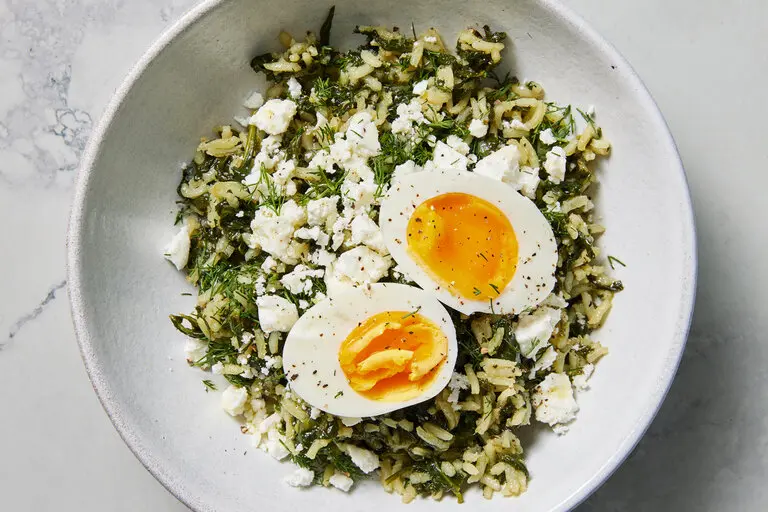

---
tags:
  - dish:main
  - protein:eggs
  - difficulty:easy
---
<!-- Tags can have colon, but no space around it -->

# Spanakorizo With Jammy Eggs

<!-- Serves has to be a single number, no dashes, but text is allowed after the
number (e.g., 24 cookies) -->
- Serves: 4
{ #serves }
<!-- Time is not parsed, so anything can be input here, and additional
values can be added (e.g., "active time", "cooking time", etc) -->
- Time: 30 min
- Date added: 2024-07-14

## Description
Bright and soulful, spanakorizo is a beloved Greek dish, with a name that reflects its combination of two key ingredients: spinach and rice. This version is fairly traditional in its essence, relying upon rice, spinach, lemon and herbs, but includes some flourishes. Though the addition of the jammy egg is not traditional, it injects a sunny burst of color, as well as added protein. For ease, this recipe calls for baby spinach (or chopped mature spinach), but frozen spinach can also be used (simply thaw it and squeeze out the water), or try a hardy green like chard or kale. A whole bunch of scallions delivers a richly aromatic base for the rice. Basmati is used here for its quick cooking time and light finish, but if you would like to use more traditional medium-grain rice, simply add an extra ½ cup of stock (2 cups total). As with any recipe, the timing is a guideline, but you should use your senses: Check your rice at the 15-minute mark, as some brands of rice will cook quicker than others.

## Ingredients { #ingredients }

<!-- Decimals are allowed, fractions are not. For ranges, use only a single dash
and no spaces between the numbers. -->
- 3 tablespoons extra-virgin olive oil, plus more for serving
- 1 bunch scallions (6 to 9 stems), trimmed and thinly sliced
- 1 pound baby spinach (or 1 pound mature spinach, trimmed and roughly chopped)
- 2 garlic cloves, finely chopped
- Salt and pepper
- 1 cup basmati rice
- 1.5 cups vegetable stock
- 4 large eggs
- 1 lemon, juiced (3 to 4 tablespoons)
- 1 cup roughly chopped dill or parsley
- 1 (6-ounce) block Greek feta, crumbled (about 1⅓ cups)

## Directions

<!-- If you have a direction that refers to a number of some ingredient, wrap
the number in asterisks and add `{.ingredient-num}` afterwards. For example,
write `Add 2 Tbsp oil to pan` as `Add *2*{.ingredient-num} to pan`. This allows
us to properly change the number when changing the serves value. -->
1. Heat a large, wide Dutch oven or deep skillet on medium-high heat. Add the olive oil and scallions and stir until fragrant and softened, 2 minutes. Add the spinach (depending upon the size of your pot, you may need to add it gradually, throwing in more as it cooks down), garlic and about 1 teaspoon salt; toss until wilted, about 2 minutes.
2. Stir in the rice, then pour in the stock. Bring to the boil and then cover, reduce heat to medium-low and simmer until the liquid has been absorbed and rice is cooked, 15 to 20 minutes.
3. Meanwhile, bring a medium pot of water to a boil over high. Add the eggs in their shells to the boiling water and continue to cook over medium-high for 7 minutes. (Make sure you set a timer.) Set up an ice bath. Using a spider ladle or slotted spoon, remove the eggs from the water and immediately add them to the ice bath. Cool for 3 to 4 minutes and then peel them.
4. When the rice is ready, turn off the heat. Uncover and add the lemon juice and half of the herbs and gently toss them through the rice. Taste to check seasonings, adding salt if needed.
5. Divide the spinach rice among bowls. Halve the eggs and place the halves on top of the rice; top each with feta and additional herbs. To finish, drizzle over some olive oil and season well with pepper.

## Source

[NYTimes](https://cooking.nytimes.com/recipes/1025232-spanakorizo-with-jammy-eggs)

## Comments

- 2024-07-14: this was tasty and easy. I used a mix of fennel fronds, parsley, and mint for the herbs, and mixed half in with the spinach.
