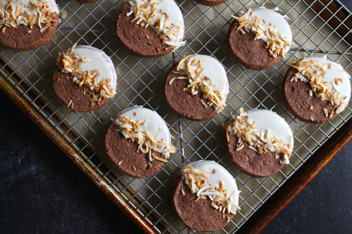

---
tags:
  - dish:dessert
  - context:holiday
---
<!-- Tags can have colon, but no space around it -->

# Asha's Spiced Cacao Cookies with Coconut Glaze

<!-- Serves has to be a single number, no dashes, but text is allowed after the
number (e.g., 24 cookies) -->
- Serves: 12 cookies
{ #serves }
<!-- Time is not parsed, so anything can be input here, and additional
values can be added (e.g., "active time", "cooking time", etc) -->
- Time: 1 hour
- Date added: 2025-12-22

## Description
Calling all holiday bakers—it's cookie szn! These glazed, shortbread-like cookies are an ode to the Anamalai Estate, where Diaspora Co.'s cacao, nutmeg and mace are grown. Another crop found in abundance on the farm is coconuts—and, you know what they say, what grows together goes together! 

The Anamalai Cacao Powder's high cocoa butter content gives it an almost milk chocolate quality (without the dairy, of course), pairing beautifully with the rich, earthy notes of the nutmeg, warming cinnamon, fragrant Baraka Cardamom and cloves. This recipe makes 12 cookies, but if you're baking for gifting, the recipe can easily be doubled.
## Ingredients { #ingredients }

<!-- Decimals are allowed, fractions are not. For ranges, use only a single dash
and no spaces between the numbers. -->
### For the spiced cacao cookies
- 1 cup all-purpose flour
- .25 cup Anamalai Cacao Powder 
- .5 teaspoon kosher salt
- .5 teaspoon ground Peni Miris Cinnamon
- .25 teaspoon ground Baraka Green Cardamom
- .25 teaspoon freshly grated Anamalai Nutmeg
- .125 teaspoon ground Kandyan Cloves
- 4 ounces (1 stick) unsalted butter, softened
- .25 cup granulated white sugar
- .25 cup light brown sugar
- 1 teaspoon vanilla extract
### For the coconut glaze and garnish
- 1 cup powdered confectioner’s sugar
- 2 – 3.5 tablespoons unsweetened coconut milk
- .5 cup unsweetened shredded coconut, toasted

## Directions

<!-- If you have a direction that refers to a number of some ingredient, wrap
the number in asterisks and add `{.ingredient-num}` afterwards. For example,
write `Add 2 Tbsp oil to pan` as `Add *2*{.ingredient-num} to pan`. This allows
us to properly change the number when changing the serves value. -->

1. In a medium bowl, combine the flour, cacao powder, salt, cinnamon, cardamom, nutmeg and cloves. Mix well and set aside.
2. In a large bowl, combine the butter, white sugar and brown sugar. Using an electric mixer, cream the butter and sugar until light and fluffy, about 4–6 minutes. Add the vanilla and continue to beat for another 30 seconds.
3. Scrape down the sides of the bowl with a spatula and then add the dry ingredients, mixing on low until combined. Turn the dough out onto a large piece of plastic wrap. Fold the plastic wrap over the dough and form into a log about 2 inches in diameter and 6 inches long. Refrigerate for 2 hours to overnight.
4. Preheat the oven to 325°F. Line a baking sheet with parchment paper and set aside.
5. Remove the cookie dough from the fridge. Unwrap and using a sharp knife, slice into 1/2-inch thick rounds, turning the log slightly with each slice (this will help keep a round shape as you cut). Place the cookies about 1-inch apart on the baking sheet. Bake until cooked through, about 13–15 minutes.
6. Remove the cookies from the oven and let cool on the tray for 5 minutes and then transfer them to a cooling rack and let sit until completely cooled.
7. To make the glaze, mix the powdered sugar and 2 tablespoons of coconut milk in a small bowl. The glaze should be thick and pourable. If the glaze is too thick, add the remaining coconut milk a teaspoon at a time until you reach the desired consistency.
8. To glaze the cookies, hold one cookie over the bowl of glaze and spoon the glaze over one half of the cookie, letting the excess glaze fall back in the bowl. Keep spooning the glaze over the cookie until there is an even layer of glaze on half of the cookie. Place back on the cooling rack and sprinkle a line of toasted coconut down center edge of the glaze. Repeat with the remaining cookies and then let sit until the glaze sets, about 1–2 hours.

## Source

[Diaspora Co](https://www.diasporaco.com/blogs/recipes/ashas-spiced-cacao-cookies-with-coconut-glaze)

## Comments

- 2025-12-22: really good, should have made more
