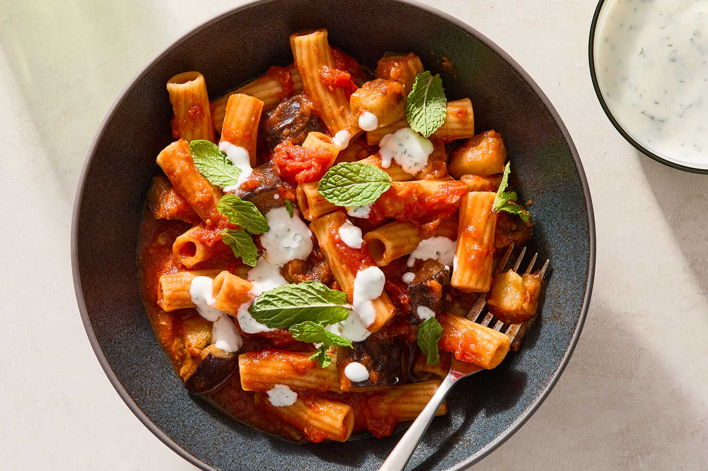

---
tags:
  - dish:main
  - ingredient:pasta
  - difficulty:easy
---
<!-- Tags can have colon, but no space around it -->

# Spiced Tomato and Eggplant Pasta

<!-- Serves has to be a single number, no dashes, but text is allowed after the
number (e.g., 24 cookies) -->
- Serves: 4
{ #serves }
<!-- Time is not parsed, so anything can be input here, and additional
values can be added (e.g., "active time", "cooking time", etc) -->
- Time: 45 min
- Date added: 2026-04-08

## Description
This Afghan-Italian mashup, from my cookbook “Third Culture Cooking” (Abrams, 2025), is inspired by the beloved Italian pasta alla Norma and Afghan borani banjan; both feature tender eggplant in a spiced tomato sauce. While the technique mirrors a classic pasta alla Norma, the flavors here steer closer to borani banjan, which is made with earthy spices and typically served with yogurt over top to add a fresh, bright balance to the richly spiced stewed eggplant. The marriage of these inspirations results in a spectacular, satisfying vegetarian pasta that tastes like it took hours to make (and it can easily be prepped ahead; see Tips). The yogurt may feel unorthodox, but paired with the hearty pasta and sauce, its punch adds a welcome balance.

## Ingredients { #ingredients }

<!-- Decimals are allowed, fractions are not. For ranges, use only a single dash
and no spaces between the numbers. -->
- Kosher salt, such as Diamond Crystal
- .33 cup plus 2 tablespoons olive oil, divided
- 1 large eggplant (about 1¼ pounds), cut into 1-inch cubes
- 6 garlic cloves, finely grated, divided
- 2 teaspoons ground cumin
- 2 teaspoons ground coriander
- .5 teaspoon crushed red pepper
- 3 tablespoons tomato paste, preferably double-concentrated 
- 1 (28-ounce) can whole peeled San Marzano tomatoes (see Tips)
- 1 cup plain whole-milk yogurt
- 3 tablespoons finely chopped mint (or dill), plus leaves for serving
- 1 pound rigatoni pasta, or another large pasta shape

## Directions

<!-- If you have a direction that refers to a number of some ingredient, wrap
the number in asterisks and add `{.ingredient-num}` afterwards. For example,
write `Add 2 Tbsp oil to pan` as `Add *2*{.ingredient-num} to pan`. This allows
us to properly change the number when changing the serves value. -->
1. Bring a large pot of salted water to a boil.
2. Heat *.33*{.ingredient-num} olive oil in a large heavy-bottomed pot or skillet over medium heat. Add eggplant and *1*{.ingredient-num} teaspoon salt. Cook, stirring occasionally, until eggplant is softened and golden brown, 8 to 10 minutes. Transfer to a bowl.
3. Add remaining *2*{.ingredient-num} tablespoons of olive oil to the same pot. Add ⅔ of the finely grated garlic (about *4*{.ingredient-num} cloves’ worth), the cumin, coriander and crushed red pepper. Cook to toast the spices, 15 to 30 seconds. Add tomato paste and cook, stirring often, until darker in color, about 3 minutes.
4. Add whole peeled tomatoes (including liquid), *.5*{.ingredient-num} cup water and *1*{.ingredient-num} teaspoon salt and stir, scraping the bottom of the pot. Using a wooden spoon, crush the tomatoes until the sauce is mostly smooth. Bring to a boil over high heat, then reduce heat and simmer until sauce comes together, about 20 minutes.
5. In the meantime, make the yogurt sauce by combining the yogurt, finely chopped mint, remaining garlic (about *2*{.ingredient-num} cloves’ worth) and *.5*{.ingredient-num} salt. Taste and adjust the seasoning, then chill until ready to serve.
6. Cook the pasta in the salted boiling water until 2 minutes less than al dente. Reserve 1 cup pasta water, then drain pasta.
7. Add eggplant to the tomato sauce and continue to cook until eggplant is tender and warmed through, another 3 to 5 minutes. Transfer cooked pasta to sauce along with a ladle of reserved pasta water. Stir to coat and continue cooking until pasta is al dente, 2 minutes. Taste for salt and adjust to your preference.
8. Divide pasta among bowls and top with 1 to 2 tablespoons of the yogurt sauce and some more fresh mint leaves.

## Notes

<!-- Delete section if no additional notes -->
- Use a 28-ounce can of crushed tomatoes instead of whole peeled tomatoes if you cannot find San Marzano whole peeled tomatoes.
- Do Ahead: Eggplant and garlic can be prepared ahead, stored separately in airtight containers, and refrigerated for up to 3 days. Eggplant can be sautéed up to 3 days in advance and stored in an airtight container in the refrigerator. Sauce can be entirely prepared up to 3 days in advance and stored in an airtight container in the refrigerator, or frozen for up to 3 months; thaw in the refrigerator overnight and reheat on the stovetop before adding pasta and pasta water. The mint yogurt can be prepared, without the salt, up to 2 days in advance, stored in an airtight container, and refrigerated until ready to serve; season with salt before serving.

## Source

[NYTimes](https://cooking.nytimes.com/recipes/1027681-spiced-tomato-and-eggplant-pasta)

## Comments
