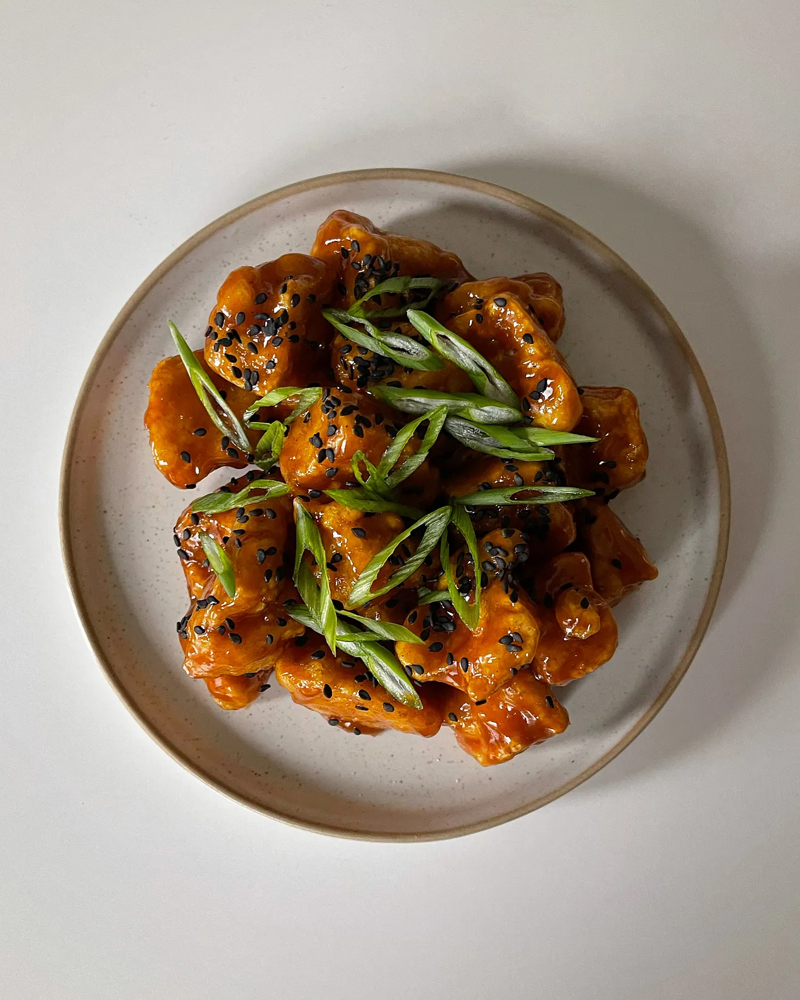

---
tags:
  - dish:main
  - protein:tofu
  - difficulty:easy
---
<!-- Tags can have colon, but no space around it -->

# Sticky sesame tofu

<!-- Serves has to be a single number, no dashes, but text is allowed after the
number (e.g., 24 cookies) -->
- Serves: 2
{ #serves }
<!-- Time is not parsed, so anything can be input here, and additional
values can be added (e.g., "active time", "cooking time", etc) -->
- Date added: 2023-09-25

## Description

If it ain’t broke, don’t fix it — that’s what this tofu recipe is to me. It’s my forever go-to foolproof sticky tofu. At this point, I could probably make this in my sleep. It all comes down to the technique, which is mainly just tearing the tofu pieces by hand instead of slicing or chopping. If you’ve got good time management skills, you could freeze the block of tofu overnight and let it thaw on the counter for 6 hours before squeezing the water out. This will give you crispier tofu because you’re maximizing how much water you can squeeze out of it. I don’t mention this in the actual recipe because not everyone remembers to thaw frozen tofu — it’s not actually necessary to eat this; it’s just a preference. These measurements are purely for guidance, so if you’re more confident in the kitchen, feel free to mix things up with the seasoning. I like a little bit of heat, so adding a couple teaspoons of gochujang is perfect. I usually eat this tofu with rice and smashed cucumbers seasoned with Lao Gan Ma chilli crisp at least once a week.

## Ingredients { #ingredients }

- 1 block (350g) extra-firm tofu
- 2 garlic cloves, grated
- .33 cup cornstarch, plus more if needed
- .25 cup water
- 3 tablespoons soy sauce
- 2 tablespoons honey or maple syrup
- 1 tablespoon sesame oil
- 2 teaspoons gochujang
- Kosher salt to taste
- Sesame seeds and sliced scallions for garnish
- Neutral oil

## Directions

1. Drain the excess liquid from the tofu by gently pressing it down using a clean tea towel or paper towel. Tear the tofu apart into 1-inch pieces using your hands. This will create natural crevices, helping the tofu have more texture.
2. Add the cornstarch to a large mixing bowl, then add the tofu pieces and toss them together until each piece is coated with the cornstarch.
3. Combine the grated garlic, soy sauce, honey, sesame oil, gochujang, a teaspoon of cornstarch, salt to taste, and water in a small bowl. Stir together until combined.
4. Heat oil in a heavy-bottomed skillet over medium-high, using just enough oil to cover the bottom of the pan. Once the oil is hot enough (use a wooden spoon or chopstick to check if the oil bubbles around it), gently add the coated tofu pieces into the pan by working with one at a time. Fry each side for 5 to 7 minutes or until golden brown and crispy, then remove them from heat using a kitchen spider or strainer. Transfer the cooked tofu in a bowl.
5. Lower the heat, then add the sauce to the pan, stirring constantly to ensure a smooth consistency. The sauce should coat the spoon. Add a bit more water if the sauce is too thick, and stir. At this point, feel free to taste the sauce and adjust the seasoning. Once the sauce is ready, add the tofu and toss everything together until each piece of tofu is coated in the sauce.
6. Remove the sticky tofu from the heat, then garnish with sesame seeds and sliced scallions. Serve with rice and enjoy while hot.

## Source

[Kitchen gems](https://kitchengems.substack.com/p/sticky-sesame-tofu)

## Comments
