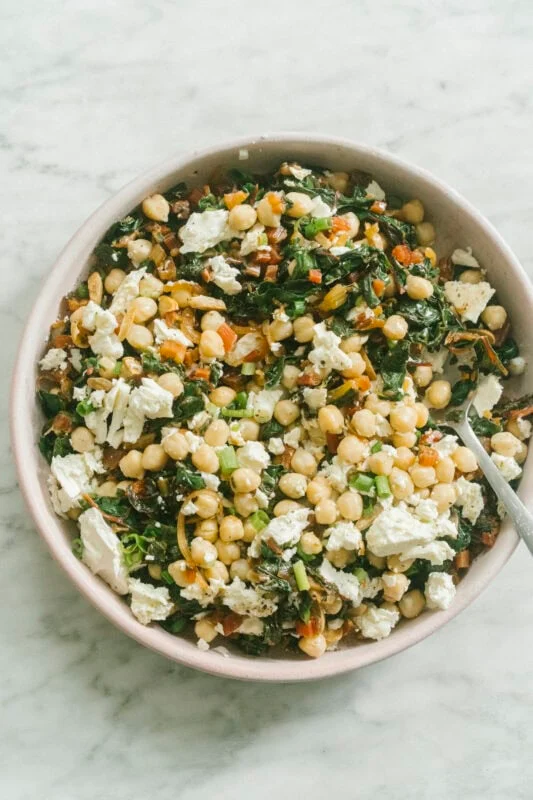

---
tags:
  - dish:main
  - protein:chickpeas
  - ingredient:chard
---
<!-- Tags can have colon, but no space around it -->

# Lemony Swiss chard with chickpeas and feta

<!-- Serves has to be a single number, no dashes, but text is allowed after the
number (e.g., 24 cookies) -->
- Serves: 4
{ #serves }
<!-- Time is not parsed, so anything can be input here, and additional
values can be added (e.g., "active time", "cooking time", etc) -->
- Time: 30 min
- Date added: 2026-07-07

## Description
A big bowl of lemony greens, with earthy chickpeas and salty cheese (a vegan one works great). This is a wonderful stand alone dish (add another can of chickpeas if you’d like it heartier) but it can also be used as a foundation for pasta, grains or rice.

I like chard with lemon. It tempers the intense mineral taste of the leaves, earthy and metallic. Lemon brightens, but also deepens. For the same reason, I add a teaspoon of cumin seeds too (or use ground variety), because their nutty citrus notes makes chard taste like itself.

## Ingredients { #ingredients }

<!-- Decimals are allowed, fractions are not. For ranges, use only a single dash
and no spaces between the numbers. -->
- 1 bunch Swiss or rainbow chard, washed and stem ends trimmed
- extra virgin olive oil
- 1 brown/yellow onion, halved and thinly sliced
- 2 garlic cloves, finely chopped
- 1 teaspoon cumin seeds or ground cumin
- sea salt and black pepper
- 2 tablespoons lemon juice (from 1 lemon), plus more to serve
- 1 fifteen-ounces / 425g can chickpeas, drained
- 200 g vegan or dairy feta, crumbled
- 2 scallions, thinly sliced
- toasted almonds, for topping

## Directions

<!-- If you have a direction that refers to a number of some ingredient, wrap
the number in asterisks and add `{.ingredient-num}` afterwards. For example,
write `Add 2 Tbsp oil to pan` as `Add *2*{.ingredient-num} to pan`. This allows
us to properly change the number when changing the serves value. -->
1. Separate the leaves from the chard stem. Keeping them separate, thinly slice the stems and roughly chop the leaves.
2. Heat a medium skillet (frying pan) on medium high. Drizzle with 1 tablespoon of oil and add the onion. Stir and cook until slightly softened and starting to turn golden, 2 to 3 minutes. Add the chard stems, garlic and cumin, 1/2 teaspoon of salt and lots of black pepper and toss for 2 minutes. Pile in the chard leaves, as many as will fit into the pan, drizzle the leaves with a bit more oil and season with 1/2 teaspoon of salt and more black pepper and toss until the leaves have reduced. Add the remaining leaves and toss until the leaves have completely wilted, 5 to 6 minutes. Turn off heat and add 2 tablespoons of lemon juice and stir to combine.
3. Transfer the chard to a serving bowl or plate. Add the chickpeas, feta, scallions and toss to combine. Squeeze over some more lemon juice (to your taste), season with a little salt and more black pepper and drizzle over some olive oil. To finish, top with almonds. Serve as is, with bread on the side, or toss through pasta or rice.

## Source

[Hetty McKinnon](https://hettymckinnon.com/recipe/lemony-swiss-chard-with-chickpeas-and-feta/)

## Comments

- 2026-07-07: made this with lentils and served with quinoa, which worked really well!
