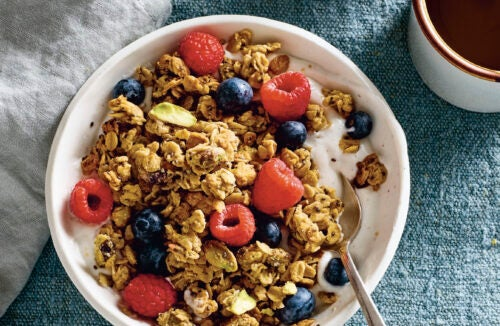

---
tags:
  - dish:pantry
  - ingredient:oats
---
<!-- Tags can have colon, but no space around it -->

# Tahini Pistachio Granola

<!-- Serves has to be a single number, no dashes, but text is allowed after the
number (e.g., 24 cookies) -->
- Serves: 4
{ #serves }
<!-- Time is not parsed, so anything can be input here, and additional
values can be added (e.g., "active time", "cooking time", etc) -->
- Time: 30 min
- Date added: 2025-06-08

## Description
The reward-to-effort ratio of making your own granola is ever in your favor: All you have to do is stir and bake, and you’ll start to resent boxed granola’s one-note sweetness and muted crunch. Homemade granola is crackly, fresh, and exactly the way you like it.

But even among other simple, rewarding granola recipes, this one from Jenné Claiborne, author of the book and blog Sweet Potato Soul, stands out. It calls for less stirring, shorter baking, and fewer ingredients than most—you won’t even need oil, since the fat from ground sesame seeds in the Middle Eastern cooking staple tahini adds all the crisping power you need. I start thinking about it the second I wake up.
## Ingredients { #ingredients }

<!-- Decimals are allowed, fractions are not. For ranges, use only a single dash
and no spaces between the numbers. -->
- .5 cup well-stirred tahini
- .33 maple syrup
- 1 tsp vanilla extract
- .25 tsp fine sea salt
- 2 c old-fashioned rolled oats
- .5 c to 1 cup shelled raw pistachios (or another nut or pepitas)
- 2 tbsp chia seeds 

## Directions

<!-- If you have a direction that refers to a number of some ingredient, wrap
the number in asterisks and add `{.ingredient-num}` afterwards. For example,
write `Add 2 Tbsp oil to pan` as `Add *2*{.ingredient-num} to pan`. This allows
us to properly change the number when changing the serves value. -->

1. Stir everything together: Heat the oven to 350°F (175°C) with a rack in the center. Line a sheet pan with a silicone baking mat or parchment paper. In a large mixing bowl, stir together the tahini, maple syrup, vanilla, and salt with a silicone spatula until it’s smooth and evenly combined. Stir in the oats, pistachios, and chia seeds.
2. Bake the granola: Spread the wet, sticky oats onto the sheet pan in a thin, even layer. Bake for 10 minutes, then, using oven mitts, take the pan out of the oven and stir the granola—this will help it finish baking evenly. Return the pan to the oven and bake until the granola is dry and golden brown, another 5 to 10 minutes. Keep a close eye toward the end to make sure it doesn’t start to burn at the edges.
3. Eat: Let the granola cool completely to crisp up, about 20 minutes, before breaking it into clumps with your hands. Eat with your favorite yogurt or milk, in a smoothie bowl or parfait (a handy on-the-go breakfast in a jar), or by the handful as a snack.
4. Store: The granola keeps well in a sealed container at room temperature for at least a week, or as long as it lasts.
5. Great with: Blueberries, plain yogurt, a little olive oil, and a pinch of salt.

## Source

[TASTE](https://tastecooking.com/recipes/tahini-pistachio-granola/)

## Comments

- 2025-06-08: made with pepitas and poppy seeds, delicious
