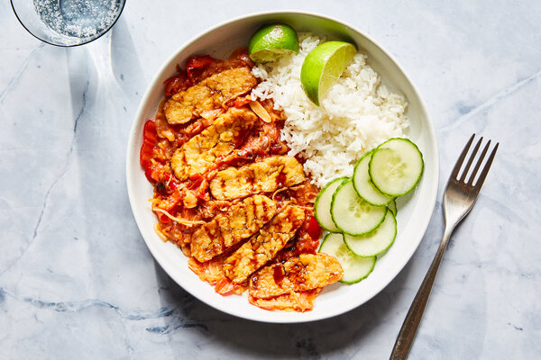

---
tags:
 - dish:main
 - protein:tempeh
 - cuisine:indonesian
---

# Tempe Penyet (Smashed Tempeh With Sambal)

- Serves: 4 servings
{ #serves }
- Working time: 30
- Waiting time: 0
- Date added: 2024-01-15

## Description

Tempe penyet is a famous street food in Indonesia, especially common on the island of Java, where tempeh originated. “Penyet” means “to smash” or “to flatten” in Indonesian, and the technique ensures that every crack and crevice of this fried tempeh is penetrated by the sambal it is smashed upon.

## Ingredients { #ingredients }

- 4.0 garlic cloves (peeled and minced)
- 2.0 teaspoons ground coriander 
- 1.25 teaspoons Fine sea salt 
- 16.0 ounces/455 grams tempeh (cut into .25-inch-by-2.5-inch slices)
- 0.25 cup canola oil (plus more as needed)
- 0.25 cup canola oil 
- 4.0 medium tomatoes (halved and thinly sliced)
- 7.0 medium shallots (peeled and sliced)
- 10.0long (red, medium-spicy chiles (such as serrano, red finger or cayenne), deseeded and sliced)
- 7.0 garlic cloves (peeled and sliced)
- 0.25 teaspoon Fine sea salt 
- 1.0 tablespoon fresh lime juice (preferably from makrut lime (calamansi or Key lime), plus lime wedges for serving)
- 1.0 to 2 tablespoons kecap manis (see Tip)
- Steamed jasmine rice 
- 0.5 medium English cucumber (thinly sliced)

## Directions

1. This version pan-fries the tempeh for ease, rather than deep-frying it, as is traditional. (If you prefer deep-frying, fry for 5 to 6 minutes in 350-degree oil until golden.) Caramelize the shallot, tomato and chile sambal until it browns and slightly chars, adding wonderful flavor and chewy-crispy bits. A drizzle of kecap manis, an Indonesian sweet soy sauce infused with spices, balances the dish with a savory-sweetness.

2. Marinate the tempeh: In a large bowl or resealable freezer bag, combine the garlic, coriander and 1 teaspoon salt with .75 cup plus 2 tablespoons water. Add the tempeh and massage the marinade into all the pieces. Set aside while you make the sambal.

3. Prepare the sambal: Heat .25 cup oil in a large skillet over high. Once the oil is shimmering, add the tomatoes, shallots, chiles and garlic. Cook for 20 minutes, stirring the ingredients every so often. When the shallots begin to brown slightly after 10 to 15 minutes, reduce the heat to medium as the sambal continues to caramelize. Cook the sambal, stirring often, until it has caramelized and reduced and the tomatoes have softened, with a few crispy, browned bits, around 5 minutes. The sambal should not be burned, however, so regulate the heat as needed. Remove from the heat and season with .25 teaspoon salt. (This makes about 1 .5 cups, and will keep in the fridge for up to 1 week.)

4. While the sambal cooks, pan-fry the tempeh: Carefully remove the tempeh from the marinade and set it in a colander to drain excess liquid. Heat .25 cup oil in a large nonstick skillet over high. When the oil is shimmering, but not smoking, add the tempeh to the pan in a single layer using tongs. Be careful, as the oil will spit because of the water in the marinade. Fry for 2 to 3 minutes on each side, or until golden and crispy all over. You may need to fry in batches, adding extra oil as needed. Transfer the tempeh to a paper towel-lined baking sheet to drain; season with .25 teaspoon salt.

5. To serve, transfer the sambal to serving plates. Lay the tempeh on top of the sambal. Using a pestle, rolling pin or wooden spoon, gently flatten each piece of tempeh, massaging it into the sambal. The idea is to gently create small cracks and crevices where the tempeh meets the sambal so they can combine, rather than completely destroying the tempeh. Squeeze lime juice over the tempeh pieces, then drizzle kecap manis on top. Serve with steamed white rice, slices of cucumber and extra wedges of lime.

## Source

[NYTimes](https://cooking.nytimes.com/recipes/1022382-tempe-penyet-smashed-tempeh-with-sambal)

## Comments
