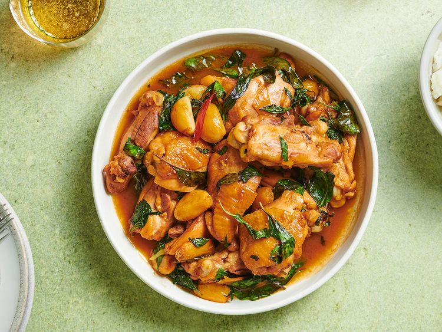

---
tags:
  - dish:main
  - protein:chicken
  - cuisine:chinese
---
<!-- Tags can have colon, but no space around it -->

# Three Cup Chicken

<!-- Serves has to be a single number, no dashes, but text is allowed after the
number (e.g., 24 cookies) -->
- Serves: 4
{ #serves }
<!-- Time is not parsed, so anything can be input here, and additional
values can be added (e.g., "active time", "cooking time", etc) -->
- Time: 25 min
- Date added: 2025-07-18

## Description
What its name doesn't give away, however, is that Three Cup Chicken also gets its intense flavor from heaps of whole garlic cloves and big rounds of ginger, fried in the sesame oil until golden-brown. When your chicken's added, they continue to cook until soft and sweet, mingling with sugar that's been added to the braising liquids. Toward the end of cooking, the whole dish is showered liberally with fresh basil leaves—the telltale sign that it's Taiwanese, although the dish has roots in Southern China. When it's ready to serve, the reddish-stained chicken is crowded with the soft, tender garlic cloves and lightly candied ginger, coated with a slightly reduced sauce, and peppered with herbs. It really is an exercise in over-abundance, and the result proves just what a good thing that can be. 
### Why it works
- The bold and flavorful cooking liquid is incredibly easy, made from equal parts soy sauce, sesame oil, and rice wine.
- By cooking the garlic and ginger in the oil first, then adding the chicken and cooking liquid, the entire dish can be made quickly in just one skillet or wok.
- Two options for cutting up the chicken allow you to choose between a more traditional version (with the chicken cut into 3-inch, bone-in pieces), or a more home-cook-friendly version (with the drumsticks left whole and the thighs cut in half along—but not through—the bone).

## Ingredients { #ingredients }

<!-- Decimals are allowed, fractions are not. For ranges, use only a single dash
and no spaces between the numbers. -->

- .25 cup Asian sesame oil (*not* toasted sesame oil)
- 1 (1-inch) piece fresh ginger, peeled and thinly sliced into rounds
- 12-15 medium garlic cloves, peeled
- 1-2 fresh Thai red chiles, stemmed and halved
- 2 pounds skin-on chicken drumsticks, thighs, and/or wings, either chopped into 3-inch, bone-in pieces, or thighs halved along along the bone, wings split at the joint, and drumsticks left whole
- .5 cup rice wine
- .25 cup soy sauce
- 1 tablespoon sugar
- 2 cups fresh Thai basil leaves (from 1 large bunch)
- Steamed white rice, for serving

## Directions

<!-- If you have a direction that refers to a number of some ingredient, wrap
the number in asterisks and add `{.ingredient-num}` afterwards. For example,
write `Add 2 Tbsp oil to pan` as `Add *2*{.ingredient-num} to pan`. This allows
us to properly change the number when changing the serves value. -->

1. Heat sesame oil in a large skillet or wok over medium-high heat until shimmering. Add ginger, garlic, and chiles and cook until very fragrant, about 1 minute.
2. Add chicken pieces to the skillet in a single layer and cook, tilting the pan if necessary to submerge all pieces in the oil, for 1 minute. Flip chicken pieces and cook for 1 minute longer.
3. Add rice wine, soy sauce, and sugar and bring to a boil, stirring to dissolve the sugar. Reduce heat to a simmer. Partially cover the skillet to prevent splashes of oil and cook, turning the chicken pieces every few minutes, until the chicken is cooked through, about 15 minutes. Stir in Thai basil and remove from heat. Serve immediately with rice. 

## Source

[Serious Eats](https://www.seriouseats.com/taiwanese-three-cup-chicken-san-bei-gi-recipe)

## Comments

- 2025-07-18: delicious. I used canola oil instead of sesame, and then mixed in 2 Tbsp toasted sesame oil at the end
