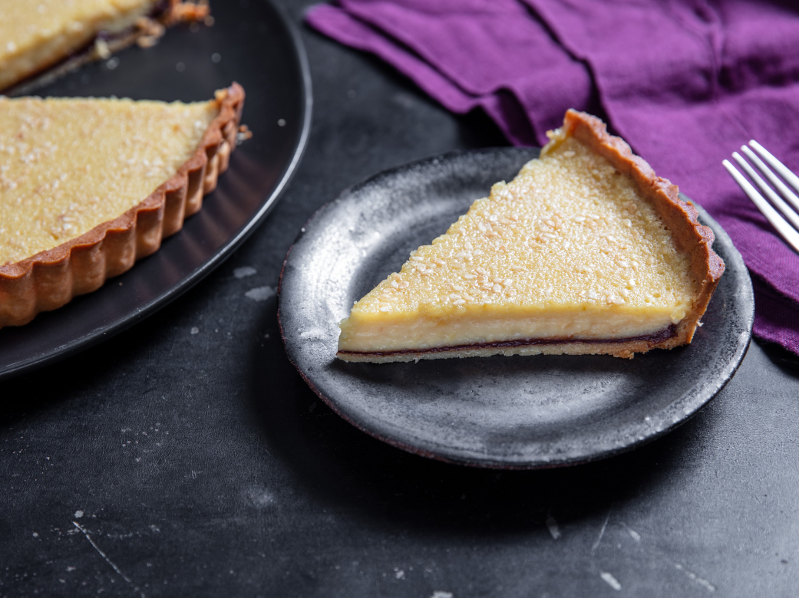

---
tags:
  - dish:dessert
---
# Toasted White Sesame Tart with Bittersweet Chocolate Ganache

- Serves: 1 tart
{ #serves }
<!-- Time is not parsed, so anything can be input here, and additional
values can be added (e.g., "active time", "cooking time", etc) -->
- Time: 60 min
- Date added: 2024-08-04

## Description
This rich tart pairs a smooth and creamy toasted white sesame custard with a bittersweet chocolate ganache and packages it in a crisp, cookie-like crust for a welcome addition to any holiday table. 

## Ingredients { #ingredients }

### For the Ganache:
- 2 ounces bittersweet chocolate, about 60%, chopped (.333 cup; 60g)
- 2 ounces (.25 cup; 60g) heavy cream
- .5 recipe [pâte sucrée](https://www.seriouseats.com/pate-sucree-tart-shell-recipe), blind-baked per directions (1 pie shell)

### For the Custard:
- 1 ounce toasted white sesame seeds (.25 cup; 30g), plus more for sprinkling on top
- 2 ounces granulated sugar (.25 cup; 60g), plain or toasted
- 1.5 teaspoons all-purpose flour, such as Gold Medal
- .5 teaspoon Diamond Crystal kosher salt; for table salt, use half as much by volume
- 2 ounces (4 tablespoons; 60g) unsalted butter, melted
- .5 ounce (1 tablespoon; 15g) honey
- .5 ounce (1 tablespoon; 15g) tahini paste
- 1 teaspoon vanilla extract
- 1 large egg (1 .75 ounces; 50g)
- 1 large egg yolk (.75 ounce; 20g)
- 2 ounces (.25 cup; 60g) sour cream
- 6 ounces (.75 cup; 170g) heavy cream

## Directions

1. Adjust oven rack to center position and preheat oven to 325°F (163°C).

### Ganache

2. Place chocolate in a small, heatproof bowl. In a 1-quart stainless steel saucier, heat cream over medium-high heat until it has reached a simmer and started to bubble hard around the edges. Immediately pour hot cream over chocolate and let stand 1 minute. Using a spoon, stir until smooth.
3. Using the same spoon, scrape the ganache into the blind-baked tart shell. Using the back of the spoon, spread ganache in a smooth, even layer that covers the inside bottom of tart shell.
4. Transfer tart shell to a rimmed baking sheet and place in the freezer until ganache is firm, about 10 minutes.

### Custard
5. In a blender or spice grinder, process sesame seeds until coarsely powdered, about 5 seconds.
6. In a medium bowl, whisk together powdered sesame seeds, granulated sugar, all-purpose flour, and salt.
7. Add melted butter, honey, tahini paste, and vanilla extract to dry ingredients. Whisk until thoroughly combined.
8. Whisk in egg and egg yolk, followed by sour cream, until mixture is smooth with no visible lumps.
9. Whisk in heavy cream until well combined.
10. Remove baking sheet from freezer and place on a level surface. Pour custard into prepared tart shell, then sprinkle sesame seeds evenly on top. Carefully transfer baking sheet with filled tart shell to oven. Bake until custard is slightly puffed at the edges and the center is just set, about 35 minutes.
11. Set baking sheet with finished tart on a wire rack to cool to room temperature, about 1 hour. Slice and serve.

## Source

[Serious Eats](https://www.seriouseats.com/recipes/2020/11/toasted-white-sesame-tart-chocolate-ganache.html)

## Notes

- The custard can be prepared ahead of time and then refrigerated in an airtight container for up to 24 hours. When you are ready to bake the tart, remove the custard from the refrigerator and whisk well before pouring into the prepared tart shell. 
- Covered with foil or plastic, the tart will keep for up to 1 day at room temperature. 

## Comments

 - 2024-08-04: this was really good! made with Greek yogurt instead of sour cream, which still worked well
