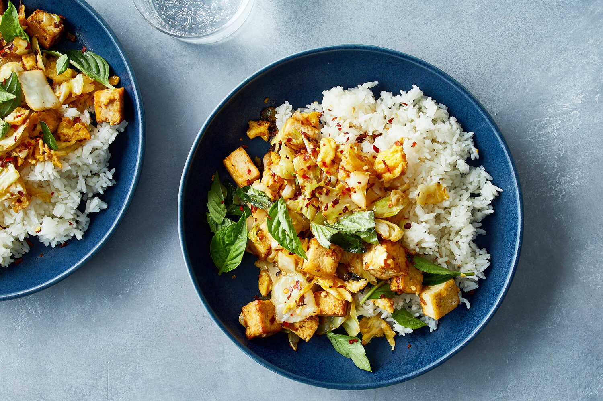

---
tags:
  - dish:main
  - protein:tofu
  - ingredient:basil
  - ingredient:cabbage
  - difficulty:easy
---
<!-- Tags can have colon, but no space around it -->

# Tofu and Cabbage Stir-Fry With Basil

<!-- Serves has to be a single number, no dashes, but text is allowed after the
number (e.g., 24 cookies) -->
- Serves: 4
{ #serves }
<!-- Time is not parsed, so anything can be input here, and additional
values can be added (e.g., "active time", "cooking time", etc) -->
- Time: 25 min
- Date added: 2026-03-22

## Description

Tofu and cabbage make ideal partners in a stir-fry, bringing contrasting soft and crisp textures. For best results, the tofu is pan-fried until golden, then stirred in at the end to maintain its shape and preserve its creamy texture. Scrambled eggs add fluffy bites, while fresh basil perfumes and brightens the dish. The hot mustard sauce complements the caramelized cabbage. Green cabbage is used here, but Napa or Savoy varieties are fantastic alternatives.

## Ingredients { #ingredients }

<!-- Decimals are allowed, fractions are not. For ranges, use only a single dash
and no spaces between the numbers. -->
- .25 cup neutral oil, such as safflower or canola
- 1 (14-ounce to 16-ounce) package firm tofu, drained and cut into ½-inch cubes
- Kosher salt (such as Diamond Crystal) and black pepper
- 1 tablespoon jarred hot mustard (such as Colman’s or Ka-Me)
- 1 tablespoon low-sodium soy sauce
- 2 tablespoons minced garlic (from 6 cloves)
- 2 large eggs, beaten
- 1 pound green cabbage (from ½ large cabbage), chopped into 1-inch pieces (6 cups)
- 1 tablespoon minced fresh ginger
- .25 cup chopped or torn basil, plus more for garnish
- A few pinches red-pepper flakes (optional)
- Steamed rice, for serving

## Directions

<!-- If you have a direction that refers to a number of some ingredient, wrap
the number in asterisks and add `{.ingredient-num}` afterwards. For example,
write `Add 2 Tbsp oil to pan` as `Add *2*{.ingredient-num} to pan`. This allows
us to properly change the number when changing the serves value. -->
1. In a 12-inch nonstick skillet, heat 2 tablespoons of the oil over medium. Add tofu, season with salt and pepper and cook, stirring occasionally, until tofu is lightly golden in spots, about 5 minutes.
2. While the tofu cooks, in a small bowl, combine the mustard and soy sauce; stir until smooth.
3. Once the tofu is golden in spots, stir in 1 tablespoon of the garlic until well incorporated, then push the tofu to one side of the skillet.
4. Add eggs to the empty side of the skillet and allow them to set a little before stirring. Once the eggs are scrambled, stir them into the tofu mixture. Transfer tofu mixture to a large plate. Wipe out skillet.
5. In the skillet, heat the remaining 2 tablespoons oil over medium. Add cabbage, season with salt and pepper and cook, stirring occasionally, until lightly charred and softened, about 8 minutes. Add ginger and the remaining 1 tablespoon garlic and stir until fragrant, 1 minute.
6. Stir in the mustard sauce and cook, stirring occasionally, until all of the sauce has been absorbed, about 2 minutes. Fold in the tofu-egg mixture. Turn off the heat and stir in the basil and red-pepper flakes, if using.
7. Transfer the stir-fry to shallow bowls and garnish with additional basil. Serve with rice.

## Source

[NYTimes](https://cooking.nytimes.com/recipes/1023475-tofu-and-cabbage-stir-fry-with-basil)

## Comments

- 2026-03-22: really good, made with dijon instead of the spicy mustard
