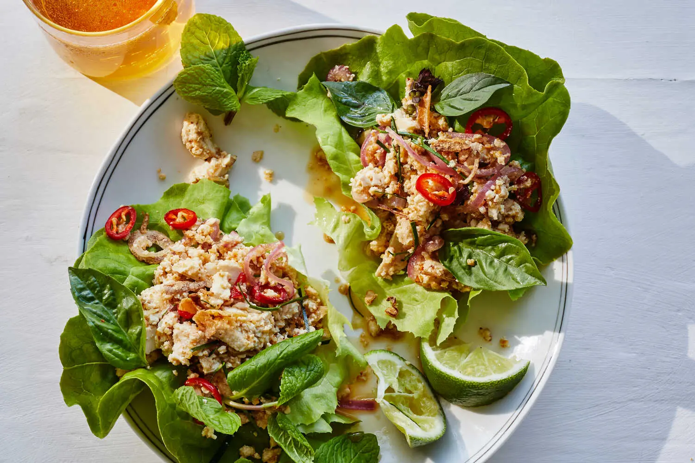

---
tags:
  - dish:main
  - protein:tofu
  - cuisine:thai
---
<!-- Tags can have colon, but no space around it -->

# Tofu laab

<!-- Serves has to be a single number, no dashes, but text is allowed after the
number (e.g., 24 cookies) -->
- Serves: 3
{ #serves }
<!-- Time is not parsed, so anything can be input here, and additional
values can be added (e.g., "active time", "cooking time", etc) -->
- Time: 20 min
- Date added: 2025-06-02

## Description

Laab (also spelled larb), a ground meat dish seasoned with fresh herbs popular in the Northeastern and Northern regions of Thailand, originated in Laos. This vegan version requires minimal cooking and features crumbled extra-firm tofu, which soaks up the spicy, citrusy sauce like a sponge. Toasted ground rice is a traditional addition that adds a lovely aroma and nuttiness while thickening the sauce. Makrut lime leaves and crispy fried shallots can be found at Asian grocery stores, at some larger supermarket chains, or online, but both can be omitted. Crispy shallots bring a bit of crunch on top, but chopped, roasted peanuts would also work. Eat it with lettuce leaves for a light meal, or if you’re looking for something more substantial, serve it with sticky or regular rice. For those who are looking for even more spice, top with sliced fresh chiles.

## Ingredients { #ingredients }

<!-- Decimals are allowed, fractions are not. For ranges, use only a single dash
and no spaces between the numbers. -->
- 3 tablespoons uncooked glutinous (sticky) or jasmine rice
- 2 (14-ounce) packages extra-firm tofu, drained and patted dry
- 1 tablespoon neutral oil, such as grapeseed or vegetable
- 1 lemongrass stem, outer layer removed, tender stem finely chopped
- 1 shallot, halved and thinly sliced
- 4 makrut lime leaves (optional), thinly sliced
- 1 cup mixed soft herbs, such as mint, Thai basil, basil, cilantro and chopped scallions
- 1 teaspoon kosher salt, plus more as needed
- 1 head butter lettuce, leaves separated
- .25 cup store-bought crispy fried shallots or onions

### For the Dressing
- 4 tablespoons fresh lime juice (from about 2 limes)
- 3 tablespoons dark or light brown sugar
- 2 tablespoons soy sauce or tamari
- .5 teaspoon red-pepper flakes or ½ to 1 red chile, such as bird’s eye, finely chopped

## Directions

<!-- If you have a direction that refers to a number of some ingredient, wrap
the number in asterisks and add `{.ingredient-num}` afterwards. For example,
write `Add 2 Tbsp oil to pan` as `Add *2*{.ingredient-num} to pan`. This allows
us to properly change the number when changing the serves value. -->
1. Make the toasted rice powder: Heat a medium (10-inch) skillet over medium-high. Add the rice and stir constantly for 4 to 6 minutes until golden, with a nutty aroma. Transfer rice to a mortar and pestle or spice grinder and grind until it is a coarse powder. (You don’t want it too fine; some texture is nice.) You should have about *3.5*{.ingredient-num} Tbsp. Set rice powder aside.
2. Make the dressing: In a small bowl, combine the lime juice, brown sugar, soy sauce and red-pepper flakes; whisk until the sugar is dissolved.
3. Crumble the tofu into small chunks and place in a large bowl.
4. Heat the medium skillet over medium-high and add *1*{.ingredient-num} tablespoon oil. Add the lemongrass and shallot and cook, stirring constantly, until softened and aromatic, about 2 minutes. Remove from heat and add to the tofu, along with the lime dressing, rice powder, makrut lime leaves, herbs and salt. Taste and add more salt if needed.
5. To serve, spoon the tofu laab into the lettuce leaves and garnish with crispy fried shallots.

## Source

[NYTimes](https://cooking.nytimes.com/recipes/1022299-tofu-laab)

## Comments

- 2025-06-02: made this, freezing the tofu and replacing the soy sauce with fish sauce (as recommended in the comments), and brown sugar with palm sugar. I thought it needed more sauce, but Anna thought it was good. Also, took longer than the time suggested, because of all the chopping and prepping.
