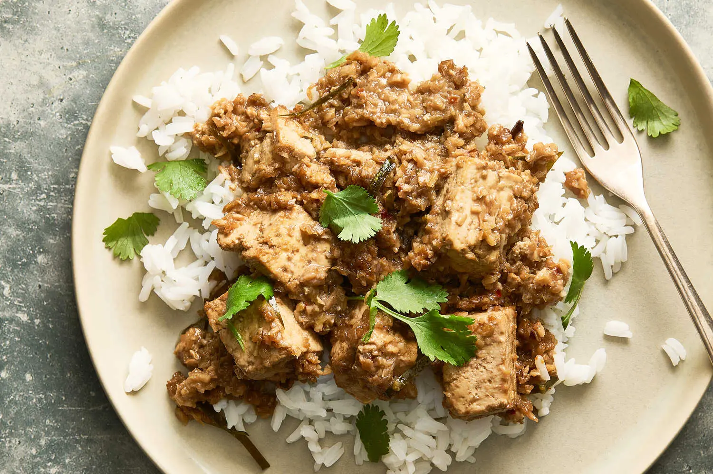

---
tags:
  - dish:main
  - protein:tofu
  - cuisine:indonesian
---
<!-- Tags can have colon, but no space around it -->

# Tofu Rendang

<!-- Serves has to be a single number, no dashes, but text is allowed after the
number (e.g., 24 cookies) -->
- Serves: 4
{ #serves }
<!-- Time is not parsed, so anything can be input here, and additional
values can be added (e.g., "active time", "cooking time", etc) -->
- Time: 1 hour
- Date added: 2025-07-17

## Description
Rendang is an Indonesian and Malaysian curry associated with the long and gentle cooking of protein, most often beef. This vegan version, however, evokes rendang’s signature deep and intoxicating flavors in a fraction of the time thanks to tofu, which absorbs flavor readily without requiring lengthy cooking. The spice paste of ginger (or galangal), shallots, lemongrass and garlic brings potent flavor, and clings to the tofu as it cooks down with the coconut milk. Classic rendang will often feature a buttery, toasted coconut paste, but this recipe uses toasted shredded coconut to impart texture and nuttiness. If you are meal prepping, cook this on the weekend to eat during the week, as the curry increases in flavor over time.

## Ingredients { #ingredients }

<!-- Decimals are allowed, fractions are not. For ranges, use only a single dash
and no spaces between the numbers. -->
### For the Spice Paste
- 3 large shallots (about ½ pound), roughly chopped 
- 1 (1-inch) piece fresh ginger or galangal (about 1 ounce), peeled and roughly chopped 
- 2 lemongrass stalks (white parts only), roughly chopped (about 2 tablespoons)
- 4 garlic cloves, roughly chopped
- 1.5 teaspoons crushed red pepper
### For the Curry
- 3 tablespoons vegetable oil or other neutral oil
- 1 cinnamon stick or ½ teaspoon ground cinnamon
- .25 teaspoon whole cloves or ⅛ teaspoon ground cloves
- 2 star anise 
- .25 teaspoon ground cardamom or 2 cardamom pods, smashed 
- 2 (14- to 16-ounce) packages extra-firm tofu, cut into 1-inch cubes
- 1 (14-ounce) can coconut milk
- 1 tablespoon tamarind paste or concentrate
- .5 cup unsweetened shredded coconut 
- 4 makrut lime leaves, thinly sliced 
- 2 tablespoons brown sugar 
- 2 teaspoons sea salt
- Cooked rice, to serve
- Handful of cilantro leaves

## Directions

<!-- If you have a direction that refers to a number of some ingredient, wrap
the number in asterisks and add `{.ingredient-num}` afterwards. For example,
write `Add 2 Tbsp oil to pan` as `Add *2*{.ingredient-num} to pan`. This allows
us to properly change the number when changing the serves value. -->
1. Make the spice paste: Place the shallots, ginger, lemongrass, garlic and crushed red pepper into a small blender or food processor and blend until you have a thick paste. (Alternatively, you can use a mortar and pestle to pound all the ingredients together.)
2. Make the curry: Place a large Dutch oven or other heavy lidded pot over medium-high heat. Add the neutral oil and the spice paste, and stir until fragrant, about 2 minutes. Add the cinnamon, cloves, star anise and cardamom, then reduce heat to medium-low and stir until the paste caramelizes, darkens and starts to stick to the bottom of the pot, 3 to 5 minutes.
3. Add the tofu and gently stir to coat. Add the coconut milk and tamarind and gently toss. Cover with a lid and simmer for 10 minutes.
4. Meanwhile, heat a small frying pan over medium. Add the shredded coconut and stir constantly until golden, 2 to 4 minutes.
5. Remove the lid from the pot and add the toasted coconut, lime leaves, brown sugar and salt, stirring gently to combine. Simmer, uncovered, until the sauce is dark and reduced, 8 to 10 minutes.
6. Serve on top of rice and top with cilantro.

## Source

[NYTimes](https://cooking.nytimes.com/recipes/1026262-tofu-rendang)

## Comments

- 2025-07-17: delicious! made it the day before and then reheated with some water on the stove.
