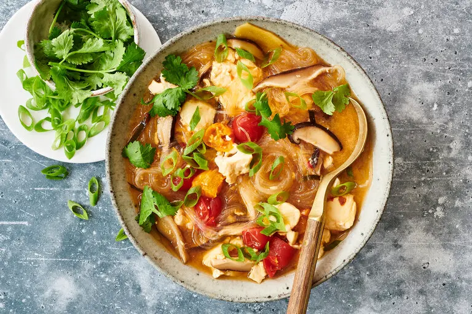

---
tags:
  - dish:main
  - protein:tofu
  - ingredient:mushrooms
  - ingredient:tomato
  - cuisine:thai
  - difficulty:easy
---
<!-- Tags can have colon, but no space around it -->

# Tom Yum Soup With Tofu and Vermicelli

<!-- Serves has to be a single number, no dashes, but text is allowed after the
number (e.g., 24 cookies) -->
- Serves: 4
{ #serves }
<!-- Time is not parsed, so anything can be input here, and additional
values can be added (e.g., "active time", "cooking time", etc) -->
- Time: 20 minutes
- Date added: 2024-05-12

## Description

Tom yum is a hot and sour soup from Thailand with lively notes of lemongrass, makrut lime leaves and galangal. There are many variations of this iconic soup, including tom kha (coconut milk and dominant galangal notes), tom yum pla (fish) and tom yum gai (chicken). This version is vegetarian, hence not traditional, but it is reminiscent of tom yum koong nam khon, a creamy version that uses canned evaporated milk. (Use coconut milk if you prefer). Tom yum is often moored by nam prik pao, a staple Thai chile paste of roasted chiles, shrimp paste and fish sauce, but in this recipe, a combination of soy sauce, lime, garlic and sambal oelek provides a similar umami kick. The addition of vermicelli and tofu is also unconventional, but it turns this soup into a hearty, quick and comforting weeknight dinner.

## Ingredients { #ingredients }

<!-- Decimals are allowed, fractions are not. For ranges, use only a single dash
and no spaces between the numbers. -->

- 3 ounces rice or mung bean vermicelli
- 2 tablespoons soy sauce
- 2 tablespoons lime juice (from 1 lime)
- 1 tablespoon sambal oelek
- 1 garlic clove, grated
- 1 stalk lemongrass, cut into 2-inch sections and crushed
- 1 (2-inch) piece ginger or galangal, peeled and finely sliced
- 2 makrut lime leaves, finely sliced
- 4 cups vegetable stock
- 4 to 6 shiitake mushrooms (4 ounces), stemmed and cut into ¼-inch slices
- 6 cherry or grape tomatoes, halved
- 1 sixteen-ounce package silken tofu, broken into five or six large chunks
- 2 teaspoons kosher salt (Diamond Crystal)
- .25 cup evaporated milk (optional)
- 2 scallions, finely sliced
- Handful of cilantro leaves

## Directions

<!-- If you have a direction that refers to a number of some ingredient, wrap
the number in asterisks and add `{.ingredient-num}` afterwards. For example,
write `Add 2 Tbsp oil to pan` as `Add *2*{.ingredient-num} to pan`. This allows
us to properly change the number when changing the serves value. -->
1. Soak the vermicelli in room temperature water for 10 minutes, until they have softened. (Disregard package instructions.) Drain and set aside.
2. Meanwhile, whisk together the soy sauce, lime juice, sambal oelek and garlic. Set aside.
3. In a large pot over medium-high heat, combine the lemongrass, ginger, makrut lime leaves and vegetable stock. Bring to a boil, and cook for 3 to 4 minutes. Reduce the heat to medium, add the mushrooms, and cook for 5 minutes. Discard the lemongrass stalks. Add the tomatoes and tofu, and cook for 2 to 3 minutes, until the tofu is warm and the tomatoes have softened.
4. Add the sambal oelek mixture, salt and drained vermicelli to the soup, stirring gently to break the tofu into bite-size pieces. Cook for 2 to 3 minutes or until the noodles are transparent. Turn off the heat, and stir in the evaporated milk, if using.
5. Divide the soup into four bowls, top with scallions and cilantro leaves, and serve immediately.

## Source

[NYTimes](https://cooking.nytimes.com/recipes/1022612-tom-yum-soup-with-tofu-and-vermicelli)

## Comments

- 2024-05-12: this was very good! replaced evaporated milk with a full can of coconut milk and salt with fish sauce
