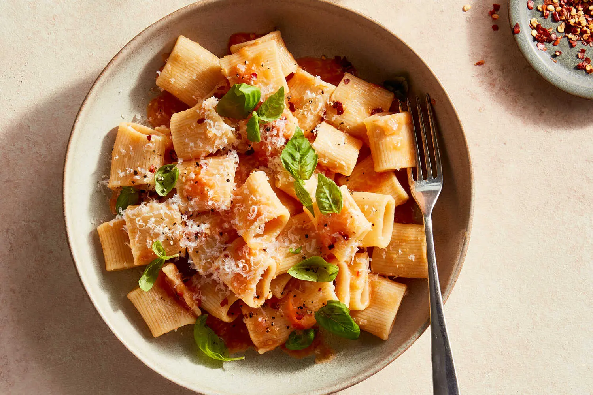

---
tags:
  - dish:main
  - ingredient:pasta
  - ingredient:tomato
  - cuisine:italian
  - difficulty:easy
---
<!-- Tags can have colon, but no space around it -->

# Tomato-Butter Pasta

<!-- Serves has to be a single number, no dashes, but text is allowed after the
number (e.g., 24 cookies) -->
- Serves: 4
{ #serves }
<!-- Time is not parsed, so anything can be input here, and additional
values can be added (e.g., "active time", "cooking time", etc) -->
- Time: 25 min
- Date added: 2025-09-07

## Description
When you have ripe, perfect tomatoes that you want to enjoy without much fuss, this is the pasta to make. (If your tomatoes are tasteless, your pasta will be too, so don’t try this with the off-season grocery store variety.) It’s inspired by pan con tomate, in which grated tomato and its juices are spooned onto garlic toasts. Here, with vigorous stirring, grated tomato and cold butter form a glossy, light, pretty-in-pink sauce that tastes of sweet, just-cooked tomato. The red-pepper flakes, garlic, basil and Parmesan bring out the flavor of the tomato, and while there are plenty of other ways to embellish further, you don’t need to: This is lazy, easy summer cooking at its best. (P.S. Leftovers make a great room-temperature pasta salad.)

## Ingredients { #ingredients }

<!-- Decimals are allowed, fractions are not. For ranges, use only a single dash
and no spaces between the numbers. -->
- Kosher salt
- 1 pound wavy or ridged pasta (like cavatappi or rigatoni), or a long noodle (like fettuccine)
- 2 pounds large, ripe tomatoes (about 2 to 3), halved horizontally
- 4 tablespoons cold unsalted butter
- 1 large garlic clove, peeled
- .25 teaspoon red-pepper flakes, plus more for serving
- Black pepper
- Torn basil leaves, for serving (optional)
- Finely grated Parmesan, for serving

## Directions

<!-- If you have a direction that refers to a number of some ingredient, wrap
the number in asterisks and add `{.ingredient-num}` afterwards. For example,
write `Add 2 Tbsp oil to pan` as `Add *2*{.ingredient-num} to pan`. This allows
us to properly change the number when changing the serves value. -->

1. Bring a large pot of salted water to a boil. Add the pasta and cook according to package instructions until al dente. Reserve 1 cup pasta cooking water, then drain the pasta.
2. Meanwhile, using the large holes of a box grater, grate the cut ends of the tomato into a large bowl. Discard or compost skins. Grate the butter into the bowl as well. Using the small holes of the box grater, grate the garlic into the bowl. Add the red-pepper flakes, and season generously with salt. Refrigerate until ready to use.
3. Return the drained pasta to the pot, along with the bowl of grated tomato and butter. Set over medium-high heat and cook, stirring constantly, until the mixture thickens slightly and glosses the pasta, 2 to 3 minutes (the sauce will thicken as it sits). Add pasta water as needed to emulsify the sauce. Season to taste with salt and pepper. Serve with more red-pepper flakes, black pepper, basil and Parmesan as desired.

## Source

[NYTimes](https://cooking.nytimes.com/recipes/1022464-tomato-butter-pasta)

## Comments

- 2025-09-07: very good but the sauce never thickened up.
