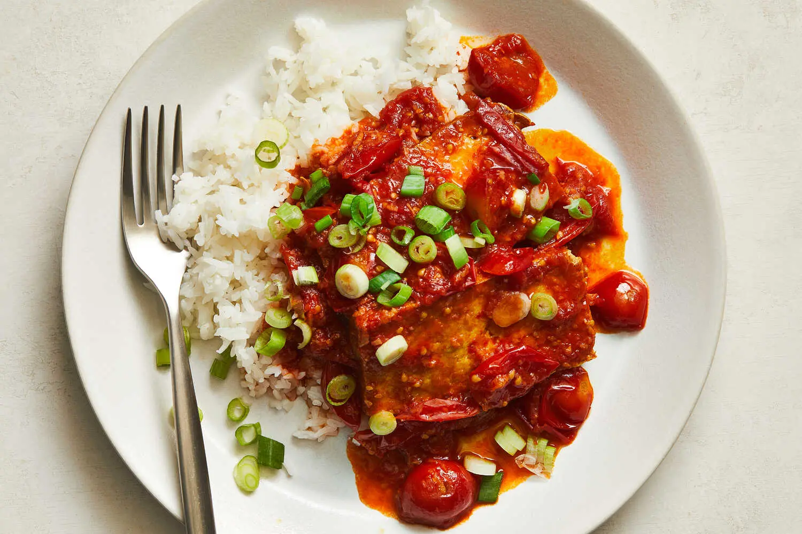

---
tags:
  - dish:main
  - protein:tofu
  - ingredient:tomato
  - difficulty:easy
---
<!-- Tags can have colon, but no space around it -->

# Recipe title

<!-- Serves has to be a single number, no dashes, but text is allowed after the
number (e.g., 24 cookies) -->
- Serves: 4
{ #serves }
<!-- Time is not parsed, so anything can be input here, and additional
values can be added (e.g., "active time", "cooking time", etc) -->
- Time: 50 min
- Date added: 2024-12-15

## Description
Tomatoes and tofu may not be an obvious pairing, but they belong together in this speedy braise. A brave amount of ginger provides a robust flavor foundation for this sauce, imparting verve. (If you’d like to increase the heat, you could add some crushed red pepper, too.) Halving the cherry tomatoes helps them break down faster, transforming them into a rich sweet, savory and tangy sauce in minutes. This recipe works any time of year: If fresh cherry tomatoes are unavailable, 28 ounces of canned cherry tomatoes will also work. Pan-frying the tofu first makes the slices sturdier and locks in moisture, creating the perfect texture to carry and soak up the braising sauce. 
## Ingredients { #ingredients }

<!-- Decimals are allowed, fractions are not. For ranges, use only a single dash
and no spaces between the numbers. -->
- Extra-virgin olive oil
- 4 garlic cloves, finely chopped
- 2- to 3-inch piece fresh ginger, peeled and finely chopped
- 2 pounds cherry tomatoes, halved
- Salt and pepper
- 2 (fourteen- to sixteen-ounce) blocks extra-firm tofu, sliced into ½-inch-thick pieces
- 2 tablespoons soy sauce
- 4 teaspoons rice vinegar
- 2 teaspoons sugar
- 2 scallions, thinly sliced
- Cooked rice, for serving
## Directions

<!-- If you have a direction that refers to a number of some ingredient, wrap
the number in asterisks and add `{.ingredient-num}` afterwards. For example,
write `Add 2 Tbsp oil to pan` as `Add *2*{.ingredient-num} to pan`. This allows
us to properly change the number when changing the serves value. -->
1. Heat a wide pot or deep skillet on medium-high. When hot, add a generous drizzle of olive oil, along with the garlic and ginger. Toss for 30 to 60 seconds until fragrant, then add the tomatoes and ½ cup water. Season well with salt and pepper. Cover with lid (or use a sheet pan), adjust heat to medium-low and cook until the tomatoes have broken down and look jammy, 10 to 12 minutes.
2. Meanwhile, heat a large 12-inch skillet on medium-high for 2 minutes, until very hot. Drizzle with olive oil and, working in batches, add as many tofu slices as can comfortably fit in the pan. Season the tofu generously with salt and pepper and drizzle the top of the tofu with a little more oil. Cook until golden, 3 to 4 minutes per side. Transfer to a plate and repeat with remaining tofu.
3. To the tomatoes, add the soy sauce, rice vinegar and sugar, stirring to break up the tomatoes. Taste the sauce — it should be tangy and savory — and if needed, season with more salt and pepper, or sugar if it’s too tart.
4. Add the tofu slices to the tomatoes, carefully turning them in the sauce to coat. Cook on medium heat until the tofu is heated through, about 2 minutes.
5. Top with scallions and serve with rice.

## Source

[NYTimes](https://cooking.nytimes.com/recipes/1025855-tomato-and-ginger-braised-tofu)

## Comments
