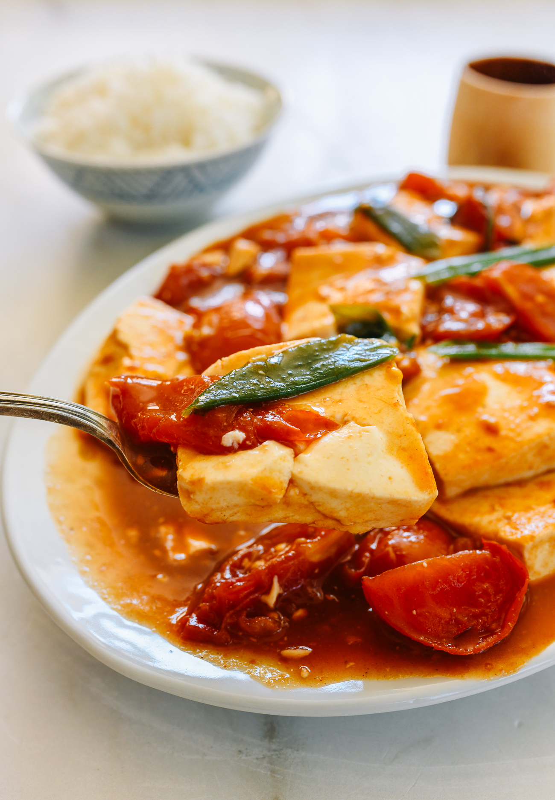

---
tags:
  - dish:main
  - protein:tofu
  - cuisine:chinese
  - difficulty:easy
---
<!-- Tags can have colon, but no space around it -->

# Tomato tofu

<!-- Serves has to be a single number, no dashes, but text is allowed after the
number (e.g., 24 cookies) -->
- Serves: 4
{ #serves }
<!-- Time is not parsed, so anything can be input here, and additional
values can be added (e.g., "active time", "cooking time", etc) -->
- Time: 20 minutes
- Date added: 2024-05-14

## Description

This tomato tofu recipe is a delicious home-cooked vegan and vegetarian Chinese stir-fry, with lots of sauce to spoon over steamed rice!

## Ingredients { #ingredients }

<!-- Decimals are allowed, fractions are not. For ranges, use only a single dash
and no spaces between the numbers. -->
- 2 tablespoons neutral oil (such as vegetable, canola, or avocado oil)
- 1 scallion (white and green parts separated, cut on an angle into 2-inch/5cm pieces)
- 1.5 pounds ripe tomatoes (cut into wedges; 1½ pounds/680g = about 4-5 medium tomatoes)
- 1 tablespoon Shaoxing wine
- .5 cup water (or mushroom, vegetable, or chicken stock)
- 1 tablespoon sugar (or to taste)
- .5 teaspoon salt (or to taste)
- 1 tablespoon vegetarian oyster sauce (or regular oyster sauce if you’re not vegan/vegetarian)
- 2 teaspoons light soy sauce
- 1 teaspoon sesame oil
- .5 teaspoon white pepper
- 2 teaspoons cornstarch (mixed into a slurry with 2 tablespoons water)
- 16 ounces soft tofu (cut into ¾-inch/2cm thick square slices; soft tofu holds up better than silken, but you can use silken tofu if that’s all you can find)

## Directions

<!-- If you have a direction that refers to a number of some ingredient, wrap
the number in asterisks and add `{.ingredient-num}` afterwards. For example,
write `Add 2 Tbsp oil to pan` as `Add *2*{.ingredient-num} to pan`. This allows
us to properly change the number when changing the serves value. -->
1. Heat your non-reactive stainless steel wok or skillet over high heat, and add the neutral oil along with the white parts of the scallions. After about 15 seconds, add the tomatoes. Stir-fry for 2 minutes, then add the Shaoxing wine around the perimeter of the pan.
2. Add the water (or stock), sugar, salt, vegetarian oyster sauce, light soy sauce, sesame oil, and white pepper. Bring to a simmer and cook for 1 minute, until the tomatoes begin to wilt.
3. While that’s happening, make the cornstarch slurry. Stir the cornstarch slurry into the sauce, allowing it to thicken for a few seconds. Then add the tofu. Mix a few times, partially submerging the tofu in the sauce. Take care not to break it up too much.
4. Reduce the heat to medium, cover, and cook for 2 minutes, until the tomatoes are completely softened and the sauce has thickened. (If it’s still too wet, add more cornstarch slurry to reach your desired consistency.)
5. Uncover, and stir in the scallions. Add salt to taste, adjust the amount of sugar if needed, and serve with jasmine rice. (Or quinoa rice!)

## Source

[Woks of Life](https://thewoksoflife.com/tomato-tofu/)

## Comments
