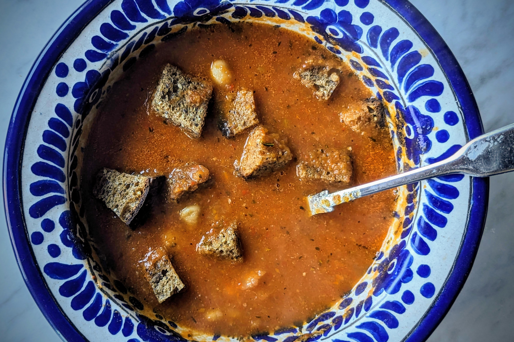

---
tags:
  - dish:soup
  - protein:beans
  - ingredient:tomato
---
<!-- Tags can have colon, but no space around it -->

# Tomato and white bean soup

<!-- Serves has to be a single number, no dashes, but text is allowed after the
number (e.g., 24 cookies) -->
- Serves: 2
{ #serves }
<!-- Time is not parsed, so anything can be input here, and additional
values can be added (e.g., "active time", "cooking time", etc) -->
- Time: 
- Date added: 2024-02-18

## Description

There's nothing like rain and thunder to inspire one to stay home and eat soup. This recipe finds its inspiration from a cold, Northern California evening with nothing prepared to eat but a fridge full of good cooked Ayocote Blanco beans. 

We made this with chicken broth (from the weekend's leftover bones and vegetable scraps) but a good vegetable broth would be just as delicious. 

We had a very fancy (and expensive) local multi-grain sourdough bread that started to go south, so we cut them leftover bread into cubes and let them dry on a rack in our oven. If you wanted to indulge, they can be sautéed in oil for a richer crouton, but the soup was perfect and the croutons just added the needed crunch. 

## Ingredients { #ingredients }

<!-- Decimals are allowed, fractions are not. For ranges, use only a single dash
and no spaces between the numbers. -->
- .25 white or yellow onion, chopped
- .25 cup olive oil
- 3 garlic cloves, minced
- 2 small carrots, cubed
- 1 celery stalk, cubed
- Salt to taste
- 1 teaspoon Herbes de Provence (we used Burlap & Barrel)
- 3 canned whole peeled tomatoes, roughly chopped
- 2 roasted red peppers, chopped (we used Trader Joe's)
- 1 cup bean broth
- 2 cups chicken or vegetable broth
- 1 parmesan cheese rind (optional)
- 1-2 cups cooked Ayocote Blanco or other white heirloom beans
- Croutons or cubed stale bread (optional)

## Directions

<!-- If you have a direction that refers to a number of some ingredient, wrap
the number in asterisks and add `{.ingredient-num}` afterwards. For example,
write `Add 2 Tbsp oil to pan` as `Add *2*{.ingredient-num} to pan`. This allows
us to properly change the number when changing the serves value. -->
1. In a small soup pot, sauté the onion in the olive oil over medium heat for about 5 minutes. Add the garlic, carrots, celery, Herbes de Provence, and a small pinch of salt. Cook, stirring occasionally, until just soft, about 15 minutes. Add the tomatoes and roasted red peppers and cook for an additional 5 minutes. 
2. Add the broths and stir. Cook for 5 minutes and then puree with an immersion blender until smooth and velvety. Check seasoning and add salt if needed. Add the parmesan rind, if using, and continue to cook over medium heat with a lid ajar for about 20 minutes. The soup should reach a gentle simmer. 
3. Add the beans and continue to gently simmer until they are warmed through. 
4. Ladle into individual bowls. Drizzle with olive oil and dot with croutons (optional).

## Source

Rancho Gordo newsletters

## Comments
