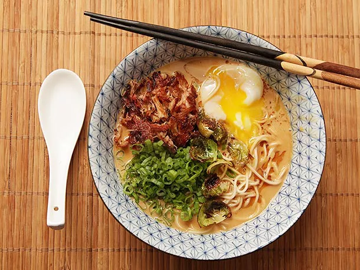

---
tags:
  - dish:main
  - protein:turkey
  - cuisine:japanese
  - context:holiday
  - difficulty:involved
---
<!-- Tags can have colon, but no space around it -->

# Turkey Paitan Ramen

<!-- Serves has to be a single number, no dashes, but text is allowed after the
number (e.g., 24 cookies) -->
- Serves: 6 
{ #serves }
<!-- Time is not parsed, so anything can be input here, and additional
values can be added (e.g., "active time", "cooking time", etc) -->
- Time: 9 hrs
- Activve time: 60 min
- Date added: 2023-12-26

## Description

Turkey soup is all well and good for the day after Thanksgiving, and what's more, it's a snap to make. But sometimes I don't feel like making things snappy. Sometimes I feel like investing a bit more time into my scraps. Sometimes I feel like I want my home to smell like simmering turkey broth for an entire day before I get to dig into the fruits of my labor (or really, the fruits of my stove's labor, because it does the lion's share of work in this recipe). Enter turkey paitan ramen. 

If you've kept abreast of our ramen style guide, you'd know that paitan refers to the thickness and opaqueness of the soup. Rich and creamy is what we're after here, and while paitan-style broths are traditionally made with pork (tonkotsu being the most famous example) or chicken, turkey works wonderfully well, with its fuller flavor and slightly sweet aroma. 

### Why It Works

- The paitain-style broth is cooked at a low rolling boil, which results in a rich, deep brown stock that is loaded with turkey flavor.
- Turkey drumsticks cooked in the broth are shredded and browned, serving as a crispy garnish in the finished bowl.

## Ingredients { #ingredients }

<!-- Decimals are allowed, fractions are not. For ranges, use only a single dash
and no spaces between the numbers. -->

- 3 pounds turkey backs and wings or leftover roasted turkey bones and carcass, roughly chopped with a cleaver or a heavy duty chef's knife
- 2 pounds turkey drumsticks and/or thighs
- 3 tablespoons vegetable oil, divided
- 1 large onion, skin on, roughly chopped
- 16 garlic cloves, divided
- One 3-inch knob ginger, roughly chopped
- 2 whole leeks, washed and roughly chopped
- 2 dozen scallions, white parts only (reserve greens and light green parts for garnishing finished soup)
- 6 ounces whole mushrooms or mushroom scraps
- .5 cup red or white miso paste
- .25 cup sesame tahini
- 12 Brussels sprouts, divided into individual leaves
- Kosher salt
- 6 to 8 servings ramen-style noodles, store-bought or homemade
- 6 to 8 marinated eggs, or sous-vide soft boiled eggs
- 2 to 3 tablespoons mayu (black garlic oil) or toasted sesame oil, for serving

## Directions

<!-- If you have a direction that refers to a number of some ingredient, wrap
the number in asterisks and add `{.ingredient-num}` afterwards. For example,
write `Add 2 Tbsp oil to pan` as `Add *2*{.ingredient-num} to pan`. This allows
us to properly change the number when changing the serves value. -->

1. Place turkey bones and drumsticks or thighs in a large stockpot and cover with cold water. Place on a burner over high heat and bring to a boil. Remove from heat as soon as boil is reached.
2. While pot is heating, heat 2 tablespoons vegetable oil in a medium cast iron or nonstick skillet over high heat until lightly smoking. Add onions, 12 cloves garlic, and ginger. Cook, tossing occasionally until deeply charred on most sides, about 15 minutes total. Set aside.
3. Once pot has come to a boil, dump water down the drain. Carefully wash all bones and meat under cold running water, removing any bits of dark marrow or coagulated blood. Bones should be uniform grey/white after you've scrubbed them. Meat should be lightly rinsed.
4. Return turkey to pot along with charred vegetables, leeks, scallion whites, and mushrooms. Top up with cold water. Bring to a rolling boil over high heat, skimming off any scum that appears (this should stop appearing within the first 20 minutes or so). Use a clean sponge or moist paper towels to wipe black or gray scum off from around the rim of the pot. Reduce heat to a bare simmer and place a heavy lid on top.
5. Once the lid is on, check the pot after 15 minutes. It should be at a slow rolling boil. If not, increase or decrease heat slightly to adjust boiling speed. Boil broth until turkey legs/drumsticks are completely tender, about 3 hours. Carefully remove turkey legs/drumsticks with a slotted spatula. Transfer to a sealed container and refrigerate until step 7. Return lid to pot and continue cooking until broth is opaque with the texture of light cream, about 3 to 5 hours longer, topping off as necessary to keep bones submerged at all times. If you must leave the pot unattended for an extended period of time, top up the pot and reduce the heat to the lowest setting while you are gone. Return to a boil when you come back and continue cooking, topping up with more water as necessary.
6. Once broth is ready, cook over high heat until reduced to around 3 quarts. Strain through a fine-mesh strainer into a clean pot. Discard solids. Skim liquid fat from top with a ladle and discard. Return to a medium pot on the stovetop and keep warm.
7. Whisk miso paste and tahini into broth. Grate garlic cloves and whisk into broth. Season to taste with salt and/or soy sauce.
8. Pick turkey meat from turkey legs and finely shred by hand. Place in a cast iron or nonstick skillet and heat over medium-high heat. Cook, flipping and breaking up the meat occasionally, until crusty and browned all over. Season to taste with salt and transfer to a bowl. Set aside.
9. Heat remaining tablespoon oil in a large skillet over high heat until lightly smoking. Add Brussels sprouts leaves. Season to taste with salt and cook, tossing frequently, until bright green and charred in spots, about 2 minutes. Transfer to a bowl and set aside.
10. Cook ramen noodles according to package directions. Drain and transfer to individual serving bowls. Top with broth, Brussels sprouts leaves, sliced scallion greens, shredded turkey, and an egg. Drizzle with mayu or toasted sesame oil. Serve immediately. 

## Notes

<!-- Delete section if no additional notes -->
For an even cleaner soup, strain through a fine-mesh strainer lined with several layers of cheesecloth.

## Source

[Serious Eats](https://www.seriouseats.com/turkey-paitain-ramen-crispy-turkey-soft-cooked-egg-recipe)

## Comments
