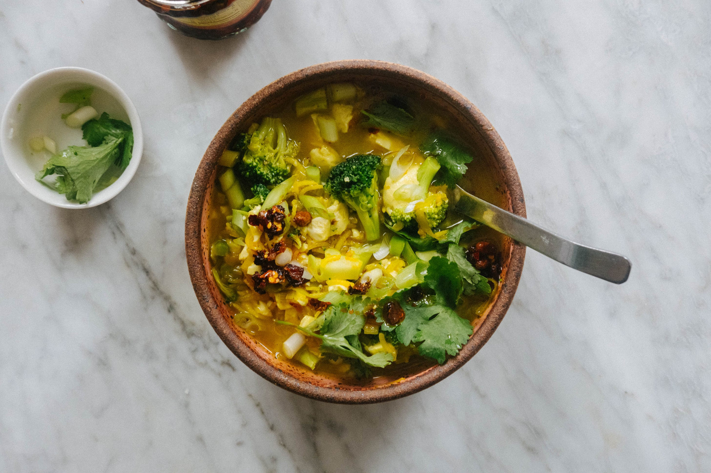

---
tags:
  - dish:main
  - protein:tofu
  - ingredient:broccoli
  - difficulty:easy
---
<!-- Tags can have colon, but no space around it -->

# Turmeric broccoli, tofu and rice soup

<!-- Serves has to be a single number, no dashes, but text is allowed after the
number (e.g., 24 cookies) -->
- Serves: 4
{ #serves }
<!-- Time is not parsed, so anything can be input here, and additional
values can be added (e.g., "active time", "cooking time", etc) -->
- Time: 
- Date added: 2023-10-27

## Description

My overarching vision for this soup was a sea of broccoli, still green and slightly crisp from restrained cooking. By all means, cook it more if prefer it more tender, but I am always attracted to a soup which offers contrasting textures.

Basmati rice is the best choice here because it cooks so quickly. Since it’s not an overly starchy rice, it will stay quite separated, and light. I like this finish in this soup but it is also acceptable to use a starchier variety like long grain or arborio to get a thicker, more velvety soup. And here’s a curveball - if you’re looking for something richer, add 1 can of coconut milk. It becomes sweeter and almost like a curry. 

## Ingredients { #ingredients }

<!-- Decimals are allowed, fractions are not. For ranges, use only a single dash
and no spaces between the numbers. -->
- extra-virgin olive oil
- 1 leek, trimmed, white and green parts sliced (or 1 brown/yellow onion, sliced)
- 2 inch (5cm) piece ginger, peeled and finely chopped
- 3 cloves garlic, finely chopped
- 2 teaspoons turmeric powder
- .5 cup (90g) rice, preferably basmati
- sea salt and black pepper
- 5 cups (1250ml) vegetable stock
- 1 pound (450g) silken tofu
- 1 large head broccoli (about 450g / 1 pound), cut into very small pieces 
- handful coriander leaves, to serve
- finely sliced scallions, to serve
- soy sauce or maggi seasoning sauce, to serve (optional)
- chili oil or crisp, to serve (optional)

## Directions

<!-- If you have a direction that refers to a number of some ingredient, wrap
the number in asterisks and add `{.ingredient-num}` afterwards. For example,
write `Add 2 Tbsp oil to pan` as `Add *2*{.ingredient-num} to pan`. This allows
us to properly change the number when changing the serves value. -->

Heat a large pot on medium. Add *2*{.ingredient-num} tablespoons of olive oil, along with the leeks. Cook, stirring constantly, until the leeks are soft and starting to turn golden, about 5 to 6 minutes. Add the ginger, garlic and turmeric and stir until fragrant, about 30 to 60 seconds. Add the rice and stir to coat, and then add *1*{.ingredient-num} teaspoon of sea salt and the vegetable stock. Cover and cook until for 10 minutes. Using a large spoon, scoop out big chunks of the tofu and add to the soup (don’t worry, it will break down), along with the broccoli. Gently stir to submerge the broccoli and simmer, uncovered, until the tofu is heated through, and the broccoli is bright, green, and tender, about 5-7 minutes. Taste and season with sea salt and black pepper.

To serve, top with coriander, scallions, and a little soy sauce or maggi seasoning sauce and chili oil/crisp, if using.

## Source

[To Vegetables, With Love](https://tovegetableswithlove.substack.com/p/turmeric-broccoli-tofu-and-rice-soup)

## Comments
