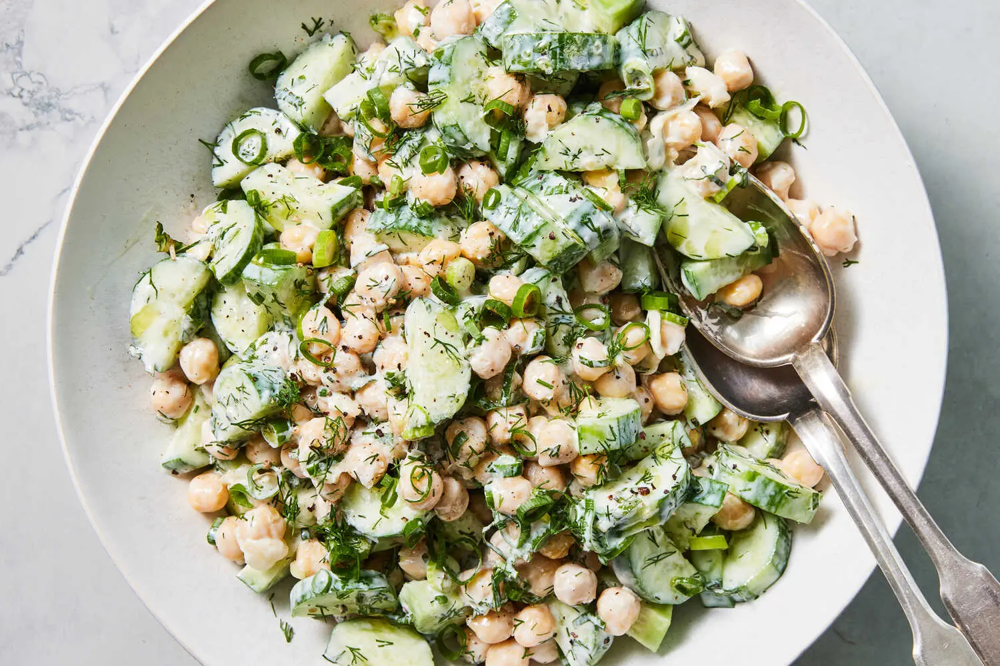

---
tags:
  - dish:main
  - protein:chickpeas
  - ingredient:cucumbers
  - difficulty:easy
---
<!-- Tags can have colon, but no space around it -->

# Tzatziki Chickpea Salad

<!-- Serves has to be a single number, no dashes, but text is allowed after the
number (e.g., 24 cookies) -->
- Serves: 4
{ #serves }
<!-- Time is not parsed, so anything can be input here, and additional
values can be added (e.g., "active time", "cooking time", etc) -->
- Time: 15 min
- Date added: 2025-07-22

## Description
Vibrant with the sharp creaminess of tzatziki, the Greek yogurt dip, this dish embodies the cool, easy eating of the warmer months. Crisp cucumbers and hearty chickpeas are dressed with a lemony and garlicky Greek yogurt mixture. A hint of honey brings harmony to the dressing; the hum of sweetness softens the tartness of the yogurt and introduces a richness to the dish. This no-cook salad is hearty enough for a standalone meal, but should you wish to dress it up, here are a few serving suggestions: Eat with flatbread, falafel, veggie skewers, or roasted Greek lemon potatoes.
## Ingredients { #ingredients }

<!-- Decimals are allowed, fractions are not. For ranges, use only a single dash
and no spaces between the numbers. -->
- 1 cup Greek yogurt
- 1 garlic clove, grated
- 2 tablespoons olive oil, plus more for serving
- 2 teaspoons honey
- 1 lemon, halved (or more, if desired, for seasoning)
- Salt and pepper
- 1 pound Persian cucumbers, halved lengthwise and cut into ½-inch pieces
- 2 (15-ounce) cans chickpeas, drained
- Big handful dill, chopped
- Big handful mint leaves, chopped
- 2 scallions, thinly sliced
## Directions

<!-- If you have a direction that refers to a number of some ingredient, wrap
the number in asterisks and add `{.ingredient-num}` afterwards. For example,
write `Add 2 Tbsp oil to pan` as `Add *2*{.ingredient-num} to pan`. This allows
us to properly change the number when changing the serves value. -->
1. To a large bowl, add the yogurt, garlic, olive oil, honey and the juice of .5 lemon; whisk to combine. If it seems too thick, loosen it up with a splash of water or more lemon juice. Season well with salt and pepper.
2. To the yogurt, add the cucumbers, chickpeas, dill, mint and scallions, and squeeze the remaining .5 lemon over the mixture. Toss to coat. Taste and season well with salt and pepper.
3. To serve, drizzle with additional olive oil.

## Source

[NYTimes](https://cooking.nytimes.com/recipes/1025698-tzatziki-chickpea-salad)

## Comments

- 2025-07-22: made this by just mixing tzatziki with chickpeas and adding some extra salt, fresh dill, and garlic powder. that worked well, but adding some fresh cucumber would've been better. Nora loved it.
