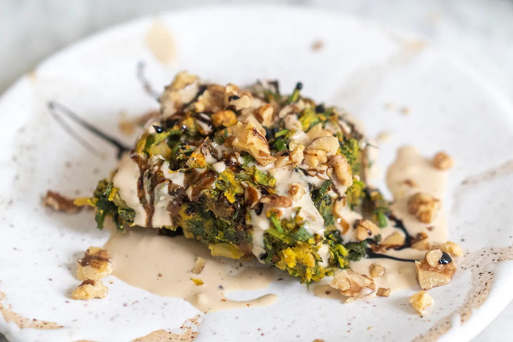

---
tags:
  - dish:main
  - ingredient:greens
  - difficulty:easy
---
<!-- Tags can have colon, but no space around it -->

# Vegan green kuku

<!-- Serves has to be a single number, no dashes, but text is allowed after the
number (e.g., 24 cookies) -->
- Serves: 4
{ #serves }
<!-- Time is not parsed, so anything can be input here, and additional
values can be added (e.g., "active time", "cooking time", etc) -->
- Time: 1 hour
- Date added: 2025-03-11

## Description
This recipe is a vegan take on kuku/koukou. Partly inspired by the egg shortage but also because I’ve been slowly reducing my egg intake in the last couple of years. Eggs have naturally become a special occasion for me nowadays and I’m okay with that. In place of eggs, I’ve used chickpea flour. I love how nutty and earthy the flavour is.

The idea is that you could use any leaves for this kuku. I used a total of 7 cups of kale and herbs (4 cups kale and 3 cups of herbs). Use whatever leaves and herbs you have on hand to make up 7 cups. 4 cups of kale sounds like a lot but it was from only 1/2 bunch of kale.

If you have a food processor, use that to make quick work of the chopping. The finer the chop, the better the cooked texture will be. But make sure you don’t blend it into a liquid. You want a fine, airy chop, not juiced.

You could eat this kuku with any sauce you have around. Yoghurt is a great option, chili oil or crisp works too. Leftover salad dressing would be lovely, as would a dollop of mayo and a squeeze of sriracha. I had lemon juice leftover so I made a lemony tahini.

## Ingredients { #ingredients }

<!-- Decimals are allowed, fractions are not. For ranges, use only a single dash
and no spaces between the numbers. -->
extra virgin olive oil
- 1 onion, any colour, sliced
- 1 leek, thinly slice
- salt and pepper
- 3 fat garlic cloves, roughly chopped
- 4 cups very finely chopped kale leaves
- 3 cups very finely chopped soft herbs such as parsley, mint, dill, coriander/cilantro or a mix
- 2 cups (220g) chickpea flour (besan)
- 2 teaspoons baking powder
- .5-1 teaspoon ground turmeric (to your liking)
- pinch of saffron (optional)
- 1.5 cups vegetable stock
- .5 cup (50g) walnuts, roughly chopped, plus a few more for topping
- Pomegranate molasses, for serving (optional)

### Lemon tahini
- .25 cup tahini
- 1 small garlic clove, grated
- 1 tablespoon lemon juice
- salt and pepper
## Directions

<!-- If you have a direction that refers to a number of some ingredient, wrap
the number in asterisks and add `{.ingredient-num}` afterwards. For example,
write `Add 2 Tbsp oil to pan` as `Add *2*{.ingredient-num} to pan`. This allows
us to properly change the number when changing the serves value. -->
1. Heat a large skillet on medium high. Drizzle with olive oil and add the onion and leek, season with salt and pepper, and cook, tossing often, until completely softened and starting to stick to the pan and caramelize, about 10 minutes. Add the garlic and stir for 1 minute. Turn off heat.
2. Preheat oven to 180˚C / 350˚F. Prepare an 8-inch (20 cm) square or circular dish by lining it with baking paper or applying a non-stick spray.
3. In a large bowl, add the chickpea flour, baking powder, turmeric, saffron (if using), season with about 1 teaspoon of salt and lots of black pepper and whisk to combine. Add the vegetable stock and whisk well to combine, until mostly smooth and lump free. Fold in the onion and leek mix, kale, herbs and walnuts until well combined.
4. Pour the batter into the prepared pan and bake until slightly golden and firm on top, 25 to 30 minutes. Allow to cool for 5 to 10 minutes.
5. Meanwhile, make the lemon tahini: place the tahini, garlic, lemon juice and 2 tablespoons of water into a bowl and whisk to combine. If the tahini seizes or is too thick, add a touch more water until it is smooth and pourable. Season well with salt and pepper.
6. To serve, cut the frittata into squares and top with the lemon tahini, a drizzle of pomegranate molasses (if using) and a final scatter of walnuts.

## Notes

<!-- Delete section if no additional notes -->
- Spend time and chop the kale and herbs as finely as you can (or use a food processor). It will give you a better final texture. Think of how you would chop parsley and mint for a tabbouleh, that’s how fine you want it. You can also use a food processor to do this job, in fact, your life will be much easier if you do. I doggedly chop by hand, I enjoy the moment of control, but don’t feel pressured to be a masochist like me.
- Substitutes:
  - Kale: spinach, chard/silverbeet
  - Ground turmeric: paprika, chili powder, spice mix such as harissa, ras el hanout
  - Walnuts: pistachios, almonds

## Source

[Hetty McKinnon](https://tovegetableswithlove.substack.com/p/vegan-greens-and-herb-frittata)

## Comments

- 2025-03-11: made this with 2 cups fresh herbs and 2 cups cooked collard greens, and I think it was enough vegetables. didn't serve with lemon tahini, but with feta, walnuts, and pomegranate molasses. took about 20 minutes longer than expected.
