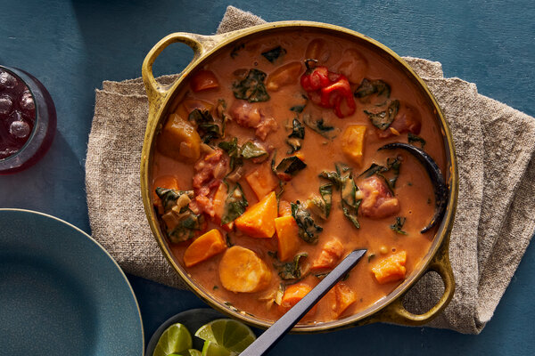

---
tags:
 - dish:main
 - ingredient:butternut squash
 - cuisine:west african
---

# Vegetable Maafé

- Serves: 6 servings
{ #serves }
- Working time: 60
- Date added: 2023-09-26

## Description

A great maafé effortlessly balances sweet, savory, earthy and spicy. Maafé is often called West African peanut stew, but that’s an oversimplification. This highly adaptable stew can be made with any assortment of meat, poultry, seafood and seasonal vegetables you have on hand (see Note), but this one goes all in on produce.

## Ingredients { #ingredients }

- 1.0 tablespoon Vegetable oil 
- 1.0 small red onion (chopped)
- 4.0 garlic cloves (chopped)
- 1.0 piece fresh ginger, scrubbed and grated (1-inch)
- 1.0 tablespoon tomato paste 
- 1.0 can whole peeled tomatoes (14.5-ounce)
- 1.0 red Scotch bonnet 
- Salt 
- 2.0 medium green plantains, peeled and cut into 1-inch pieces (see Note)
- 0.5 medium butternut squash (~1 lb, peeled and cut into 1-inch pieces)
- 2.0 medium carrot (scrubbed and cut into 1-inch pieces)
- 4.0 cups vegetable stock or water 
- 0.5 cup creamy, unsalted peanut butter
- 2.0 tablespoon tamarind purée (optional)
- 2.0 teaspoons ground dawadawa (or 1 Tbsp fish sauce, optional)
- 4.0 cups hearty greens (such as mature spinach, turnip greens, collards or kale, chopped with stems)
- Steamed rice (fonio or millet, for serving)
- 1.0 lime (sliced, for squeezing)

## Directions

1. Keeping the Scotch bonnet whole in the sauce controls the heat: cook to soften, then break it open to dissolve seeds in the sauce for more heat, or cook and remove the softened whole chile from the sauce for less heat. Serve it all over steamed rice, millet or fonio, with some lime slices for squeezing. Maafé can be made ahead, refrigerated and reheated for a warm, comforting meal whenever you need — its rich flavor only improves with time.
2. In a large saucepan, heat the oil over medium, and add the onion and garlic. Sauté until soft and just beginning to brown at the edges, about 6 minutes. Add in the grated ginger and sauté until fragrant, 1 minute.
3. Add the tomato paste, stirring to evenly coat the vegetables. Cook until the paste turns brick red, 1 minute. Add the whole tomatoes and their liquid, breaking up the tomatoes in the pot. Stir and scrape the bottom of the pan to loosen any bits that have stuck to the surface. Using a sharp knife, poke slits in the Scotch bonnet and drop it into the pot. Season the sauce with salt, and bring the sauce to a simmer.
4. Add the plantains and cook until they just begin to soften, 10 minutes. Add the butternut squash, carrots and vegetable stock. Increase the heat to high and bring the stew up to a boil. Once the liquid is bubbling, reduce heat to medium. Cook until the vegetables are just fork tender, about 15 minutes. In a small bowl, combine the peanut butter with .25 cup hot liquid from the pot. Stir into a loose sauce.
5. Stir the peanut butter mixture into the pot. Add the tamarind purée, ground dawadawa or fish sauce, if using. Stir in the greens. Drop the heat to low and let the sauce simmer, stirring frequently, for another 10 minutes or until the sauce is thickened to a creamy but loose consistency. Remove from heat, taste and season with more salt if necessary. Remove the Scotch bonnet chile and discard. Serve maafé over steamed rice, fonio or millet, with a couple of lime slices for squeezing.

## Notes

- Maafé lends itself to a variety of fall vegetables: potatoes, pumpkin, kabocha or any type of squash, parsnips, turnips, sweet potatoes, or a mix of mushrooms. Substitute the amounts above with the same amounts of any mix of vegetables.
- Dawadawa is a fermented locust bean product frequently used in West African cooking to add deep, robust flavor to soups and stews. It can be found as a ground powder or whole beans in the spice aisles of any African grocer. Possible alternatives are fish sauce or fermented black beans.

## Source

## Comments
