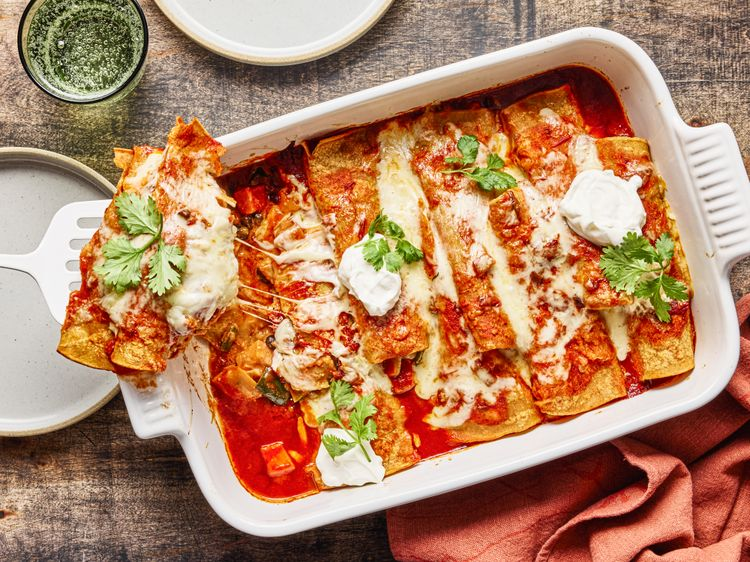

---
tags:
  - dish:main
  - protein:beans
  - ingredient:sweet potatoes
  - cuisine:mexican
---
<!-- Tags can have colon, but no space around it -->

# Cheesy sweet potato enchiladas

<!-- Serves has to be a single number, no dashes, but text is allowed after the
number (e.g., 24 cookies) -->
- Serves: 4
{ #serves }
<!-- Time is not parsed, so anything can be input here, and additional
values can be added (e.g., "active time", "cooking time", etc) -->
- Time: 100 min
- Date added: 2025-10-26

## Description
I've always loved enchiladas that come out of the oven bubbling in a blanket of cheese, smothered in sauce, and finished with unapologetic clouds of sour cream. They're the kind you find all over the American Southwest and in Southwestern restaurants throughout the US. They're messy, cozy, and just the right kind of over-the-top. This sweet potato enchilada recipe, developed by our colleague Julia Levy in our Birmingham, Alabama, test kitchen, belongs to that camp: hearty and proudly dripping with cheese.

It should be noted that these are not traditional Mexican enchiladas, which come in many varieties but always tend to be leaner, simpler, and centered around chiles.

Here, sweet potatoes are roasted with poblanos and onions until golden and smoky, then tossed with black beans, sour cream, and cheese for a vegetarian filling that's creamy, sweet-savory, and substantial. 

In the red chile sauce, the tomato paste and chipotle chiles build a base that's smoky and a little fiery, while chili powder and cumin layer in a distinctly Southwestern warmth. 

To make the best version of these enchiladas, roast the vegetables until they're browned and crisped at the edges—that's what keeps the filling from tasting flat. Dipping the tortillas in the sauce before rolling might seem fussy, but this ensures they remain soft and don't dry out as they bake in the oven. And don't skip the broil at the end; it gives you those browned, stretchy patches of cheese that make every bite memorable. 
### Why It Works

- Roasting the sweet potatoes, poblanos, and onions concentrates their flavors and adds caramelized depth, preventing the filling from tasting flat or overly sweet.
- Dipping the tortillas in enchilada sauce before rolling keeps them soft while baking, creating tender, saucy enchiladas that don't crack or dry out.

## Ingredients { #ingredients }

<!-- Decimals are allowed, fractions are not. For ranges, use only a single dash
and no spaces between the numbers. -->

- 12 ounces (340 g) sweet potato (about 1 large), peeled and cut into 1/2-inch pieces (about 2 1/3 cups)
- 4 ounces (113 g) poblano chiles, stemmed, seeded, and chopped (about 3/4 cup)
- 1 small yellow onion (4 ounces, 113 g), chopped (about 2/3 cup)
- .75 teaspoon Diamond Crystal kosher salt; for table salt use half as much by volume or the same weight
- .25 cup (60 ml) extra-virgin olive oil, divided
- 2 tablespoons plus 1 teaspoon (9 g) chili powder, divided
- 1 tablespoon plus 1 teaspoon (9 g) ground cumin, divided
- 1.5 teaspoons garlic powder, divided
- .5 cup tomato paste (4 ounces, 113 g)
- 1 tablespoon minced chipotle chiles in adobo sauce 
- 1 teaspoon dried oregano
- 4 cups (960 ml) homemade vegetable stock or store-bought low-sodium vegetable broth
- 1 (15-ounce) can black beans, rinsed and drained
- .5 cup (120 ml) sour cream, plus more for serving
- 8 ounces (226 g) Monterey Jack cheese, shredded (about 2 cups), divided
- 16 (6-inch) corn tortillas, warmed
- Fresh cilantro, for garnish

## Directions

<!-- If you have a direction that refers to a number of some ingredient, wrap
the number in asterisks and add `{.ingredient-num}` afterwards. For example,
write `Add 2 Tbsp oil to pan` as `Add *2*{.ingredient-num} to pan`. This allows
us to properly change the number when changing the serves value. -->

1. Adjust oven rack to upper-middle position, and preheat oven to 425°F (220°C). On a large rimmed baking sheet, toss sweet potato, poblanos, and onion with salt, 2 tablespoons oil, 1 teaspoon chili powder, 1 teaspoon cumin, and 1/2 teaspoon garlic powder until evenly coated. Bake until tender and browned, about 20 minutes.
2. While vegetables roast make the enchilada sauce: In a medium saucepan, heat remaining 2 tablespoons oil over medium heat until shimmering. Add tomato paste, chipotles in adobo, oregano, remaining 2 tablespoons chili powder, remaining 1 tablespoon cumin, and remaining 1 teaspoon garlic powder. Cook, stirring constantly, until fragrant, about 1 minute. Whisk in broth and bring to a boil over medium-high heat. Reduce heat to medium-low to maintain a simmer and cook, whisking occasionally, until slightly thickened and reduced to about 3 1/2 cups enchilada sauce, 15 to 20 minutes.
3. Transfer sweet potato mixture to a large bowl. Stir in black beans, sour cream, and 1 cup cheese until evenly distributed. Reduce oven temperature to 375°F (190°C). 
4. Pour 3/4 cup enchilada sauce in the bottom of a 9- x 13-inch baking dish, and tilt to coat bottom of dish. Lay a large piece of parchment paper on a clean work surface. Pour 1 cup enchilada sauce into a shallow dish. Working with 1 tortilla at a time, dip the tortilla into the sauce until both sides are lightly coated. Place flat on parchment paper, and top tortilla with a scant 1/4 cup sweet potato mixture in a line down the center. Roll up tightly, and place seam side down, crosswise, in prepared baking dish; continue process until all tortillas and sweet potato mixture are used (the casserole will be tightly packed).
5. Pour remaining 1 3/4 cups sauce over the prepared enchiladas. Sprinkle remaining 1 cup cheese down the middle of the enchiladas.
6. Cover tightly with aluminum foil, and bake until cheese has melted and sauce is bubbly, 25 to 30 minutes. Remove foil, and turn broiler onto high. Broil until cheese is browned, 4 to 5 minutes. Let sit for 5 minutes. Serve hot, sprinkled with cilantro and dolloped with additional sour cream.

## Notes
 Leftovers can be refrigerated in an airtight container for up to 4 days and reheated covered with foil in the oven until warmed through. Remove foil for the last few minutes.
## Source

[Serious Eats](https://www.seriouseats.com/sweet-potato-enchiladas-11831295)

## Comments
