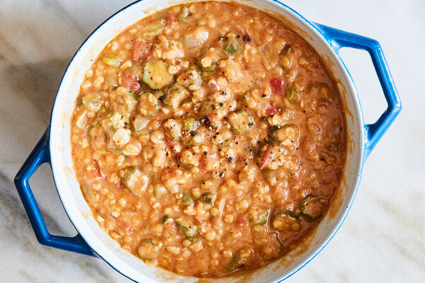

---
tags:
 - dish:main
 - protein:lentils
 - cuisine:american
 - ingredient:okra
---

# Vegetarian Gumbo

- Serves: 4 servings
{ #serves }
- Working time: 50
- Waiting time: 0
- Date added: 2024-01-28

## Description

This meatless gumbo has a distinct Louisiana flavor, thanks to the roux, Creole seasoning and the “holy trinity” of Creole cooking (onion, celery, bell pepper). Here, the okra is roasted in the oven before being added to the pot, which eliminates the gooeyness. There is also no skimping on vegetables in this gumbo, and the red lentils thicken it while adding protein.

## Ingredients { #ingredients }

- 1.0 bag frozen sliced okra (10-16oz)
- Kosher salt and black pepper 
- 5.0 tablespoons unsalted butter or vegetable oil 
- 0.25 cup all-purpose flour 
- 1.0 tablespoon extra-virgin olive oil 
- 1.0 yellow onion (diced)
- 2.0 ribs celery (thinly sliced)
- 0.5 green bell pepper (diced)
- 3.0 cloves garlic (minced)
- 1.0 teaspoon Creole seasoning (plus more to taste)
- 1.0 teaspoon Old Bay seasoning 
- 1.0 can diced tomatoes with their juices (14-ounce)
- 3.0 cups vegetable or chicken stock (plus more as needed)
- 0.5 cup red lentils 
- 1.0 tablespoon hot sauce (plus more to taste)
- 2.0 teaspoons liquid smoke (optional)
- Cooked white rice or quinoa (for serving)

## Directions

1. Serving this gumbo over white rice helps make it a complete meal

2. Heat oven to 400 degrees. Place the frozen okra in a single layer on a parchment-lined baking sheet, breaking up any large clumps, and sprinkle with .25 teaspoon salt and .25 teaspoon pepper. Roast, until cooked through and just starting to brown, about 15 to 20 minutes.

3. As okra roasts, prepare the roux: Melt the butter in a cast-iron skillet or Dutch oven over medium heat. (Either vessel will help evenly distribute the heat for a better roux.) If using vegetable oil, simply heat over medium. Using a heatproof rubber spatula or wooden spoon, mix the flour into the fat. Stir continuously, making sure to scrape the bottom of the pot so the roux does not burn (a burned roux cannot be saved), until the roux transforms from pale to peanut butter to a rich cinnamon color, about 7 minutes. Remove the roux from the heat and set aside. (Pull the pot from the heat just as the desired color is reached; the retained heat will continue to cook the roux slightly.)

4. Add the olive oil to a large skillet over medium heat. Add the onion and cook until softened, stirring occasionally, about 5 minutes. Add the celery and bell pepper, and cook until softened, another 5 minutes. Stir in the garlic and cook until fragrant, about 1 minute. Lastly, add the Creole and Old Bay seasonings, and stir so that they coat the vegetables and are lightly toasted, about 1 minute.

5. Stir in the diced tomatoes, stock and lentils. Bring the ingredients to a boil, then reduce the heat to a light simmer. Cover and allow the lentils to cook undisturbed for 15 minutes. (Add more water or stock if needed.)

6. Add the okra and cook uncovered until softened, another 5 minutes. Stir in the hot sauce, and the liquid smoke, if using. Give the cooled roux a good stir and add it to the pot, making sure to mix it in thoroughly, then simmer for 2 to 3 minutes. Taste and adjust the seasoning by adding salt, pepper, creole seasoning or hot sauce, if desired. Serve warm over white rice or quinoa.

## Notes

## Source

## Comments
