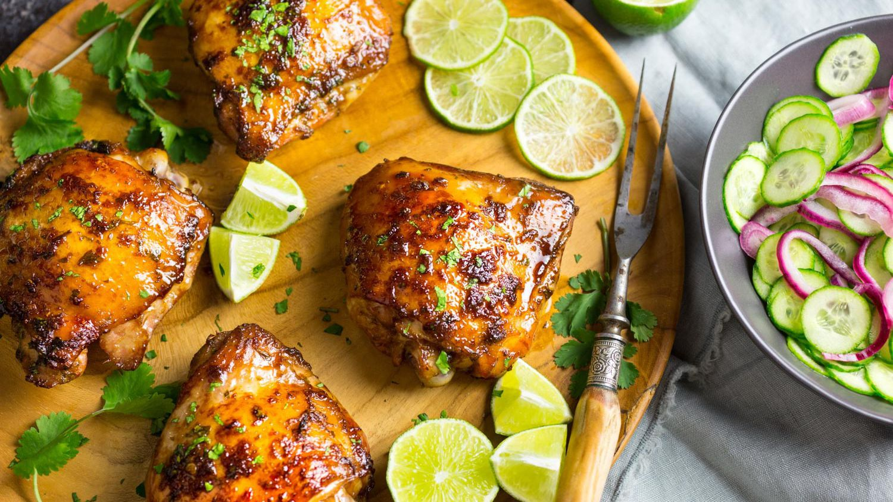

---
tags:
 - dish:main
 - protein:chicken
 - cuisine:vietnamese
 - context:summer vacation
---

# Vietnamese-Style Baked Chicken Recipe

- Serves: 4 
{ #serves }
- Working time: 25
- Waiting time: 75
- Date added: 2023-08-27

## Description

For an easy, flavorful dinner recipe, marinate chicken thighs in Vietnamese fish sauce, palm sugar, herbs, and spices, then bake until golden brown.

## Ingredients { #ingredients }

- 2.0 pounds (900g) bone-in (skin-on chicken thighs)
- 0.25 cup (60ml) soy sauce 
- 0.25 cup (60ml) Asian fish sauce (such as Red Boat)
- 0.25 cup (55g) palm or dark brown sugar 
- 2.0 tablespoons (30ml) grapeseed or other neutral oil 
- 2.0 packed tablespoons (7g) fresh cilantro leaves and tender stems (finely chopped)
- 1.5 tablespoons (20ml) fresh juice from 1 lime 
- 1.0 teaspoon (5g) finely grated zest from 1 lime 
- 1.0 tablespoon (10g) minced peeled fresh ginger 
- 2.0 teaspoons (10ml) hot chile paste (sambal oelek)
- 3.0 medium cloves garlic, minced or grated (about 2 teaspoons)
- Sliced limes and cilantro leaves (for garnish)

## Directions

1. Place thighs in a large zipper-lock bag. In a medium bowl, whisk together soy sauce, fish sauce, sugar, oil, cilantro, lime juice and zest, ginger, chili-garlic paste, and garlic. Pour marinade into bag with chicken, seal bag, and toss to coat well. Let chicken marinate for at least 30 minutes and up to 4 hours.

2. Preheat oven to 425°F (218°C) and set oven rack to middle position. Line a rimmed baking sheet with foil and place a wire rack on top. Remove chicken from bag, allowing marinade to drip off, and set on wire rack skin-side up, making sure to leave space between thighs. Discard marinade. Bake until thighs register 155 to 160°F (68 to 71°C) on an instant-read thermometer, about 35 minutes. (Be sure to measure temperature in the center of the thickest part of the thighs, but not directly against the bone.) If chicken skin is not brown and crisp enough by the time the thighs are cooked through, set broiler to high and broil until browned and crisp, about 1 minute, being careful not to burn the skin. Transfer chicken to a platter and let rest for 5 minutes. Garnish with lime slices and cilantro, then serve.

## Notes

- Someone in the comments pointed out that ATK [recommends](https://web.archive.org/web/20230326000614/https://www.americastestkitchen.com/articles/3115-best-internal-temp-chicken-thighs-drumsticks) cooking chicken thighs to 190F
- Someone in the comments recommended boiling the marinade down to a glaze while the chicken is in the oven, then brush onto the chicken before serving

## Source

[Serious Eats](https://www.seriouseats.com/vietnamese-style-baked-chicken-recipe)

## Comments
