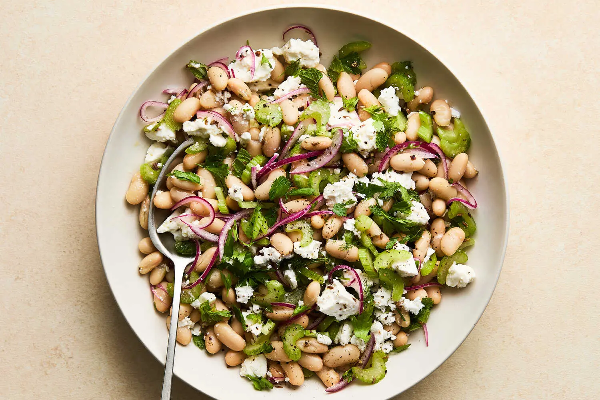

---
tags:
  - dish:main
  - protein:beans
  - protein:cheese
  - difficulty:easy
---
<!-- Tags can have colon, but no space around it -->

# White Bean, Feta and Quick-Pickled Celery Salad 

<!-- Serves has to be a single number, no dashes, but text is allowed after the
number (e.g., 24 cookies) -->
- Serves: 4
{ #serves }
<!-- Time is not parsed, so anything can be input here, and additional
values can be added (e.g., "active time", "cooking time", etc) -->
- Time: 20 min
- Date added: 2025-06-22

## Description
Pickling celery for just fifteen minutes is a game changer: The acid tames its grassy notes, brings out savoriness and transforms its texture from simply crunchy to crisp-tender. Here, celery is quickly pickled with red onion to create a sweet-and-sour foundation for this hearty cannellini bean salad. The cumin seeds are optional, but they add a deeply earthy and aromatic edge to the pickles; feel free to substitute or experiment with other whole spices such as caraway, coriander, fennel or star anise. Creamy and salty feta balances the sharpness of the pickles. This is a great no-cook dish for easy weeknight eating, but it also improves with age, so can be made ahead for potlucks, picnics or other gatherings.
## Ingredients { #ingredients }

<!-- Decimals are allowed, fractions are not. For ranges, use only a single dash
and no spaces between the numbers. -->
- 4 celery stalks, trimmed and thinly sliced
- .5 small red onion, thinly sliced
- .25 cup white or red wine vinegar
- 1 tablespoon sugar
- 1 teaspoon cumin seeds (optional) 
- S alt and pepper
- 2 (15-ounce) cans cannellini beans, rinsed
- 7-8 ounces crumbled feta
- 1 cup chopped tender herbs, such as mint, parsley, cilantro, dill or a mix 
- .25 cup extra-virgin olive oil
## Directions

<!-- If you have a direction that refers to a number of some ingredient, wrap
the number in asterisks and add `{.ingredient-num}` afterwards. For example,
write `Add 2 Tbsp oil to pan` as `Add *2*{.ingredient-num} to pan`. This allows
us to properly change the number when changing the serves value. -->
1. Place the celery and red onion in a large bowl. Add the vinegar, sugar, cumin seeds (if using) and about ½ teaspoon of salt. Toss well to combine, then set aside to pickle for 15 minutes.
2. Add the cannellini beans, feta and herbs to the celery and red onion. Drizzle with the olive oil, season well with salt and pepper and toss well to combine. Serve at room temperature. (The salad can be prepared and refrigerated up to 1 day in advance.)

## Source

[NYTimes](https://cooking.nytimes.com/recipes/1026708-white-bean-feta-and-quick-pickled-celery-salad)

## Comments
