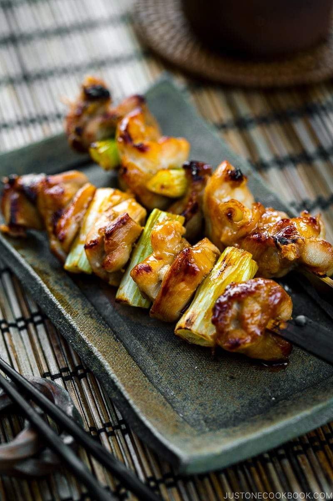

---
tags:
  - dish:main
  - protein:chicken
  - cuisine:japanese
  - context:grill
---
<!-- Tags can have colon, but no space around it -->

# Yakitori

<!-- Serves has to be a single number, no dashes, but text is allowed after the
number (e.g., 24 cookies) -->
- Serves: 10 skewers
{ #serves }
<!-- Time is not parsed, so anything can be input here, and additional
values can be added (e.g., "active time", "cooking time", etc) -->
- Prep Time: 30 min
- Cook Time: 45 min
- Date added: 2023-09-30

## Description

Glazed in a homemade Yakitori Sauce, these Japanese Grilled Chicken and Scallion Skewers are hard to resist! You‘ll love this simple Yakitori recipe with an easy savory-sweet sauce that you can make ahead. It‘s great for grilling outdoors or under the broiler.

## Ingredients { #ingredients }

<!-- Decimals are allowed, fractions are not. For ranges, use only a single dash
and no spaces between the numbers. -->
### For the Yakitori Sauce (“Tare“):
- .5 cup soy sauce
- .5 cup mirin
- .25 cup sake
- .25 cup water
- 2 tsp brown sugar (packed tightly and leveled off)

### For the Chicken Skewers
- 9 green onions/scallions
- 1 lb boneless, skinless chicken thighs (at room temperature)
- neutral oil

## Directions

<!-- If you have a direction that refers to a number of some ingredient, wrap
the number in asterisks and add `{.ingredient-num}` afterwards. For example,
write `Add 2 Tbsp oil to pan` as `Add *2*{.ingredient-num} to pan`. This allows
us to properly change the number when changing the serves value. -->

1. Soak about *10*{.ingredient-num} to *12*{.ingredient-num} 5-inch bamboo skewers in water for 30 minutes.

### To Make the Yakitori Sauce (Tare)

1. In a small saucepan, add soy sauce, mirin, sake, water, brown sugar, and the green part of *1*{.ingredient-num} of the *9*{.ingredient-num} green onions/scallions. Bring it to a boil over high heat. Once boiling, reduce the heat to low and simmer, uncovered, until the sauce reduces to one-third of its original volume. It will take about 30 minutes. Let it cool to room temperature before using. The sauce will thicken with a glossy shine as it cools. Tip: You can make the sauce ahead of time. To store, remove the green onion from the sauce and pour into a mason jar. Keep in the refrigerator for up to 2–3 months.
2. Reserve one-third of the sauce in a small bowl for final basting, just before serving. To prevent cross-contamination, use this reserved sauce with a clean brush only after the chicken is fully cooked.

### To Prepare/Assemble the Yakitori

1. Cut the white and light green parts of the remaining green onions/scallions into 1-inch (2.5-cm) pieces.
2. Cut 1 lb boneless, skinless chicken thighs into 1-inch (2.5-cm) squares.
3. On a flat work surface, fold each slice of chicken in half, insert a bamboo skewer into the chicken at a 45-degree angle, and press down on the skewer to pierce the meat through the center.
4. Next, add a piece of scallion perpendicular to the skewer. Continue to alternate chicken slices with pieces of scallion, ending with a piece of chicken. Each 5-inch skewer will hold about 4 chicken slices and 3 scallion pieces.

### To Grill/Broil the Yakitori

1. Grease the grate of the broiler/wire rack (or oven-safe cooling rack) with neutral oil to keep the chicken from sticking to the grate. Place the skewers on top.
2. Set the broiler to High and wait until the heating elements are hot. Then, place the skewers under the broiler. Broil for 6 minutes.
3. After 6 minutes, brush the meat on both sides with the Yakitori Sauce. Continue to broil for 3–4 minutes to caramelize the sauce.

### To Serve

Remove the skewers to a serving plate. With a clean brush, baste the top of the chicken skewers with the reserved sauce. Serve and enjoy! Tip: If you accidentally cross-contaminate the reserved sauce (by dipping the same brush you used on the uncooked chicken during cooking), you will have to boil the sauce again.
    
## Notes

You can keep the leftovers in an airtight container and store in the refrigerator for up to 3 days or in the freezer for up to a month. 
<!-- Delete section if no additional notes -->

## Source

[Just One Cookbook](https://www.justonecookbook.com/yakitori/)

## Comments

