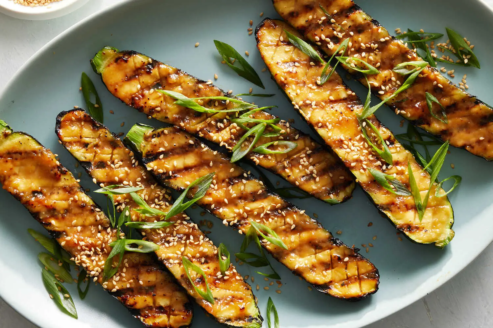

---
tags:
  - dish:sides
  - ingredient:zucchini
---
<!-- Tags can have colon, but no space around it -->

# Grilled zucchini with miso glaze

<!-- Serves has to be a single number, no dashes, but text is allowed after the
number (e.g., 24 cookies) -->
- Serves: 4
{ #serves }
<!-- Time is not parsed, so anything can be input here, and additional
values can be added (e.g., "active time", "cooking time", etc) -->
- Time: 15 min
- Date added: 2025-09-07

## Description
This dish plays on the sweetness and fruitiness of plump zucchini. Scoring the flesh in a crisscross pattern creates crevices for the miso glaze to seep into while also allowing the heat to penetrate the zucchini. Cooked quickly on high heat, the squash maintains its shape and heft, with flesh that is just tender enough. Covering the zucchini with a lid during cooking locks in all the moisture, ensuring that it becomes juicy. A grill pan is ideal for achieving smoky char marks, but you could also use a regular skillet or cook it on an outdoor grill (see Tip). If you are cooking for a group, count on one zucchini per person. Serve this as a side dish or with rice for a simple, quick and flavorful meal.

## Ingredients { #ingredients }

<!-- Decimals are allowed, fractions are not. For ranges, use only a single dash
and no spaces between the numbers. -->
- 4 zucchini (about 2 pounds), washed and halved lengthwise
- 3 tablespoons white miso paste
- 2 tablespoons mirin
- 2 teaspoons granulated sugar
- 1.5 teaspoons soy sauce
- Neutral oil, such as vegetable or grapeseed (or nonstick spray)
- White or brown rice, for serving (optional)
- 2 scallions, white and green parts, trimmed and finely sliced
- Toasted sesame seeds, for serving
## Directions

<!-- If you have a direction that refers to a number of some ingredient, wrap
the number in asterisks and add `{.ingredient-num}` afterwards. For example,
write `Add 2 Tbsp oil to pan` as `Add *2*{.ingredient-num} to pan`. This allows
us to properly change the number when changing the serves value. -->
1. Using a sharp knife (a small paring knife works best), score the zucchini flesh in a crisscross pattern, taking care not to slice all the way through.
2. Make the glaze: In a small bowl, combine the miso paste, mirin, granulated sugar and soy sauce. Add 1 tablespoon of water and whisk until combined.
3. Liberally brush the cut sides of the zucchini with the glaze. Drizzle each piece with a little oil.
4. Heat a large grill pan (or a well-seasoned cast-iron skillet) over medium-high. When hot, working in batches, place the zucchini, glazed side down, onto the hot surface. Press the zucchini onto the surface to encourage charring. (If you’re using a regular skillet, you may need to add more oil to the pan.) Cook without moving for 2 to 4 minutes until golden and charred.
5. Flip the zucchini over onto the skin side, reduce heat to medium, cover with a lid and cook for 4 to 5 minutes until tender. To check for doneness, give the sides of the zucchini a squeeze; if it yields easily, it is ready.
6. Remove the zucchini from the pan and brush more glaze over the cut side. Serve on its own or on top of rice, if desired, and scatter with scallions and sesame seeds.

## Source

[NYTimes](https://cooking.nytimes.com/recipes/1023319-grilled-zucchini-with-miso-glaze)

## Comments
